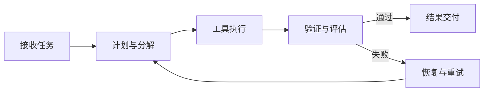

AGENT ENGINEERING PLAYBOOK

## 你将拿到的结果

  

    <h3>系统化认知</h3>
    
从架构、主循环、上下文到工具调度，建立完整 Agent 工程脑图。

  

  

    <h3>可执行方法</h3>
    
每一课都能落到“下一步动作”，不是只看概念和术语。

  

  

    <h3>落地闭环</h3>
    
把修改、验证、恢复、审批和评估串成可上线的工程流程。

  

## Agent 执行闭环

## 学习路线

  

    <strong>阶段 1：理解骨架</strong>
    第 1-4 课
  

  

    <strong>阶段 2：执行与控制</strong>
    第 5-10 课
  

  

    <strong>阶段 3：系统化升级</strong>
    第 11-15 课
  

  

    <strong>阶段 4：工程落地</strong>
    第 16-17 课
  

## 快速开始

  <a class="cta-btn cta-primary" href="/agent学习文档/01-架构总览/">从第 1 课开始</a>
  <a class="cta-btn cta-ghost" href="/agent学习文档/">查看 17 节课目录</a>
  <a class="cta-btn cta-ghost" href="/agent学习文档/17-最小可实现Agent总体设计/">直达落地设计课</a>

