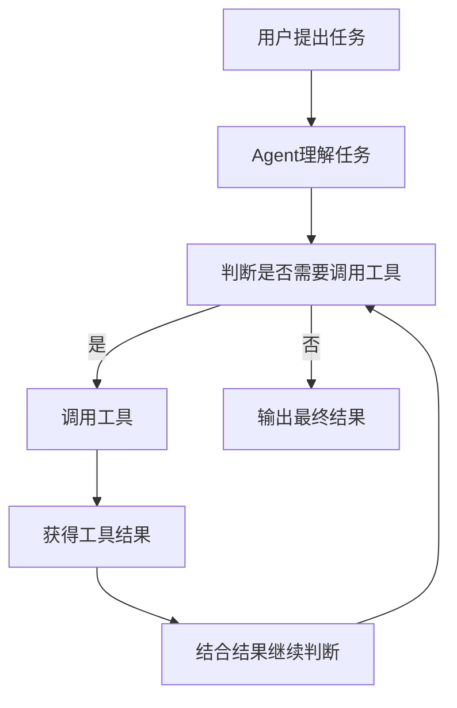
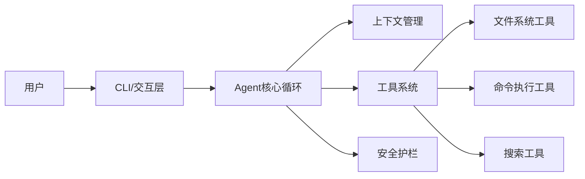
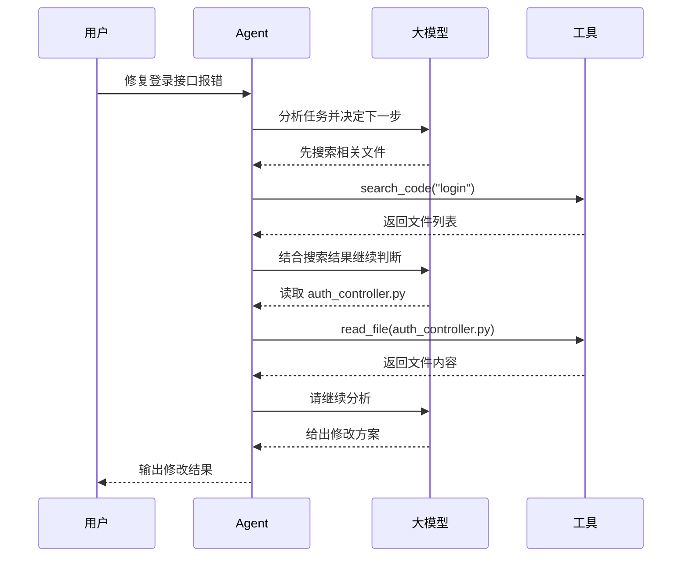
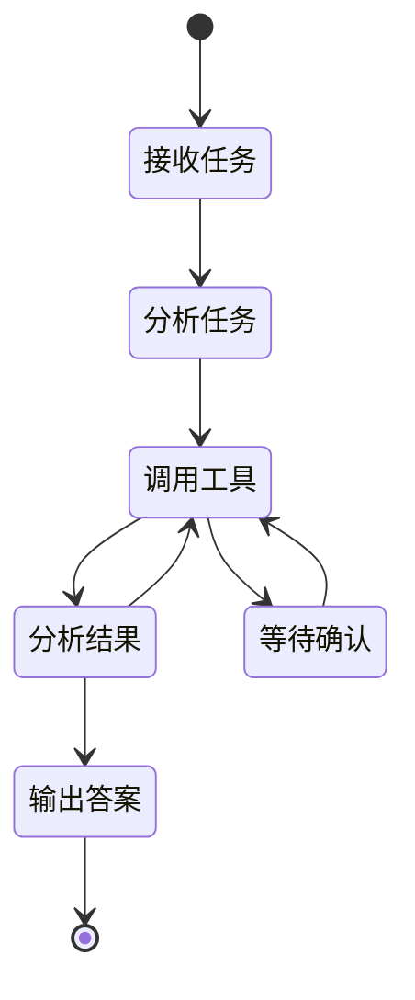
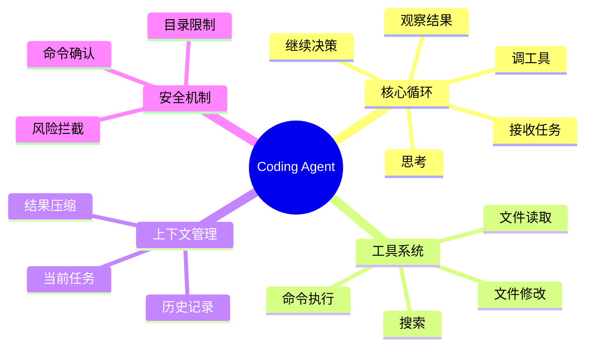
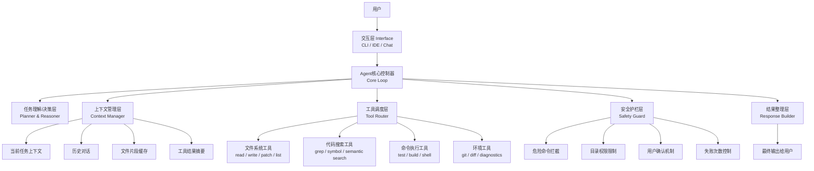
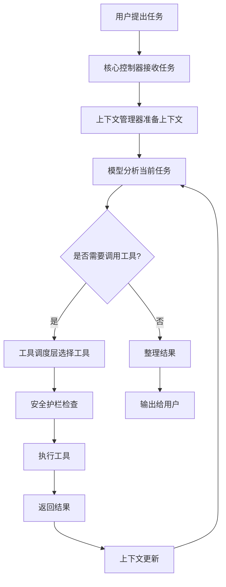
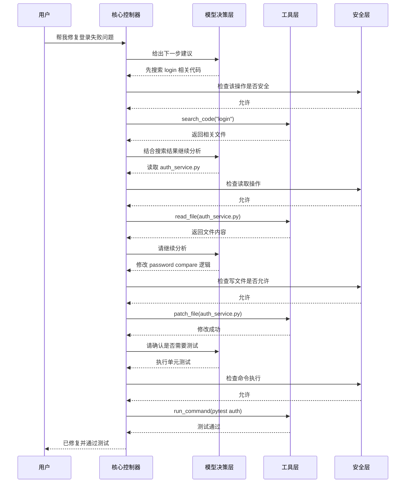
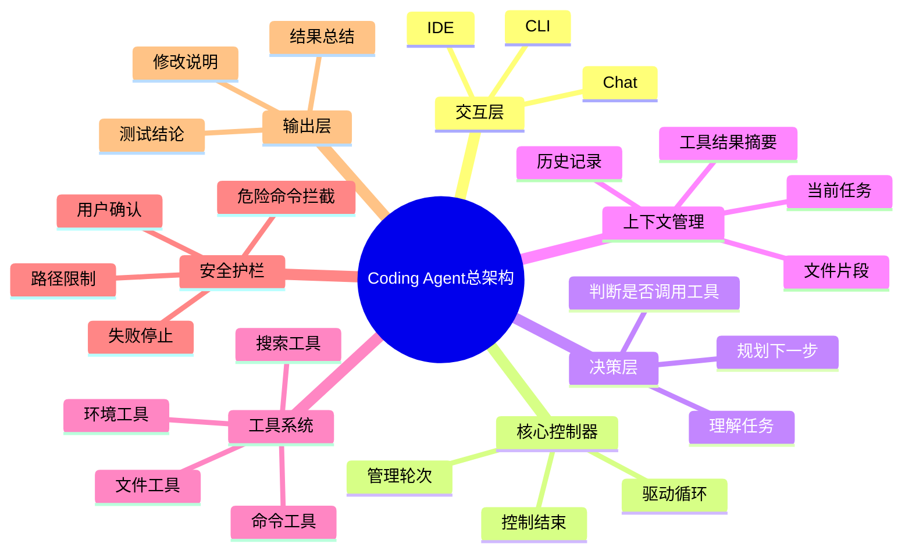

太好了，这个约束非常对你路子。

你这种学习方式，我直接给你定成：

**文字讲解 + 代码画图 + 图后翻译 + 小结论**

以后我带你学，尽量都配：

- **流程图**：看执行过程
- **架构图**：看模块关系
- **时序图**：看谁先调用谁
- **状态图**：看任务怎么流转
- **思维导图**：看知识全貌

我会优先用你最容易直接看懂、还能复制保存的“代码画图”方式来画。
最适合你的就是 **Mermaid**。

你以后自己也能把这些图复制到很多地方看，比如：

- Mermaid Live Editor
- Markdown 编辑器
- Obsidian
- GitHub
- 很多文档系统

------

# 我们先定一下以后上课的固定格式

以后每一课，我按这个结构带你：

## 1. 先讲这节课解决什么问题

让你知道为什么学它。

## 2. 先上图

先看结构图，不急着看大段文字。

## 3. 再讲图里的每个模块

把图翻成人话。

## 4. 再给一个真实例子

比如“让 Agent 修一个 bug”时，它到底怎么跑。

## 5. 最后给你一个“你必须记住的核心句子”

帮助你形成框架感。

## 6. 必要时给你练习题

不是考试题，是帮助你真正吃透的题。

------

# 先告诉你：后面我会主要用这几种图

## 1）流程图 Flowchart

适合看：

- Agent 从接任务到结束，怎么一步一步执行

示例：

------

## 2）架构图 Architecture Diagram

适合看：

- 系统由哪些模块组成
- 模块和模块之间怎么连接

示例：

------

## 3）时序图 Sequence Diagram

适合看：

- 一次任务里，谁先调用谁
- 模型、工具、用户之间如何来回交互

示例：

------

## 4）状态图 State Diagram

适合看：

- Agent 当前处于什么状态
- 成功、失败、等待确认时怎么切换

示例：

------

## 5）思维导图 Mindmap

适合看：

- 一个知识点的全貌
- 适合复习

示例：

------

# 我建议你记住一个核心原则

**图不是装饰，图是“压缩后的知识”。**

你以后学 Agent，最怕的是：

- 看了一堆文章
- 记了一堆名词
- 脑子里没有结构

但你一旦形成图，就容易真正理解。

所以从现在开始，我在教你时会尽量做到：

**先给你结构图，再给你模块解释。**

------

# 那我们现在正式进入第 1 课

# 第 1 课：Claude Code 类 Coding Agent 的完整架构图

这节课你要解决的问题只有一个：

**一个现代 coding agent，到底由哪些部分组成？**

先看总图。

------

## 一、总架构图

------

## 二、这张图你先整体怎么理解

一句话概括：

**用户不是直接跟模型说话，而是跟“一个有大脑、有工具、有记忆、有护栏的执行系统”说话。**

也就是说，真正干活的不是单独的大模型。
而是：

**大模型 + 控制循环 + 工具系统 + 上下文管理 + 安全机制**

这几个一起构成了 Agent。

------

## 三、每个模块我给你翻成人话

------

### 1. 交互层 Interface

它负责接住用户输入。

比如你说：

- 帮我修一下订单接口 bug
- 把这个项目跑起来
- 看看测试为什么失败
- 给我重构这个模块

它本身不负责“思考”，只是把任务送进去。

------

### 2. Agent 核心控制器 Core Loop

这是整个系统的心脏。

它不一定“聪明”，但它负责把整个流程转起来：

- 收到任务
- 组织上下文
- 调模型分析
- 决定是否调用工具
- 执行工具
- 获取结果
- 再次进入下一轮
- 最后结束

你可以把它理解成：

**Agent 的总调度室**

------

### 3. 任务理解/决策层 Planner & Reasoner

这是“大脑”部分。

它要判断：

- 这个任务是什么类型
- 先看代码还是先跑测试
- 要调哪个工具
- 当前结果说明了什么
- 下一步该做什么

注意：

它不是先一次性想完所有步骤。
很多时候它是：

**先做一步，再根据反馈继续判断。**

这叫迭代式决策。

------

### 4. 上下文管理层 Context Manager

这是 Agent 非常核心的一层。

因为模型不能无限读所有内容。
所以系统必须管理：

- 当前任务需要记住什么
- 历史对话要保留多少
- 哪些文件片段最重要
- 哪些工具结果该保留
- 哪些内容该压缩总结

这层做得差，Agent 就会出现：

- 东一榔头西一棒子
- 做着做着忘了前面在干嘛
- 改错文件
- 跑偏

所以你可以先记一句：

**上下文管理决定 Agent 的稳定性。**

------

### 5. 工具调度层 Tool Router

它负责把“大脑的决定”转成具体工具调用。

例如模型说：

- 先读 README
- 搜索 login 相关代码
- 打开 auth_service.py
- 执行 pytest
- 修改某段逻辑

这层就去分发给具体工具。

它相当于：

**翻译官 + 调度员**

------

### 6. 工具层 Tools

这是 Agent 真正能“动手”的地方。

没有工具，Agent 只能嘴上说。
有了工具，它才能真正做事。

最核心的工具通常就是这几类：

#### 文件系统工具

- 列目录
- 读文件
- 写文件
- patch 修改

#### 搜索工具

- grep 搜索关键词
- 查符号引用
- 按语义找代码

#### 命令工具

- 跑测试
- 执行构建
- 运行 shell 命令

#### 环境工具

- git diff
- 看错误日志
- 看诊断信息

你以后学任何 coding agent，都先找它的工具层。

------

### 7. 安全护栏层 Safety Guard

这是生产系统一定会有的。

因为模型可能犯傻，不能让它想干啥就干啥。

典型护栏包括：

- 不允许删系统关键目录
- 危险命令要确认
- 限制只能操作当前工程目录
- 连续失败太多次就停
- 网络、权限、环境要限制

所以你别把它当附属品。
它其实是主结构之一。

------

### 8. 结果整理层 Response Builder

最后 Agent 不会把所有中间过程全原样甩给用户，
而是会整理成一个可读结果：

- 我发现了什么
- 我改了哪些文件
- 为什么这么改
- 测试结果如何
- 后续建议是什么

这层决定用户体验。

------

# 四、你再看一遍“最核心的主路径”

我给你画成最简流程图。

这张图非常重要。
你现在先记住：

**现代 Agent 的本质不是“一次回答”，而是“循环决策”。**

------

# 五、我再给你一个时序图，你会更容易懂

场景：
用户说：“帮我修复登录失败问题。”

你看完这张图，应该能明显感受到：

它不是“模型一次想完”，而是：

**想一步 → 做一步 → 看结果 → 再想一步**

这就是 Agent 的味道。

------

# 六、我再给你一个思维导图，方便你记忆

------

# 七、这节课你真正必须吃透的 4 句话

## 第一句

**Agent 不等于模型，Agent = 模型 + 控制系统 + 工具 + 上下文 + 安全机制。**

## 第二句

**Coding Agent 的核心不是“会回答”，而是“会循环决策”。**

## 第三句

**工具决定它能不能干活，上下文决定它能不能持续干对活。**

## 第四句

**安全护栏不是配角，是生产级 Agent 的主结构。**

------

# 八、我给你一个小练习，帮助你真正吸收

你现在试着自己回答下面 3 个问题，不用很长：

### 题 1

为什么说“模型很强”不等于“Agent 很强”？

### 题 2

在 coding agent 里，为什么上下文管理比你想象中更重要？

### 题 3

如果一个系统只有“读文件”和“回答文字”，没有“改文件”和“跑命令”，它算不算完整的 coding agent？为什么？

你可以直接按 1、2、3 回答我。
你一回答，我就知道你到底吸收到了哪一层。

然后我下一课就继续带你学：

**第 2 课：主循环是怎么工作的——Claude Code 类 Agent 的心脏结构。**
