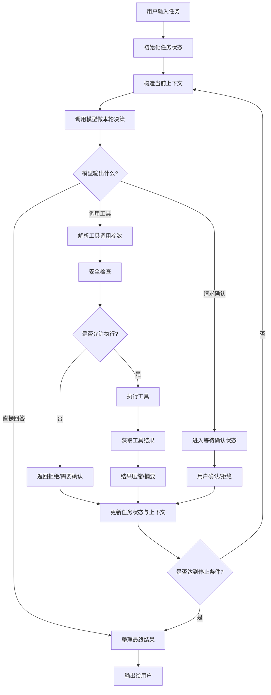
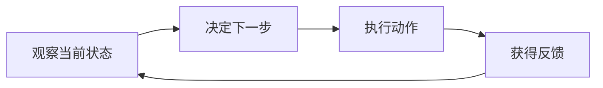
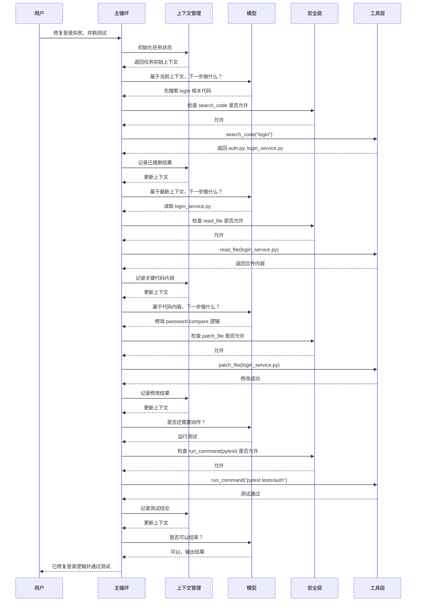
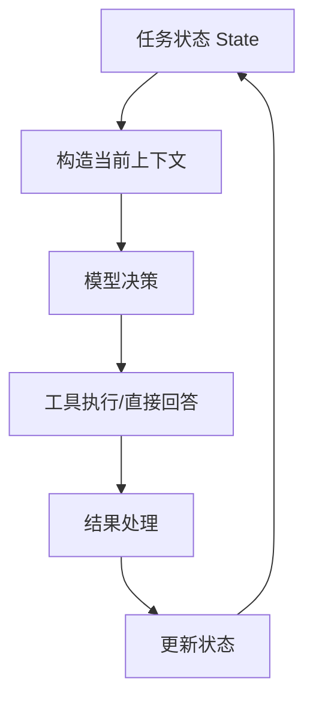
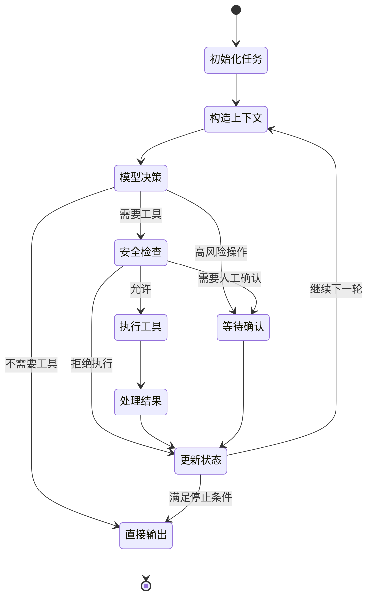
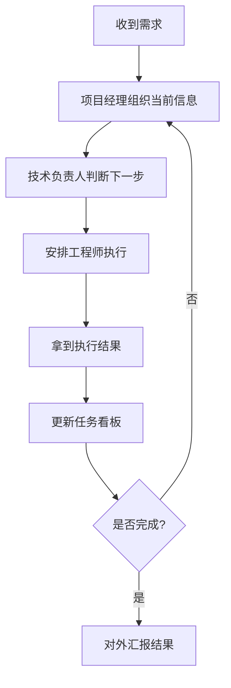
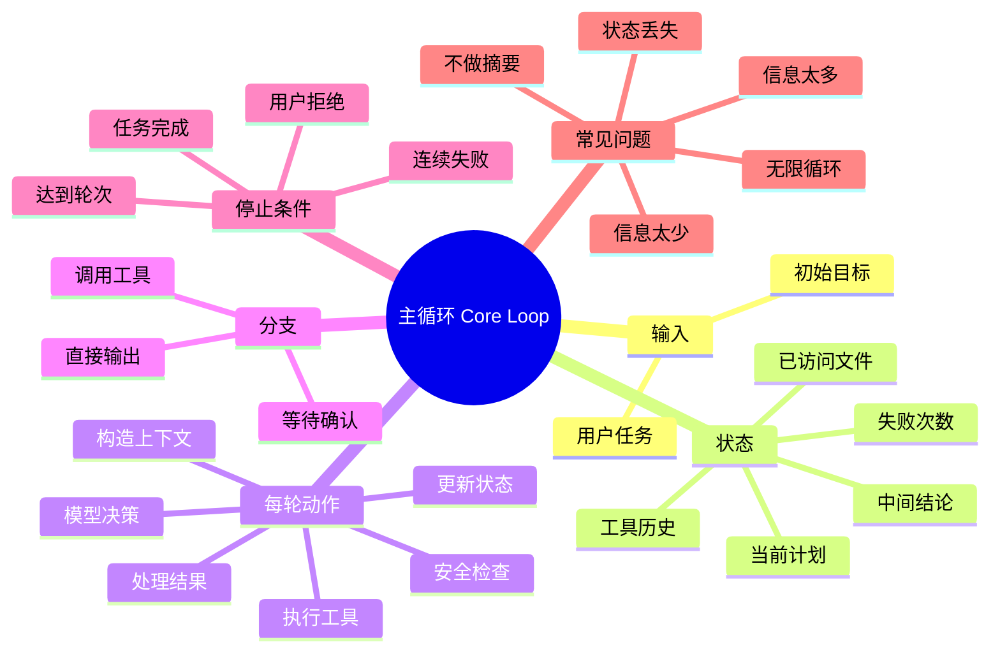

你这个理解，**相当好**，而且不是“背答案式理解”，是已经开始形成你自己的系统映射了。

尤其这句非常到位：

**“这和我们研发团队很像。”**

这说明你已经开始把 Agent 从“抽象概念”，转成“组织协作系统”来理解了。这个方向是对的。

------

# 先点评你的理解

## 你的类比，整体是成立的

我帮你稍微修正一下，会更准确：

### 你的版本

- 核心控制器 = 项目经理
- 模型决策层 = 产品经理 + 研发经理
- 工具层 = 码农
- 安全层 = 运维和安全
- 结果输出 = 软件产出

### 我帮你优化后的版本

- **交互层** = 客户 / 需求入口 / 工单入口
- **核心控制器** = 项目经理 / 总调度
- **模型决策层** = 技术负责人 + 分析负责人
- **工具层** = 研发工程师 / 测试工具 / 脚本工具
- **上下文管理层** = 文档库 / 会议纪要 / 项目知识库 / 当前任务看板
- **安全层** = 运维规范 / 权限系统 / 发布流程 / 安全审核
- **结果输出层** = 交付说明 + 改动结果 + 测试结果 + 最终发布物

也就是说：

**Agent 很像一个“超轻量数字研发团队”。**

这句话你可以记住。

------

# 再点评你对 3 个问题的回答

## 第 1 题

你答得对，而且抓住重点了：

> agent 是一整套流程和系统，模型只是其中一环

这句已经及格了。
再往上拔高一点，就是：

**模型提供“判断力”，Agent 提供“执行力”和“可持续性”。**

也就是说：

- 模型负责“想”
- Agent 负责“做”
- 护栏负责“别做错”

------

## 第 2 题

你说“代码索引最重要”，这个理解已经很接近了，但我帮你再纠正一下：

### 更准确的说法是：

**代码索引很重要，但上下文管理不只等于索引。**

上下文管理至少包含 4 件事：

1. 当前任务目标
2. 已经读过的关键信息
3. 工具执行结果
4. 历史决策与中间结论

索引只是帮助“找到信息”，
上下文管理是帮助“保住任务连续性”。

所以你可以升级成这句话：

**索引解决“找什么”，上下文管理解决“记什么、保留什么、下一步依据什么”。**

这个升级很关键。

------

## 第 3 题

你答得很准。

> 只属于智能问答，算是残缺版 coding agent

这个判断没问题。

我再帮你补一刀，让这个定义更锋利：

**不能改环境、不能改文件、不能执行验证的系统，本质上还停留在“代码顾问”阶段，不是完整 coding agent。**

这句话也记住。

------

# 你现在已经可以进入第 2 课了

这一课是整套系统最核心的一课。

因为上节课讲的是：

**Agent 由哪些模块组成。**

这节课讲的是：

**这些模块到底怎么转起来。**

也就是：

# 第 2 课：主循环是怎么工作的

一句话先告诉你答案：

**主循环 = Agent 的心脏。**

没有主循环，工具、上下文、模型，全都是散的。
有了主循环，它们才变成一个会持续干活的系统。

------

# 一、先看总流程图



------

# 二、先把这张图翻成人话

你可以把主循环理解成一个不断转动的圈：

### 第一步：接任务

用户提一个需求。

比如：

- 帮我修 bug
- 帮我加接口
- 跑测试看看哪里挂了

------

### 第二步：初始化状态

系统会生成一份“当前任务档案”。

里面至少会有：

- 当前目标是什么
- 当前已经执行了几轮
- 读过哪些文件
- 调过哪些工具
- 目前发现了什么问题
- 是否有待确认操作

这一步很像：

**项目启动，先开一个任务卡片。**

------

### 第三步：构造当前上下文

把这一轮最需要的信息喂给模型。

不是把全世界都喂进去，
而是只给“这一轮决策最需要的材料”。

例如：

- 用户目标
- 关键文件片段
- 上一轮工具结果
- 当前中间结论
- 当前可用工具列表

------

### 第四步：模型做本轮决策

模型这一轮不会“永远想完全部计划”，
它更多是在回答：

**“基于当前信息，我下一步最合理的动作是什么？”**

它可能输出三类东西：

1. 直接给结论
2. 调用某个工具
3. 请求用户确认高风险操作

------

### 第五步：如果要调工具，就先过安全层

系统不会盲目执行。

比如模型说：

- 删掉某个目录
- 跑危险 shell 命令
- 改系统配置
- git reset --hard

这时候就要：

- 拦截
- 确认
- 限制
- 或直接拒绝

------

### 第六步：执行工具

例如：

- read_file
- search_code
- patch_file
- run_command

工具跑完，返回结果。

------

### 第七步：结果不能原样全塞回去，要处理

比如：

- 命令输出太长要截断
- 错误日志太长要摘要
- 文件太大要只取关键片段
- 多次工具结果要压缩成重点

这一步非常关键。

因为：

**工具结果如果不处理，会把上下文撑爆。**

------

### 第八步：更新状态，再进入下一轮

系统把这一轮的结果写进任务状态里。

例如：

- 已经读过 auth.py
- pytest 报错在 line 83
- 登录失败和 password hash 有关
- patch 已经成功
- 已执行第 4 轮

然后继续下一轮。

------

### 第九步：满足停止条件时结束

什么时候停？

通常包括：

- 任务完成
- 模型认为无需再调用工具
- 达到最大轮次
- 连续失败过多
- 遇到无法自动继续的问题
- 用户拒绝高风险操作

------

# 三、你要先建立一个关键认知

## 主循环不是“计划一次然后执行完”

而是：

## **观察 → 决策 → 执行 → 再观察**

我给你画成最核心的小图。



这 4 步，就是 Agent 最本质的最小循环。

你以后看任何 Agent，都先问：

**它是不是在稳定地做这 4 件事？**

------

# 四、再看一个时序图：真实任务怎么一轮轮跑

场景：
用户说：“帮我修复登录失败问题，并跑一下测试。”



------

# 五、主循环里最重要的，不是“循环”两个字，而是“状态”

你现在可以把主循环理解成：

**一个不断读写状态的系统。**

所以更准确的结构其实是这样：



这张图非常关键。

因为很多新手以为：

> Agent = while循环 + 调模型

其实不够。

真正更像的是：

> Agent = 状态机 + 决策循环

------

# 六、我给你讲“任务状态”到底包含什么

一个成熟一点的 Agent，状态里往往至少有这些字段：

```text
TaskState
- user_goal                用户目标
- current_plan             当前阶段计划
- step_count               已执行轮次
- visited_files            已读/已改文件
- tool_history             工具调用历史
- observations             已发现事实
- pending_confirmation     是否有待确认操作
- failure_count            连续失败次数
- partial_results          中间结果
- final_answer             最终输出
- stop_reason              停止原因
```

你现在不用死记字段名。
你只要记住：

**Agent 每转一轮，不只是做事，还要“留下痕迹”。**

否则就会失忆。

------

# 七、我给你画成状态图，你会更直观



------

# 八、你可以把主循环类比成“项目周会机制”

这个类比你应该会很喜欢。



你会发现，这跟主循环几乎一模一样。

所以你现在可以记一句非常适合你的话：

**Agent 主循环，本质上就是“自动化项目推进机制”。**

------

# 九、主循环里最容易出问题的 5 个地方

## 1. 每轮给模型的信息太多

结果：

- token 爆炸
- 决策变慢
- 注意力分散

------

## 2. 每轮给模型的信息太少

结果：

- 失忆
- 决策跳跃
- 重复读文件
- 重复走路

------

## 3. 工具结果不做摘要

结果：

- 上下文被日志淹没
- 后面轮次越来越乱

------

## 4. 没有明确停止条件

结果：

- 无限循环
- 明明完成了还在折腾

------

## 5. 状态记录不完整

结果：

- 已经改过的文件又重新读
- 已经失败过的命令反复跑
- 做不到稳定续跑

------

# 十、你必须记住的 5 句话

## 第一句

**主循环是 Agent 的心脏，没有主循环，模块只是散件。**

## 第二句

**主循环的本质不是 while，而是“基于状态的持续决策”。**

## 第三句

**每一轮都要做 4 件事：看现状、定下一步、执行动作、记录结果。**

## 第四句

**上下文不是越多越好，而是每一轮都给“足够但不过量”的信息。**

## 第五句

**一个稳定 Agent，必须知道什么时候继续，什么时候停止。**

------

# 十一、这节课我给你一个思维导图，方便复盘



------

# 十二、给你一个小练习，这次更贴近理解

你按自己的话回答下面 3 个问题：

### 题 1

为什么我说“主循环的本质不是 while，而是状态驱动”？

### 题 2

如果每轮都把完整日志、完整文件、完整历史全塞给模型，会出什么问题？

### 题 3

如果一个 Agent 没有“停止条件”，现实里会发生什么？

你还是直接按 1、2、3 回我。

你回答完，我下一课就给你讲：

# 第 3 课：上下文工程

这节会非常关键，我会重点给你讲：

- 为什么上下文不是“越多越好”
- Claude Code 类系统为什么要裁剪、摘要、选片段
- 怎么理解“短期记忆”和“任务记忆”
- 一个 Agent 为什么会失忆、跑偏、瞎改

这节课会非常适合你。
