答得很好，而且你已经不是“听懂”，而是开始会**抓本质**了。

这次我先给你逐条点评，然后直接进入：

# 第 3 课：上下文工程

也就是——**Agent 为什么会失忆、跑偏、瞎改，以及怎么防。**

------

# 先点评你这 3 个回答

## 1）你说主循环不是 while，因为它要决策

这个回答是对的，而且抓到了关键：

你已经意识到，主循环不是“机械重复”，而是：

- 看当前状态
- 判断是否继续
- 决定下一步干什么
- 决定要不要压缩上下文
- 决定要不要等用户确认
- 决定要不要停止

所以更准确地说：

**while 只是外壳，状态决策才是灵魂。**

我给你画一个很小的对比图，你一下就明白了。

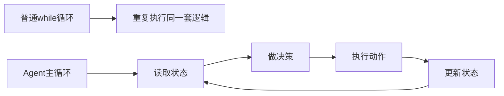

------

## 2）你说完整日志全塞进去会 token 爆炸、信息混乱

这个回答也是对的。

再补一层，你以后可以升级成这句话：

**上下文过多，不只是贵，还会让模型“注意力稀释”。**

也就是：

- 不只是花钱多
- 不只是慢
- 还会让模型抓不住重点

这很像一个人开会，桌上摆了 300 份材料，结果真正关键的那一页反而被淹没了。

------

## 3）你说没有停止条件会费用高、安全差、假循环

这个也答得很好。

再往上拔一层：

**没有停止条件的 Agent，不是更勤奋，而是不可控。**

这一句很重要。

因为一个真正商用的 Agent，核心不是“能一直干”，而是：

**知道什么时候该继续，什么时候该停。**

------

# 现在正式进入第 3 课

# 第 3 课：上下文工程

这一课非常关键。
你前面已经理解了：

- Agent 有很多模块
- 主循环是心脏

但真正决定 Agent 稳不稳定的，往往是这一层：

# **上下文管理**

一句话先给你结论：

**工具决定 Agent 能做什么，上下文决定 Agent 能不能持续做对。**

------

# 一、先看总图：上下文工程到底在干什么

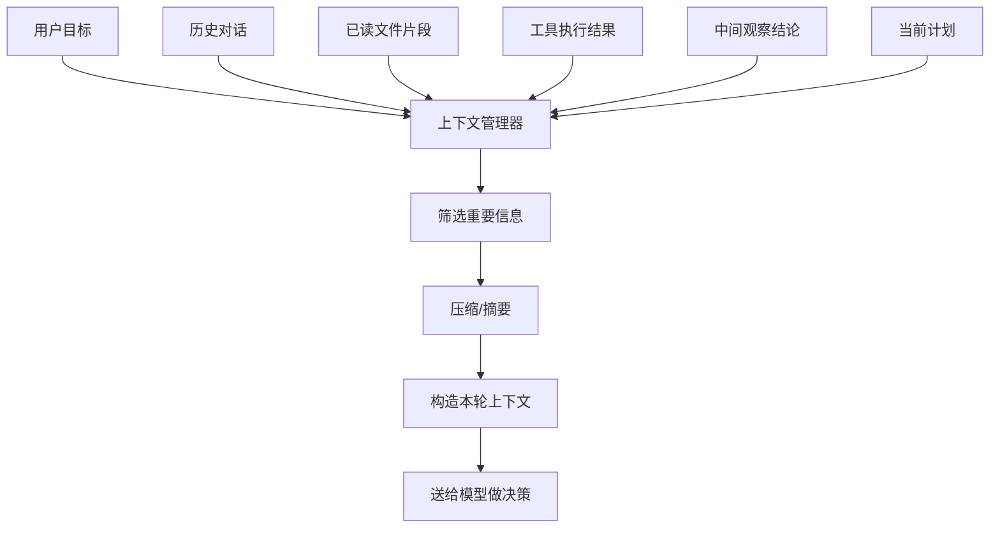

这张图表达的意思很简单：

模型每一轮做决策之前，**不是直接吃全部信息**，
而是先经过一个“上下文管理器”做 3 件事：

1. 选什么该带上
2. 什么该压缩
3. 这一轮该给模型看什么

------

# 二、你先记住：上下文不等于聊天记录

很多人最容易误解这一点。

他们会以为上下文就是：

- 用户说过什么
- 模型回过什么

但在 coding agent 里，上下文远远不止这些。

------

## 一个成熟的 Agent 上下文，至少包括这 6 类信息

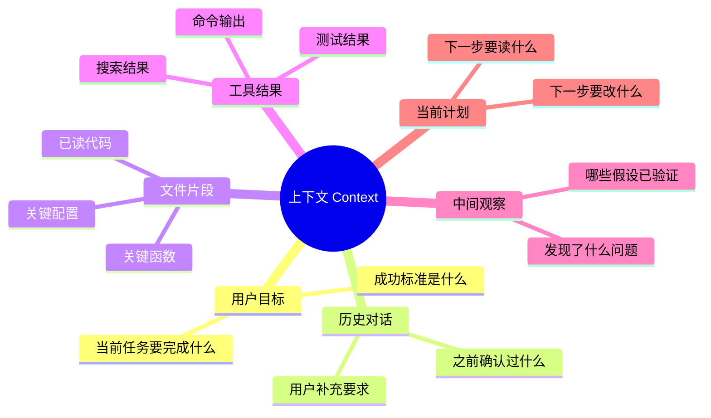

所以更准确的说法是：

**上下文 = 当前轮次决策所依赖的全部有效工作记忆。**

------

# 三、为什么 Agent 会失忆、跑偏、瞎改

我给你先上一个故障图。

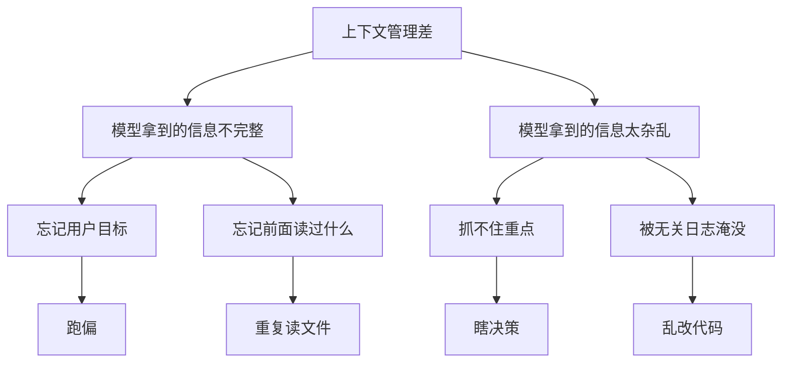

也就是说，Agent 出问题，很多时候不是模型太笨，
而是它这轮输入的“工作记忆”有问题。

------

# 四、上下文工程的核心矛盾：少了不行，多了也不行

这就是最核心的张力。

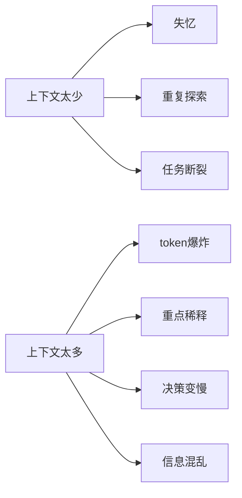

所以真正强的 Agent，不是“喂得越多越好”，
而是：

# **每一轮喂“刚刚好”的信息。**

------

# 五、你可以把上下文理解成“项目组当前会议材料”

这个类比非常适合你。

假设你现在是项目经理，要开一个 15 分钟问题排查会。

你不会把下面这些全甩给大家：

- 所有历史聊天记录
- 整个项目全部代码
- 所有构建日志
- 所有测试结果
- 过去半年所有需求变更

因为那样会议直接废掉。

你会只带：

- 当前问题描述
- 最相关的几个文件
- 最近一次测试报错
- 已确认过的结论
- 下一步准备做什么

这就是上下文工程。

------

## 画成团队类比图是这样

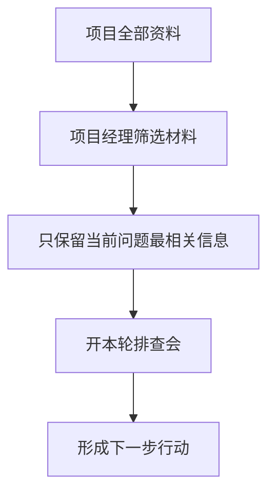

所以你可以记一句：

**上下文管理，本质上就是“给当前决策准备会议材料”。**

------

# 六、上下文通常分成 3 层

这个很重要，我建议你记下来。

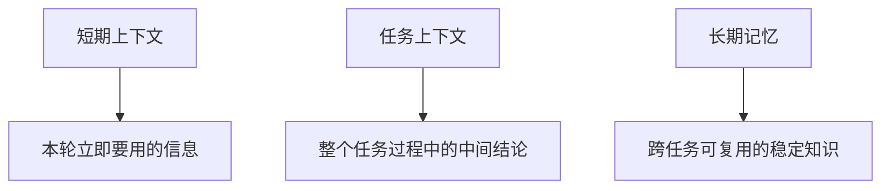

------

## 1）短期上下文

就是这一轮马上要用的信息。

例如：

- 用户这次的目标
- 当前要看的文件片段
- 上一条工具结果
- 当前这一步的局部计划

它的特点是：

- 新鲜
- 针对当前一步
- 更新很快

------

## 2）任务上下文

这是整个任务期间积累出来的工作记忆。

例如：

- 已经确认登录失败是 hash 比较问题
- 已经读过 auth.py 和 login_service.py
- pytest 在 tests/auth/test_login.py 失败
- 已经改过 compare_password 逻辑

这层很重要，因为它防止系统“前面干了啥都忘了”。

------

## 3）长期记忆

这是跨任务保留的稳定知识。

例如：

- 这个项目是 Spring Boot + MySQL
- 登录逻辑主要在 auth 模块
- 这个仓库测试命令是 `pytest -q`
- 某些目录不能动

Claude Code 这类系统更核心的是前两层。
长期记忆有价值，但不是今天最关键的重点。

------

# 七、我给你一个结构图，看三层记忆如何配合

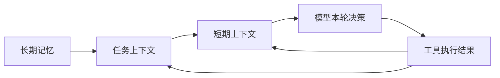

这张图很关键。

意思是：

- 长期记忆给任务层提供背景
- 任务层记录整个任务的推进情况
- 短期层负责本轮决策输入
- 每次工具结果回来，又反过来更新任务层和短期层

------

# 八、一个真实例子：修复登录失败时，上下文是怎么变化的

我们来走一遍。

用户说：

> 帮我修复登录失败问题

------

## 第 1 轮

系统刚开始，知道的很少。

### 短期上下文

- 用户目标：修复登录失败
- 当前动作：先搜索 login 相关代码

### 任务上下文

- 暂无明确结论
- 暂无已读文件

------

## 第 2 轮

搜索完了，知道了相关文件。

### 短期上下文

- 搜索结果：auth.py, login_service.py
- 当前动作：读取 login_service.py

### 任务上下文

- 已知登录逻辑相关文件可能在 auth.py / login_service.py

------

## 第 3 轮

读完文件后，发现 password compare 逻辑可疑。

### 短期上下文

- login_service.py 关键片段
- 当前动作：检查 compare_password 分支

### 任务上下文

- 已读 login_service.py
- 可疑点：password hash compare

------

## 第 4 轮

修改后跑测试。

### 短期上下文

- patch 成功
- 当前动作：执行 pytest tests/auth

### 任务上下文

- 已修改 compare_password
- 待验证：测试是否通过

------

## 第 5 轮

测试通过。

### 短期上下文

- 测试结果：通过
- 当前动作：整理结果输出

### 任务上下文

- 问题定位完成
- 修改完成
- 验证完成

------

## 这整个变化，我画成图给你看

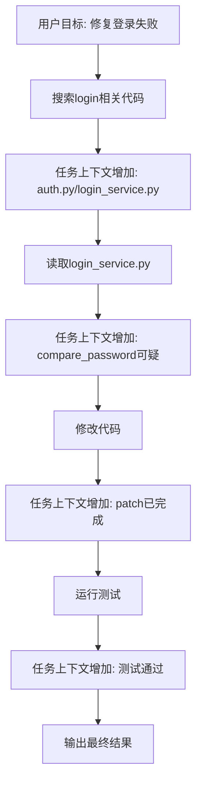

你会发现：

**上下文不是一开始就全有，而是随着任务推进不断长出来。**

------

# 九、所以，上下文管理器到底要干哪些活

这是非常核心的一张图。

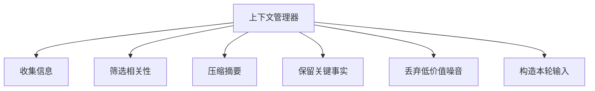

也就是说，一个好的上下文管理器，不是仓库管理员，
而是：

# **信息编辑部**

它不是把东西全堆着，
而是要判断：

- 什么是关键事实
- 什么只是临时噪音
- 什么该带到下一轮
- 什么该压缩成一句话
- 什么已经可以扔掉

------

# 十、Agent 为什么会“瞎改”

这块你一定要吃透，因为 coding agent 最大风险之一就是这个。

## 瞎改通常不是因为它“想害你”

而是因为它缺了这些信息之一：

- 不知道真正目标是什么
- 不知道前面已经验证过什么
- 不知道这个函数在别处也被依赖
- 不知道改动边界在哪里
- 不知道哪些目录不该动

也就是：

**不是它不会改，而是它拿到的上下文不够准。**

------

## 我给你画成因果图

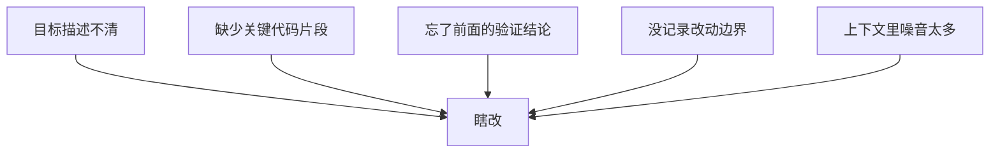

------

# 十一、上下文工程的 5 个核心动作

这是今天最重要的知识点之一。

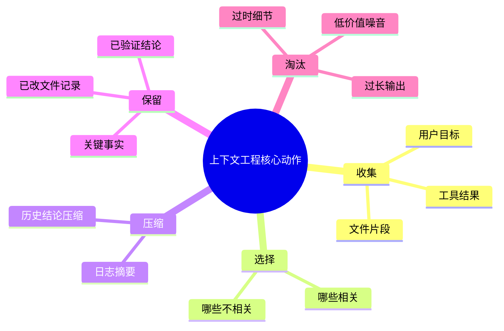

这 5 个动作分别是：

## 1. 收集

把候选信息先拿到。

## 2. 选择

找出当前轮次最有用的部分。

## 3. 压缩

把太长的内容变成要点。

## 4. 保留

把关键事实留在任务记忆里。

## 5. 淘汰

把不重要的噪音扔掉。

------

# 十二、再给你一张时序图：上下文管理到底插在哪

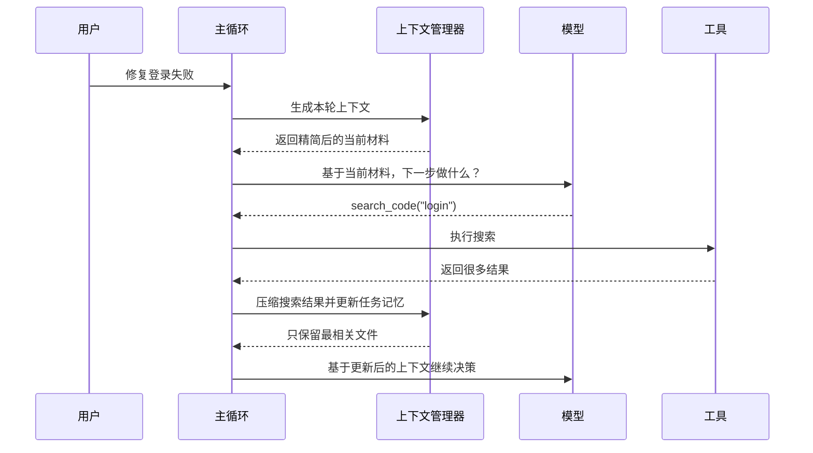

你看，上下文管理器不是可有可无，
它几乎每一轮都在中间插着。

------

# 十三、你今天必须记住的 6 句话

## 第一句

**上下文不是聊天记录，而是当前决策所需的全部有效工作记忆。**

## 第二句

**上下文太少，Agent 会失忆；上下文太多，Agent 会混乱。**

## 第三句

**强 Agent 不是知道得最多，而是每一轮拿到最合适的信息。**

## 第四句

**索引解决“找到什么”，上下文管理解决“记住什么、带什么、丢什么”。**

## 第五句

**任务记忆比很多人想象中更重要，它决定 Agent 能不能连续推进。**

## 第六句

**很多瞎改，不是因为模型坏，而是因为上下文错。**

------

# 十四、我给你一个复盘总图

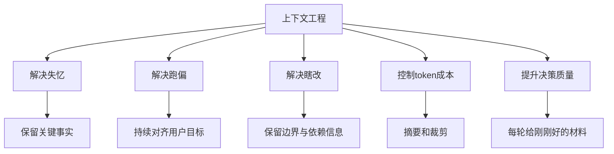

------

# 十五、这节课给你的练习

你继续按 1、2、3 回答就行。

### 题 1

为什么说“索引”和“上下文管理”不是一回事？

### 题 2

为什么上下文太多，也会导致 Agent 变笨？

### 题 3

如果一个 Agent 只会把工具结果原样堆进历史里，不做筛选和摘要，长期会出什么问题？

你答完以后，我下一课给你讲：

# 第 4 课：工具系统

我会带你彻底吃透：

- 为什么工具不是“插件”，而是 Agent 的手脚
- read_file / search / patch / run_command 各自解决什么问题
- 工具设计不好，为什么 Agent 会变蠢
- 一个好工具接口应该长什么样

这节会非常贴近 Claude Code 这类系统。
