很好，这次你已经明显进入状态了。

而且你不是在“记术语”，你是在用自己的语言重新组织知识，这才是真的在学。

我先给你批改一下，然后直接进入：

# 第 4 课：工具系统

也就是——**为什么工具不是外挂，而是 Agent 的手和脚。**

------

# 先点评你这 3 个回答

## 1）索引和上下文管理不是一回事

你答对了，而且方向很准。

你说：

- 索引更像代码编号、定位
- 上下文管理还包括摘要、剪裁、边界、目标对齐

这个理解已经很好了。

我帮你把它再升级成一句更专业、但依然好懂的话：

**索引负责“找得到”，上下文管理负责“带得对”。**

也就是：

- 索引解决检索问题
- 上下文管理解决决策输入问题

我给你画个小图：

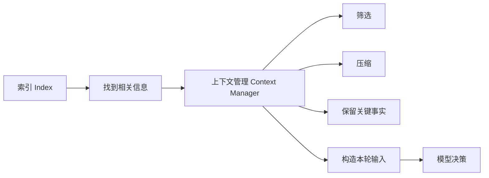

------

## 2）上下文太多会让注意力分散

这个回答是对的。

再拔高一点：

**上下文太多，不只是“分散注意力”，还会让模型的判断边界变模糊。**

比如它会开始分不清：

- 当前最重要的问题是什么
- 哪个报错才是主因
- 哪个文件才是当前该改的
- 哪些历史信息已经过时了

------

## 3）只会堆工具结果，不做摘要会怎样

你答得对，但我给你补全一点。

长期看会出现 4 个问题：

- token 成本越来越高
- 注意力越来越分散
- 历史污染越来越严重
- 主循环会越来越迟钝

所以更准确地说：

**不会做摘要的 Agent，不是记忆力强，而是信息囤积症。**

这句话你可以记住。

------

# 现在正式进入第 4 课

# 第 4 课：工具系统

这一课是 Claude Code 这类系统最关键的落地点之一。

因为前面我们已经知道：

- 模型会决策
- 主循环会推进
- 上下文会管理

但问题是：

# **它到底靠什么“动手”？**

答案就是：

# **工具系统**

一句话先给你结论：

**模型负责想，工具负责做。**

没有工具，Agent 再聪明，也只能当顾问。
有了工具，Agent 才能从“建议者”变成“执行者”。

------

# 一、先看总图：工具系统在 Agent 里处于什么位置

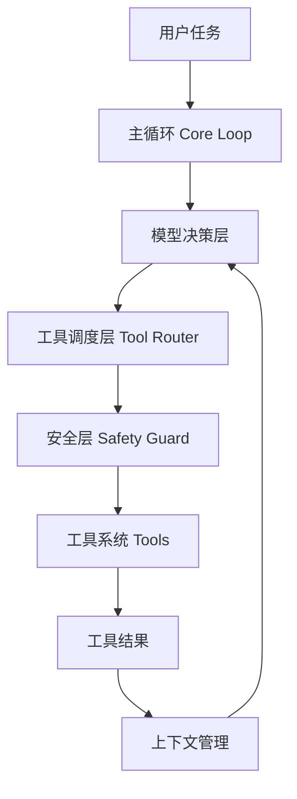

这张图你要看明白一个重点：

**工具不是模型直接乱调的。**

正常顺序是：

1. 模型先决定下一步
2. 调度层把决定翻译成工具调用
3. 安全层先检查
4. 才真正执行工具
5. 工具结果再回流到上下文和下一轮决策

所以工具系统是被纳入主循环里的，不是外接插件随便挂一挂。

------

# 二、为什么说工具不是插件，而是手和脚

你可以这样理解：

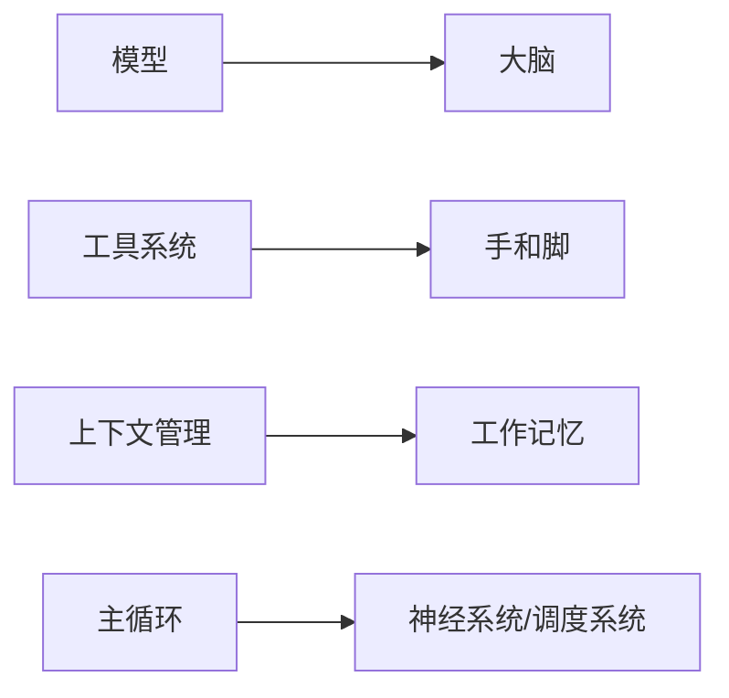

这个类比很重要。

因为很多人以为：

> 工具 = 给模型装几个插件

这个理解太浅了。

更准确的说法是：

- 模型像大脑，负责判断
- 工具像四肢，负责执行
- 主循环像神经系统，负责协调
- 上下文像工作记忆，负责维持连续行动

所以你可以记一句：

# **没有工具的 Agent，不是残废，但只能动嘴。**

------

# 三、Coding Agent 最核心的 4 类工具

这一点非常重要，你先看全景图。

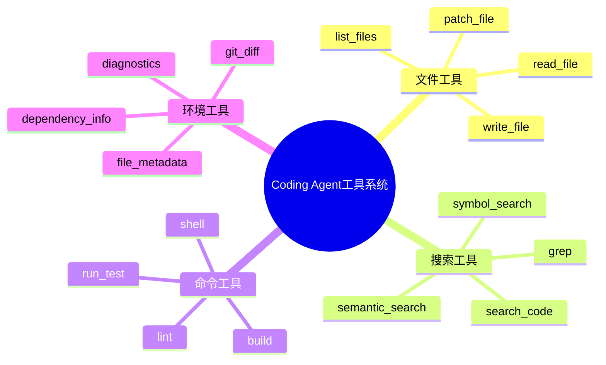

Claude Code 这类系统，不管实现细节怎么变，核心通常都绕不开这 4 大类。

------

# 四、第一类：文件工具

这是最基础的。

## 它解决的问题是：

**Agent 必须能看到文件、读懂文件、改动文件。**

没有文件工具，Agent 连代码长什么样都不知道。

------

## 文件工具典型成员

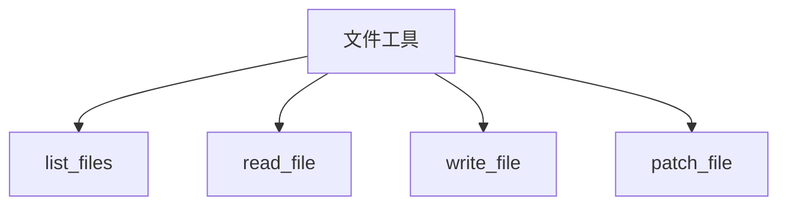

------

## 每个工具是干什么的

### 1. list_files

列出目录结构。

作用：

- 看项目长什么样
- 确认模块位置
- 判断该从哪里入手

------

### 2. read_file

读取文件内容。

作用：

- 看具体实现
- 理解函数逻辑
- 找 bug 原因

------

### 3. write_file

直接覆盖文件。

作用：

- 新建文件
- 小型生成任务

但它风险比较高，因为容易整文件覆盖。

------

### 4. patch_file

局部修改文件。

作用：

- 改一个函数
- 改一段逻辑
- 尽量少动其它内容

这比 write_file 更适合 coding agent。

------

## 文件工具流程图

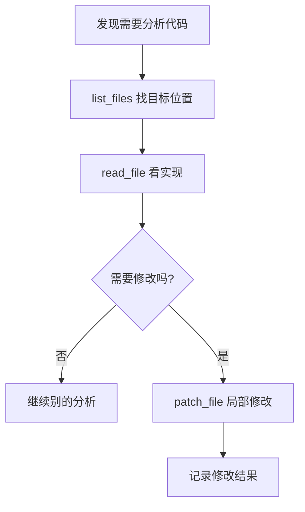

------

# 五、第二类：搜索工具

这类工具你一定要重视。

因为真实项目不是玩具 demo，
Agent 不可能靠盲读整个项目。

它必须先“找”。

------

## 搜索工具解决的问题是：

**在大项目里快速缩小范围。**

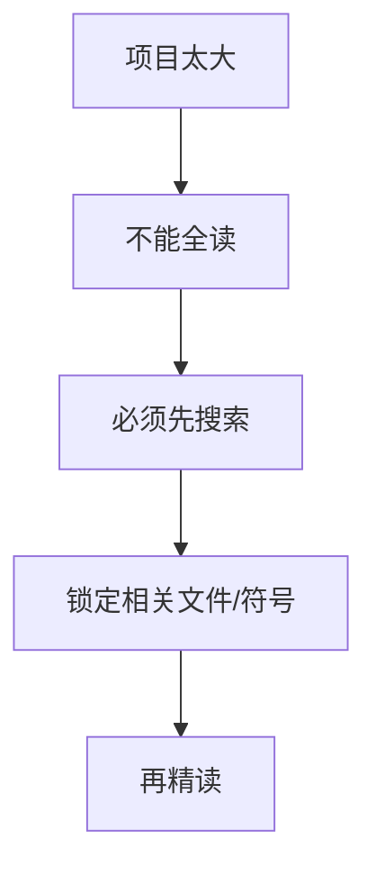

------

## 典型搜索工具

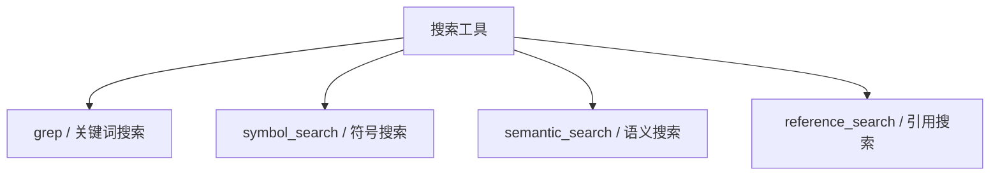

------

## 各自的区别

### 1. grep / 关键词搜索

比如搜 `login`、`auth`、`password`。

适合：

- 先粗定位
- 快速排查字符串、配置、日志关键词

------

### 2. symbol_search

按函数名、类名、变量名找。

适合：

- 查 `LoginService`
- 查 `comparePassword`
- 查某个接口定义

------

### 3. semantic_search

按语义搜。

适合：

- 用户不会说准确函数名
- 想找“处理登录校验的地方”
- 想找“生成 token 的逻辑”

------

### 4. reference_search

看谁调用了它、它依赖谁。

适合：

- 分析影响面
- 避免改一个地方炸一片

------

## 搜索工具的工作方式

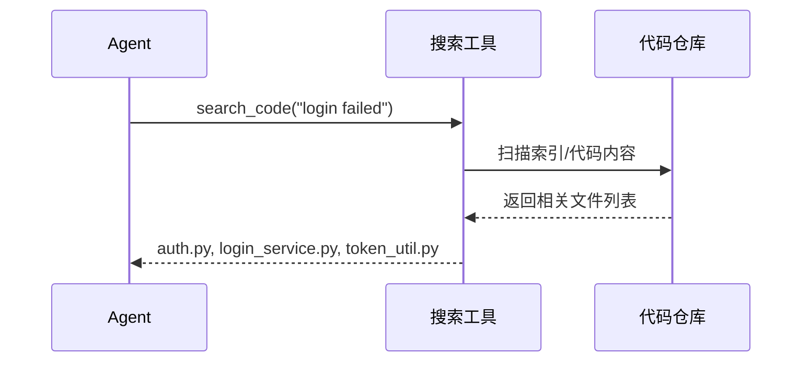

你可以记一句：

# **搜索工具不是锦上添花，而是大项目里的第一入口。**

------

# 六、第三类：命令工具

这类工具决定 Agent 能不能真正验证自己的修改。

因为你不能只改，不验证。

------

## 命令工具解决的问题是：

**把“我觉得改对了”变成“我证明改对了”。**

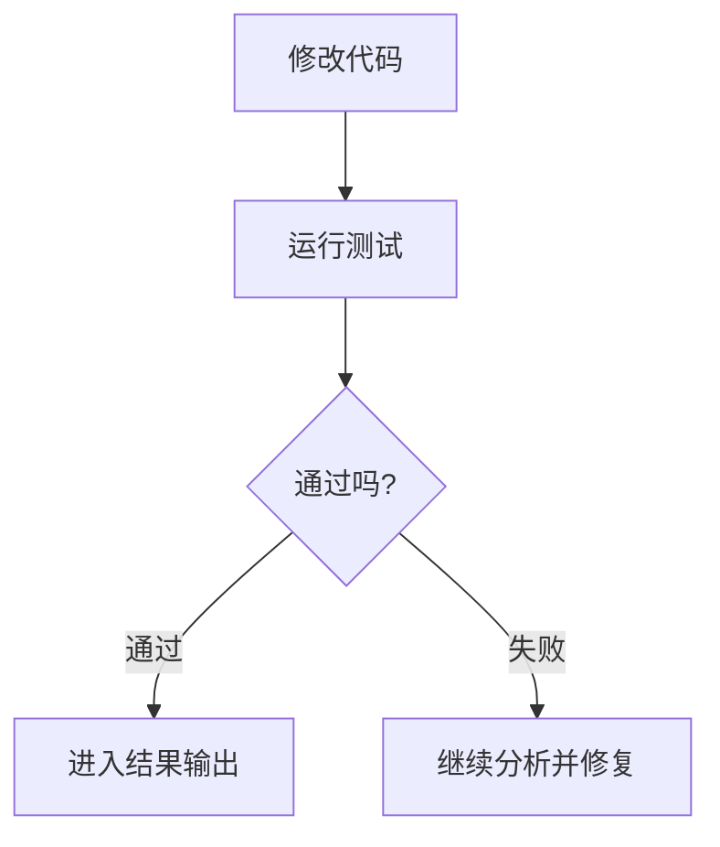

------

## 典型命令工具

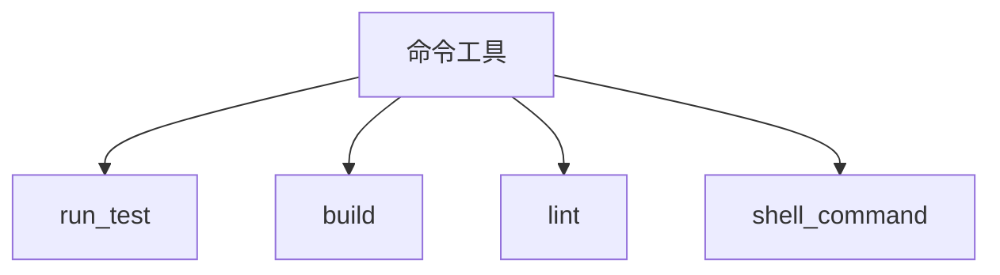

------

## 各自作用

### 1. run_test

跑测试。

作用：

- 验证 bug 是否修复
- 验证是否引入回归

------

### 2. build

跑构建。

作用：

- 检查语法
- 检查依赖和打包流程

------

### 3. lint

跑静态检查。

作用：

- 风格问题
- 明显错误
- 规范检查

------

### 4. shell_command

执行通用命令。

作用：

- 查环境
- 执行脚本
- 做自动化操作

但它风险也最大，所以必须重点受安全层控制。

------

## 命令工具时序图

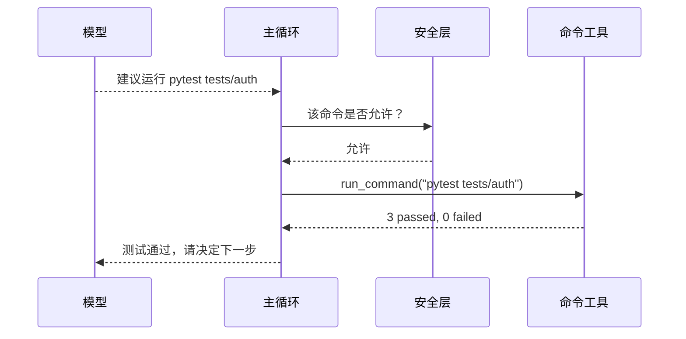

------

# 七、第四类：环境工具

很多人会低估这一类。

但生产级 agent 往往离不开它。

因为 Agent 不只是改代码，还要理解当前工程环境。

------

## 环境工具解决的问题是：

**让 Agent 看到“代码之外”的工程状态。**

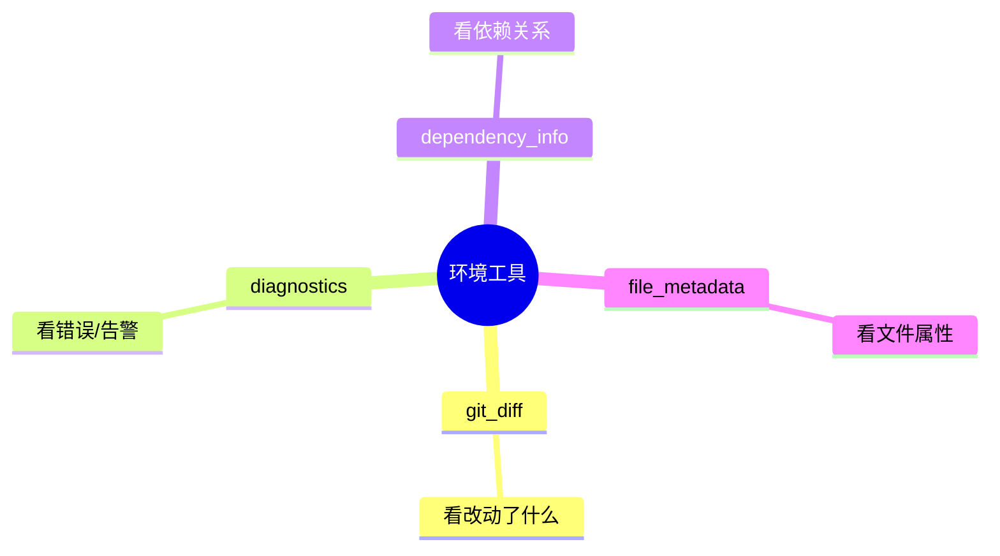

------

## 例如：

### git_diff

告诉 Agent：

- 改了哪些文件
- 哪几行被改了
- 改动范围大不大

------

### diagnostics

告诉 Agent：

- 哪些文件有报错
- 报错在第几行
- 类型是什么

------

### dependency_info

告诉 Agent：

- 当前模块依赖谁
- 改动会不会影响别的模块

------

### file_metadata

告诉 Agent：

- 文件大小
- 路径
- 修改时间
- 类型

------

# 八、为什么一个工具系统设计不好，Agent 会变蠢

这一点很重要。

不是“有工具就够了”，
而是工具本身设计得好不好，直接决定 Agent 好不好用。

------

## 先看坏工具长什么样

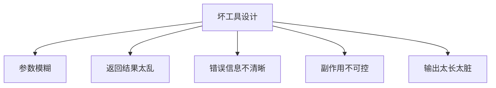

这会导致：

- 模型不会正确调用
- 工具结果难以进入下一轮上下文
- 失败时不知道怎么恢复
- 安全层也不好做控制

------

## 例如一个差的工具接口

```text
do_something(input: string) -> string
```

这个就很差，因为：

- `input` 是什么不清楚
- 返回的 `string` 是什么不清楚
- 出错怎么办不清楚
- 作用边界不清楚

------

## 一个更好的工具接口，应该像这样

```text
patch_file(
  file_path: string,
  target_range: LineRange,
  replacement: string
) -> {
  success: boolean,
  diff_summary: string,
  error_message?: string
}
```

你看区别就出来了：

- 参数明确
- 修改范围明确
- 返回结构明确
- 错误可处理

------

# 九、好工具接口的 5 个特征

这张图你要记住。

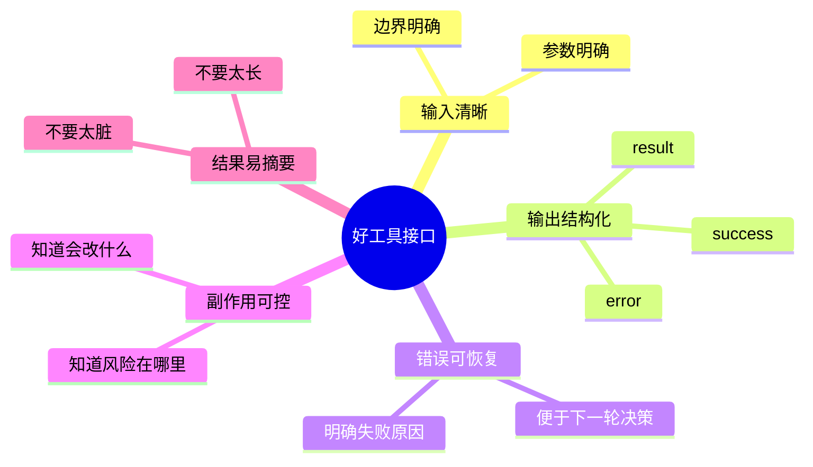

------

# 十、为什么 patch_file 往往比 write_file 更适合 Agent

这个你要吃透，因为很关键。

## write_file 的问题

- 容易整文件覆盖
- 风险大
- 上下文要求更高
- 一不小心把别人的代码冲掉

## patch_file 的优势

- 局部改动
- 更符合“最小修改原则”
- diff 更清晰
- 更容易回滚
- 更容易审查

------

## 画成对比图是这样

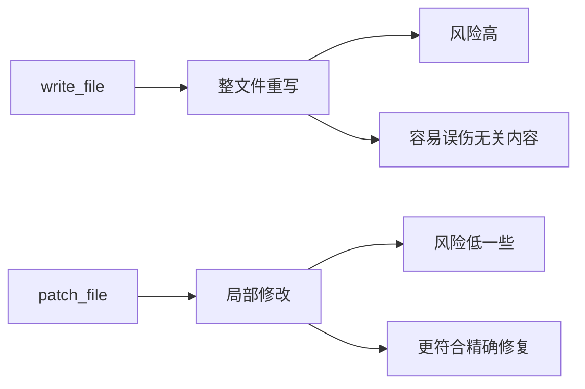

所以你可以记一句：

# **生产级 coding agent 更偏爱 patch，而不是整文件重写。**

------

# 十一、工具系统在一次真实修 bug 里怎么配合

我们走一遍完整链路。

场景：修登录失败。

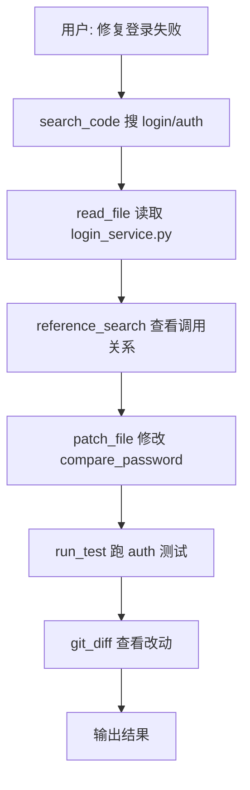

你会发现，这不是一个工具干到底，
而是多种工具组合成一个闭环。

------

# 十二、再给你一张时序图：模型怎么驱动多工具协作

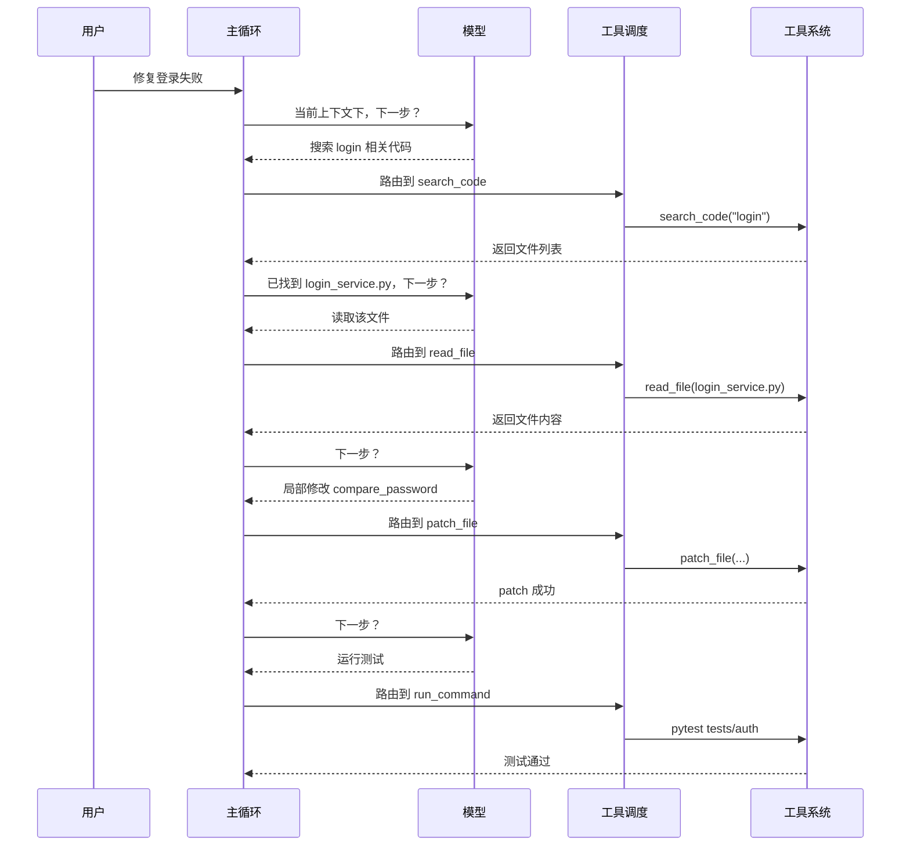

------

# 十三、你今天必须记住的 6 句话

## 第一句

**工具不是外挂，而是 Agent 的执行器官。**

## 第二句

**没有工具的 Agent 只能建议，有工具的 Agent 才能动手。**

## 第三句

**搜索工具解决“从哪里开始”，文件工具解决“具体看什么和改什么”。**

## 第四句

**命令工具解决“怎么验证我改对了”。**

## 第五句

**好工具不是能用就行，而是要让模型“容易调用、容易理解结果、容易恢复失败”。**

## 第六句

**生产级 coding agent 通常更偏爱局部 patch，而不是整文件重写。**

------

# 十四、给你一个本课总复盘图

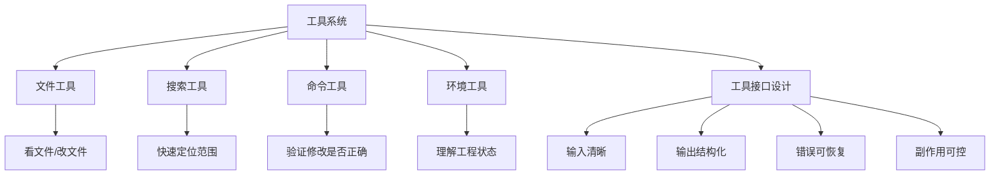

------

# 十五、这节课给你的练习

你继续按 1、2、3 回答就行。

### 题 1

为什么说搜索工具在大项目里不是辅助功能，而是第一入口？

### 题 2

为什么 `patch_file` 往往比 `write_file` 更适合生产级 coding agent？

### 题 3

一个“好工具接口”最重要的特征是什么？你用自己的话说。

你答完以后，我下一课给你讲：

# 第 5 课：安全层与护栏

这节会带你吃透：

- 为什么 Agent 越强，越需要护栏
- 高风险命令为什么不能让模型直接跑
- 用户确认、目录限制、失败停止为什么是主结构
- Claude Code 这类系统为什么不可能没有安全层

这节会非常关键，因为很多人学 Agent 时最容易忽略这一层。
