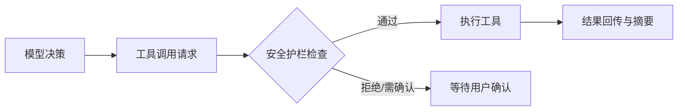

# 第 5 课：安全层与护栏

这一课基于你的主线内容整理，补齐了目录中缺失的“第 5 课”核心知识。

## 一、为什么安全层不是可选项

- Agent 一旦能调用工具，就具备真实执行能力。
- 真实执行能力如果没有边界，会直接变成风险放大器。
- 所以安全层不是附加模块，而是主链路必经节点。

## 二、安全层的目标

- 阻止高风险动作被误触发。
- 把不可逆操作改成“可确认、可追溯、可回滚”。
- 在效率和安全之间建立可配置平衡。

## 三、常见护栏机制

1. 权限分级：读、写、执行、外网、系统级操作分级授权。
2. 敏感命令拦截：删除、覆盖、批量改动前必须二次确认。
3. 作用域限制：只能在指定工作目录内修改。
4. 执行前预览：先给 diff，再执行。
5. 失败兜底：异常时自动停止并给出恢复建议。

## 四、在主循环中的位置

## 五、你要记住的核心句

**高能力工具必须配高约束护栏，否则稳定性和可控性都不成立。**

## 六、实践检查清单

- 高风险动作是否可拦截。
- 是否支持“执行前可预览”。
- 是否有失败后的可恢复路径。
- 是否记录了可审计日志。

