好，我们继续。

前面我们已经把：

- 架构
- 主循环
- 上下文
- 工具
- 安全
- OpenClaw / Claude Code 对照

都串起来了。

现在进入一个**真正贴近 coding agent 核心难点**的话题：

# 第 6 课：文件修改机制

也就是——**为什么“改老代码”比“生成新代码”难得多。**

这节课你吃透以后，你会真正理解：

- 为什么 Claude Code 这类 agent 不只是“会写代码”
- 为什么 patch / diff / 回滚 / 预览 这么重要
- 为什么生产级 agent 一定追求 **最小改动原则**
- 为什么很多 agent 看起来会写，但一进真实项目就容易瞎改

------

# 一、先给你一句总结论

# **生成代码，考验的是创造；修改老代码，考验的是约束下的精准手术。**

这两者不是一个难度级别。

我先给你上总图。

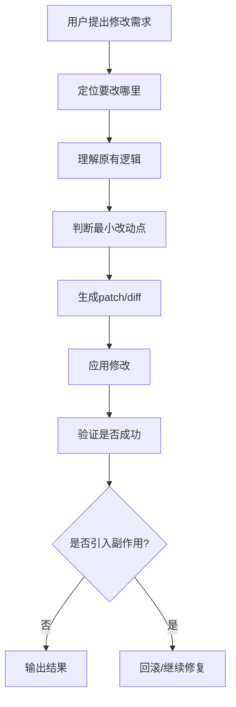

你先看这张图的感觉：

**真正难的不是“写出一段新代码”，而是“在不破坏原系统的前提下，只改该改的那一点”。**

------

# 二、为什么修改老项目，比从零写代码难

我先给你画一个对比图。

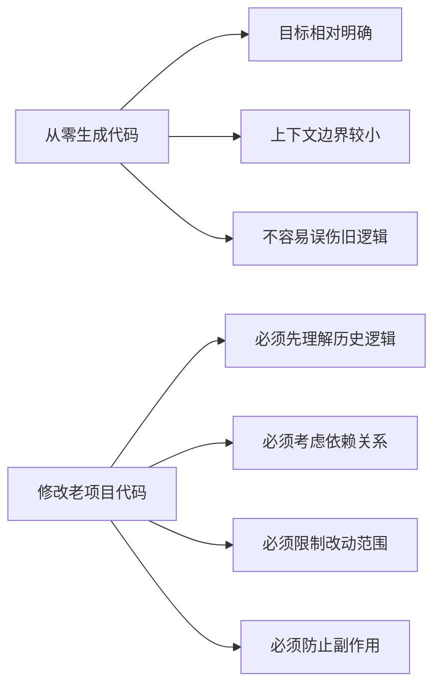

### 为什么难？

因为老项目不是白纸。

它已经有：

- 既有逻辑
- 调用链
- 配置依赖
- 历史兼容
- 隐式假设
- 团队编码风格
- 可能还有屎山

所以 agent 不能像写 demo 一样：

> “我觉得这样更优雅，我给你重写一下。”

真实项目里最怕的就是这个。

------

# 三、在 coding agent 里，“修改”到底包含哪几步

很多人以为修改就是：

- 找到文件
- 改一段
- 完事

其实不是。

真正完整的修改链路通常是这样的：

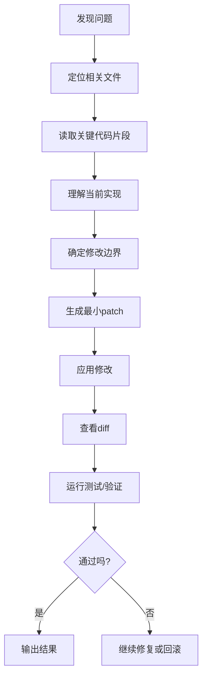

你会发现，这不是“写代码能力”的问题，
而是“**受控变更能力**”的问题。

------

# 四、为什么“最小改动原则”这么重要

这是这一课最核心的思想之一。

## 什么叫最小改动原则？

就是：

# **只改为完成当前目标所必须改动的最小范围。**

不是越改越爽，不是顺手优化，不是重构半个模块。

------

## 我给你画个图

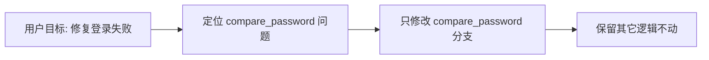

### 为什么它重要？

因为它可以降低 4 个风险：

1. 误伤无关代码
2. 引入新 bug
3. 增大审查成本
4. 让回滚变困难

------

## 对比图你会更直观

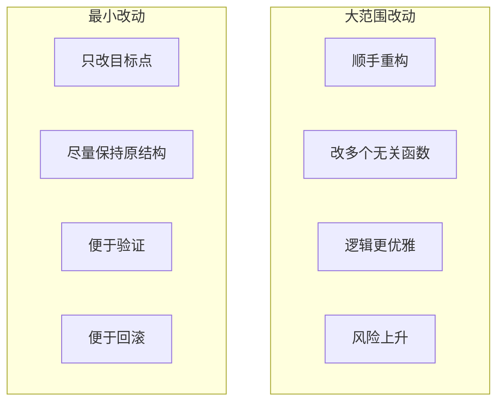

所以你可以记一句：

# **生产级 coding agent 追求的不是“写得最漂亮”，而是“改得最稳”。**

------

# 五、为什么 patch 比“整段重写”更重要

前面我们讲过 patch 比 write_file 更适合生产级 agent，这一课要更深入一点。

## patch 的本质是什么？

不是“改文件”那么简单，
而是：

# **把一次修改表达成“针对某个局部的、可审查的、可回滚的差异”。**

------

## patch 和整文件重写对比

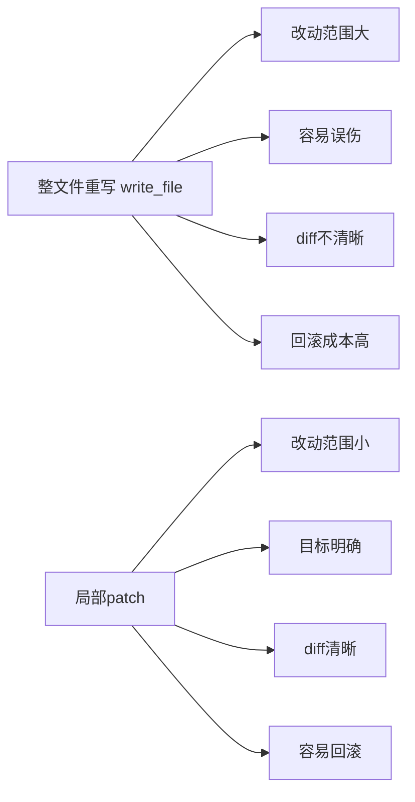

所以 patch 适合真实项目的根本原因不是“更高级”，
而是它天然符合真实工程要求：

- 可解释
- 可比较
- 可审核
- 可撤销

------

# 六、diff 为什么这么重要

你一定要把 diff 当成一个独立能力来看。

因为 agent 改完之后，不是直接就算完成。
还要看：

- 到底改了什么
- 改动有没有超边界
- 是否误改了别的地方
- 这次改动是否容易理解

------

## diff 的作用图

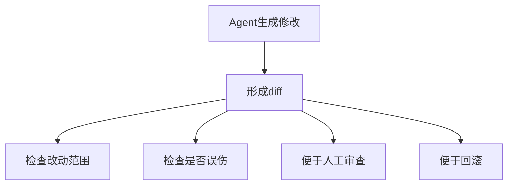

所以 diff 在 agent 体系里，不只是展示层，
它实际上承担了：

# **修改可见化**

你可以记一句：

**没有 diff 的修改，就像医生做完手术却不给手术记录。**

------

# 七、回滚为什么关键

这也是很多人学 agent 时容易忽略的点。

只会改，不会撤，是不够的。

因为真实世界里你永远会遇到：

- 改完测试失败
- 改完引入副作用
- 改完用户说不是这个意思
- 改动范围超了
- patch 应用不对

------

## 回滚流程图

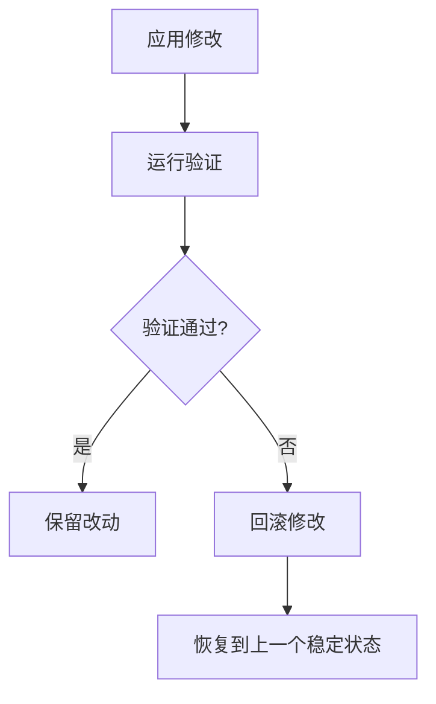

所以成熟 agent 一定要考虑：

- 怎么记录变更前状态
- 怎么识别本次改动
- 怎么恢复旧版本
- 怎么撤销局部 patch

你可以记一句：

# **回滚能力不是补丁，是修改能力的一半。**

------

# 八、为什么 agent 在老项目里容易“瞎改”

这部分很关键。

不是 agent 故意瞎搞，
而是因为修改这件事天然要求更高的约束能力。

常见原因有这些：

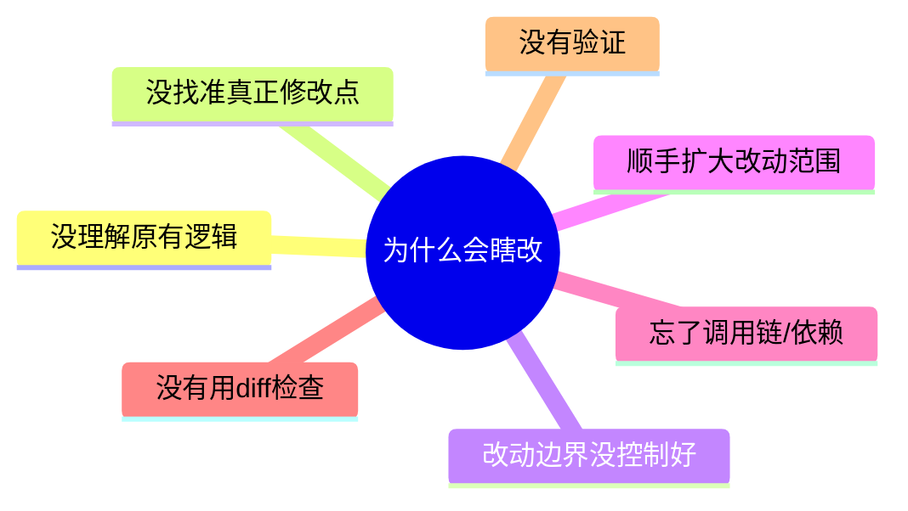

### 举个例子

用户说：

> 修复登录失败

坏 agent 可能会：

- 改登录函数
- 顺手改 token 生成
- 顺手改异常处理
- 顺手改配置
- 顺手重构 auth 模块

这就叫瞎改。

好 agent 应该先问自己：

- 真正 bug 点在哪
- 只改这里能不能解决
- 哪些部分绝对不该碰

------

# 九、我给你一个真实修改链路的时序图

场景：修复登录失败。

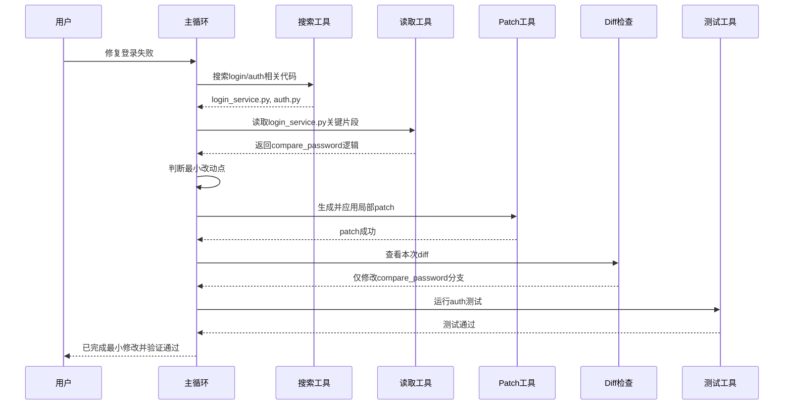

你会发现，一个成熟的修改流程里，
至少包含：

- 找
- 读
- 判断边界
- patch
- diff
- 验证

而不是“直接写”。

------

# 十、文件修改机制的 4 个核心目标

你把这一张图记住，就很值了。

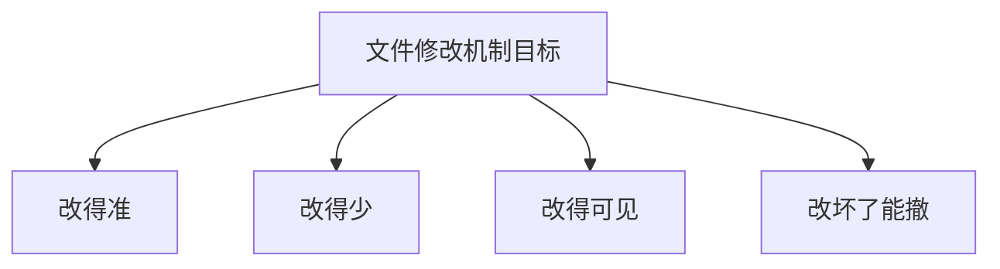

翻成人话就是：

## 1. 改得准

改到真正问题点。

## 2. 改得少

尽量小范围。

## 3. 改得可见

用 diff 能清楚看到变化。

## 4. 改坏了能撤

支持回滚。

------

# 十一、为什么“局部改对”比“从零生成”更难

我再单独给你上一张图。

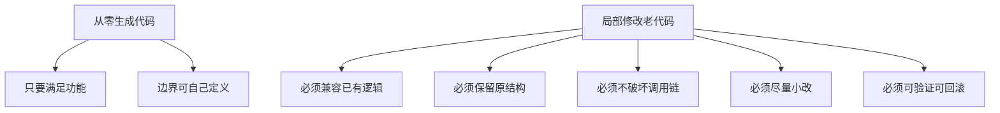

所以一个 coding agent 真正厉害，不是它能生成多长的代码，
而是它能不能做到：

# **少改、改准、不破坏。**

这 6 个字非常重要。

------

# 十二、从团队协作角度类比，你会更懂

这个类比你肯定喜欢。

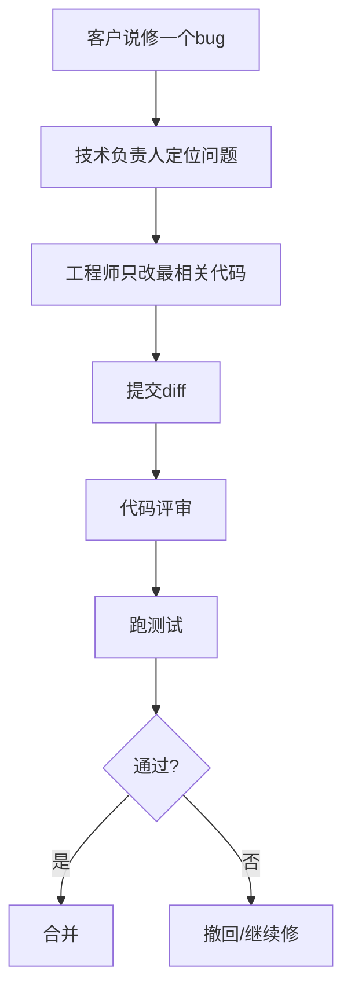

这其实就是 agent 在做的事情。

所以你可以记一句：

# **优秀 coding agent 的修改流程，本质上像一个自动化的小型代码评审与修复流程。**

------

# 十三、如果没有好的文件修改机制，会发生什么

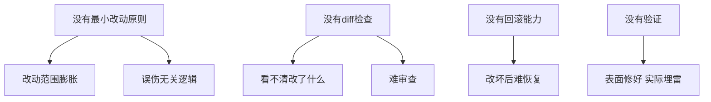

所以文件修改机制，其实是 coding agent 能否进入生产环境的关键门槛之一。

------

# 十四、这一课最核心的思维导图

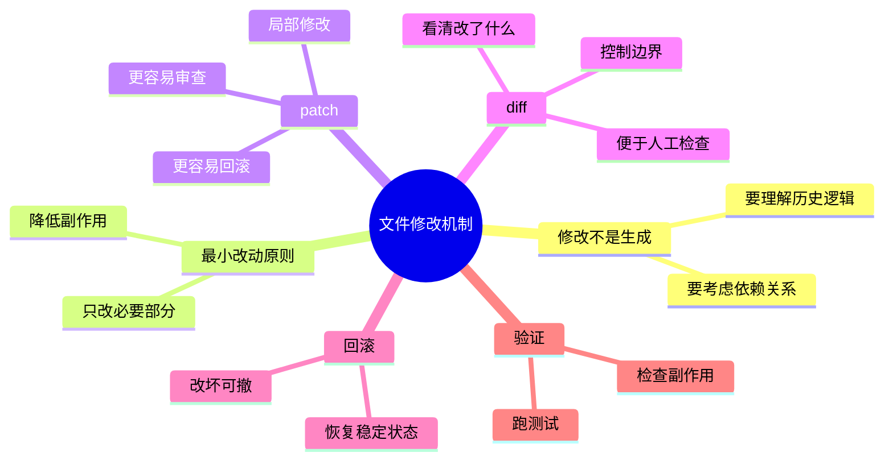

------

# 十五、你今天必须记住的 6 句话

## 第一句

**生成代码不等于修改代码，修改老项目要求更高的约束能力。**

## 第二句

**生产级 coding agent 追求的不是“写得最漂亮”，而是“改得最稳”。**

## 第三句

**最小改动原则就是：只改完成当前目标所必须改动的最小范围。**

## 第四句

**patch 的价值不只是改文件，而是把修改变成可审查、可回滚的差异。**

## 第五句

**diff 让修改变得可见，回滚让修改变得可控。**

## 第六句

**真正强的 coding agent，不是会大段生成，而是能做到：少改、改准、不破坏。**

------

# 十六、这节课给你的练习

你继续按 1、2、3 回答就行。

### 题 1

为什么说“最小改动原则”对 coding agent 特别重要？

### 题 2

为什么 patch 和 diff 在老项目修改里几乎是必需品？

### 题 3

为什么“会改代码”还不够，Agent 还必须考虑回滚能力？

你答完以后，我下一课给你讲：

# 第 7 课：验证机制

也就是：

- 为什么 Agent 不能只改不验
- 测试、构建、lint、诊断信息分别起什么作用
- “我觉得改对了”和“我证明改对了”差别在哪
- 为什么验证能力决定 Agent 能不能闭环

这一课会把“修改”真正闭合起来。
