好，回到主线。

你刚才那句“**继续主线教课，然后我的答案点评**”，我按这个来：

先点评你上一轮的答案，
然后正式进入：

# 第 7 课：验证机制

也就是——**为什么 Agent 不能只改不验。**

------

# 一、先点评你上一轮的答案

你上一轮答的是：

1. 最小改动原则为什么重要
2. patch 和 diff 为什么几乎必需
3. 为什么不能只会改，还要考虑回滚/复审

整体评价：

# **你已经抓到了 70% 以上的核心。**

而且你的理解不是死记，是已经开始能用“工程流程”去解释了，这很好。

------

## 第 1 题点评

你说：

- 如果全部改动，会导致改动文件多
- 改动内容多
- 不好复现
- 容易改错、改差、产生幻觉

这个回答是对的。

我帮你再拔高一层：

# **最小改动原则，本质上是在降低“变更不确定性”。**

改动越大，不确定性越高：

- 哪一处真正起作用，不清楚
- 哪一处引入副作用，不清楚
- 出问题后，责任点更难定位
- 回滚时也更难撤

所以以后你可以把这题升级成一句更强的话：

**最小改动原则，不只是为了“少改”，而是为了让每次修改更可定位、可验证、可回滚。**

------

## 第 2 题点评

你说：

- patch 是局部修改
- 保证最小修改原则
- diff 是用来对比改了什么
- 一个是修改工具，一个是复审工具

这个回答非常好。

尤其这句：

# **“一个是修改工具，一个是复审工具”**

非常准确。

我帮你补充一点：

- **patch** 负责“把改动落下去”
- **diff** 负责“把改动显出来”

所以 patch 和 diff 其实是配套的：

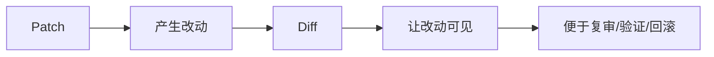

------

## 第 3 题点评

你这里用了“手术记录、日报、审核”的类比，这个方向很好。

但我帮你纠正一下：

你这里其实混在一起说了 3 个概念：

- **diff/记录**
- **审查/验证**
- **回滚**

它们关系很近，但不是同一个东西。

### 更准确地拆分是：

#### 1）diff / 记录

你改了什么，要能看见。

#### 2）验证 / 审查

你改得对不对，要能确认。

#### 3）回滚

发现不对后，要能撤回。

我给你画成图：

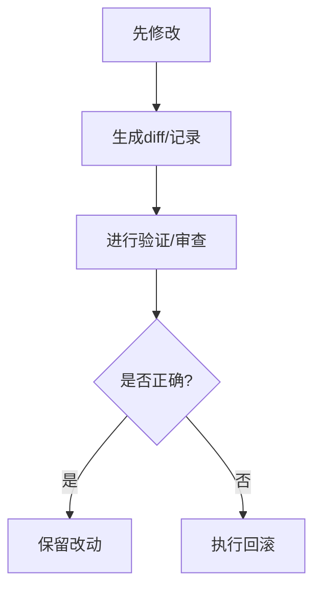

所以你原答案方向是对的，但以后表达时可以更精准一点。

------

# 二、现在进入第 7 课：验证机制

这一课很重要。

因为前面我们已经学到：

- Agent 会找代码
- 会读文件
- 会 patch
- 会 diff
- 会控制边界

但如果它改完就停，那还差最后一环：

# **验证**

一句话先给你结论：

# **“我觉得改对了”不算闭环，

# “我证明改对了”才算闭环。**

------

# 三、先看验证机制总图

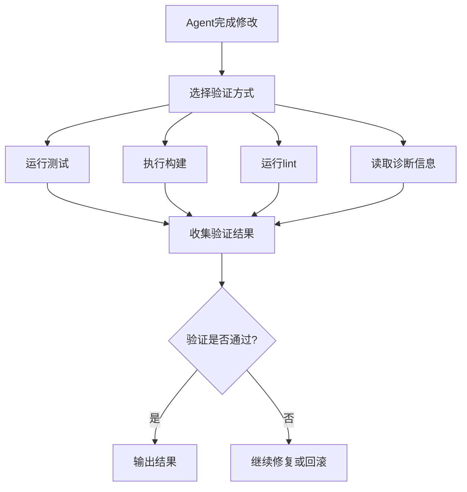

这张图你要记住一个核心：

**修改不是终点，验证才是把修改闭合起来的那一步。**

------

# 四、为什么 Agent 不能只改不验

因为只改不验，最多只能说明：

- 它“做了一个看起来合理的修改”

但不能说明：

- 修改真的解决了问题
- 没有引入新问题
- 没有破坏原有功能
- 代码仍然可运行

------

## 我给你画成对比图

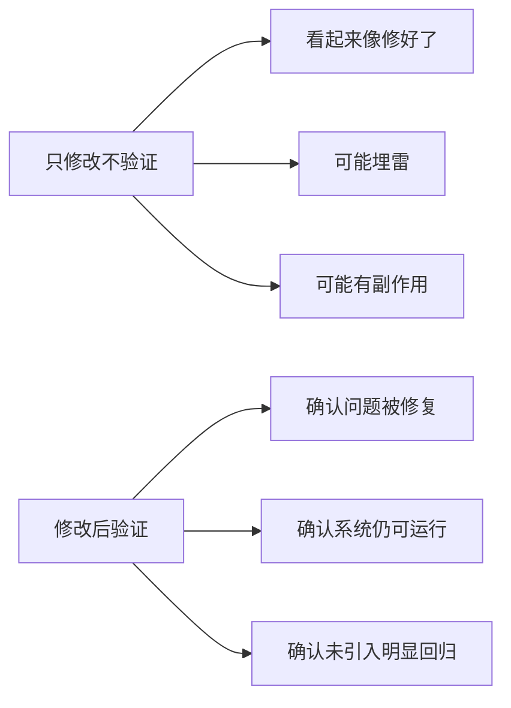

所以你可以记一句：

# **修改解决的是“动作完成”，验证解决的是“结果可信”。**

------

# 五、验证机制通常有哪几种

这一块很重要。

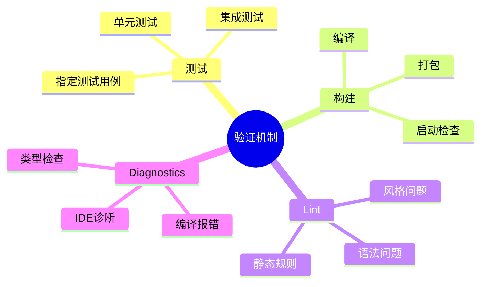

最常见的 4 类是：

- **测试**
- **构建**
- **lint**
- **诊断信息**

它们各自解决的问题不一样。

------

# 六、第一类：测试

测试是最直接的验证方式。

## 它解决什么？

验证：

- bug 是否真的修复
- 功能是否仍然可用
- 某个行为是否符合预期

------

## 测试流程图

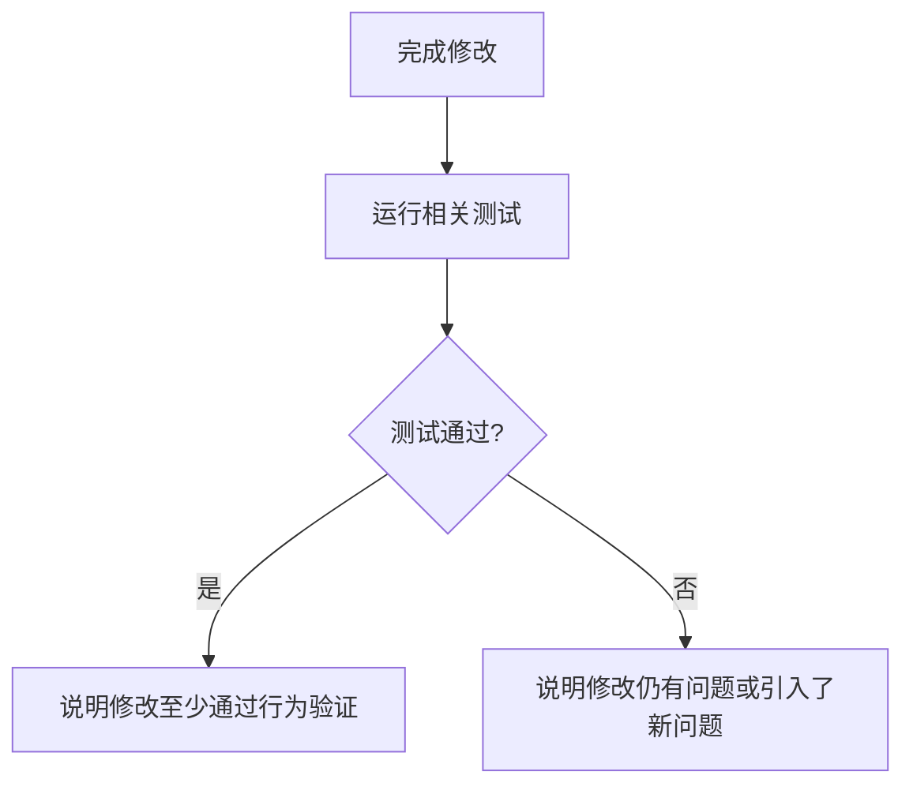

### 你要记住：

测试不是万能的，但它是最像“行为证明”的验证方式。

比如修登录失败，最理想的是：

- 跑 auth 相关测试
- 不是只凭肉眼看代码说“应该好了”

------

# 七、第二类：构建

构建验证的是：

- 能不能编译
- 依赖有没有炸
- 项目还能不能打包/运行

------

## 构建流程图

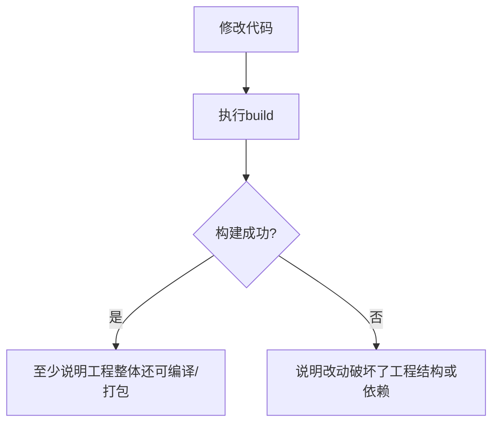

### 为什么构建重要？

因为有些问题：

- 测试未必覆盖到
- 但 build 一跑立刻爆

比如：

- import 错了
- 类型没对上
- 配置破了
- 依赖没接好

所以构建更像：

# **工程级健康检查**

------

# 八、第三类：Lint

lint 不是功能验证，
它更像“静态规则检查”。

------

## 它主要查什么？

- 明显语法错误
- 代码风格问题
- 静态规则违规
- 某些潜在 bug 模式

------

## lint 图

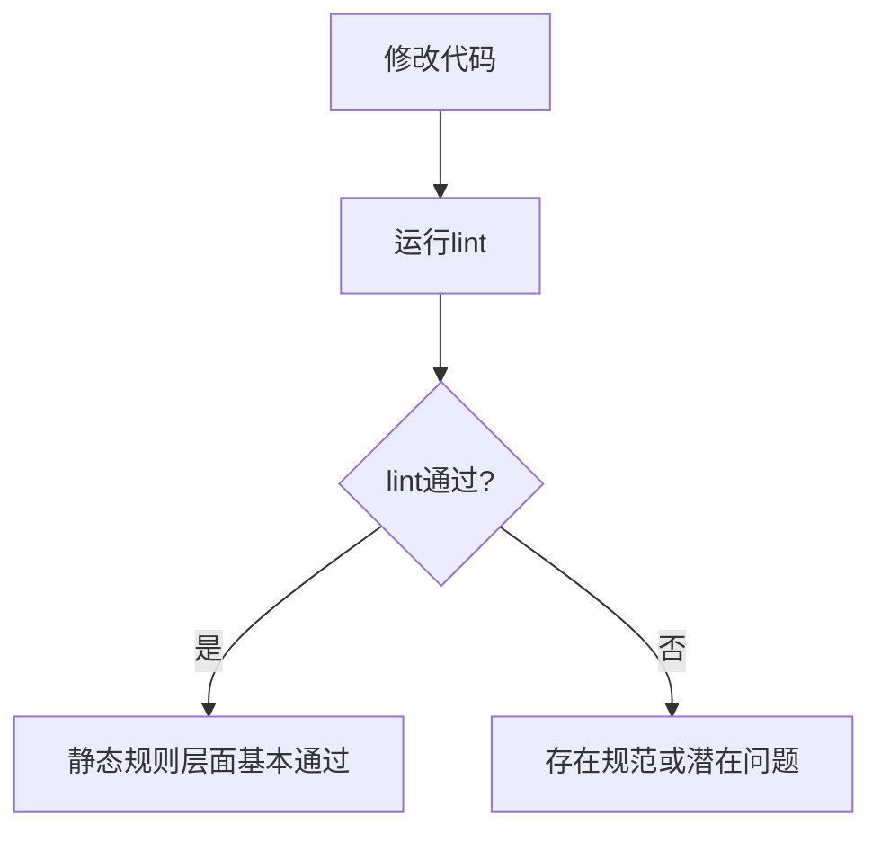

### 你要记住：

lint 通过，不代表功能对。
但 lint 不通过，通常说明代码质量层面就已经有问题。

所以 lint 更像：

# **门口保安**

不是最终判决，但能先拦掉一批低级问题。

------

# 九、第四类：诊断信息 / Diagnostics

这类很多人会忽略，但在 agent 里很常用。

比如：

- IDE 报错
- 类型检查器提示
- 编译器诊断
- 静态分析器信息

------

## 诊断信息图

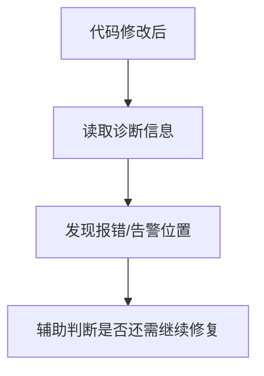

它的价值在于：

- 不用完整跑大测试
- 先快速知道哪里还炸着
- 帮 Agent 缩小问题范围

所以 diagnostics 很适合作为：

# **快速反馈机制**

------

# 十、这 4 类验证怎么配合

这一张图非常重要。

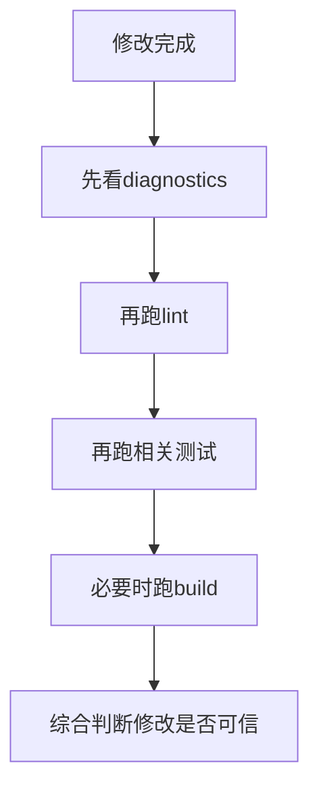

当然，实际顺序不是绝对固定。
但大致思路常常是：

- 先拿快速反馈
- 再拿局部验证
- 最后必要时做工程级验证

------

# 十一、为什么“相关测试”比“全量测试”更现实

这也是生产级 agent 很重要的取舍。

现实里不是每次都跑全量。

因为全量可能：

- 太慢
- 太贵
- 太重
- 在本地环境不现实

所以很多时候更合理的方式是：

# **先跑最相关验证，再决定要不要扩大验证范围。**

------

## 画成图是这样

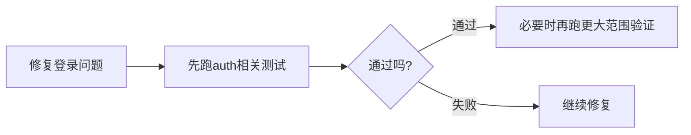

所以你可以记一句：

**验证也要讲成本控制，不是永远越多越好。**

------

# 十二、验证机制在主循环里怎么接进去

我们把它和前面的主循环接上。

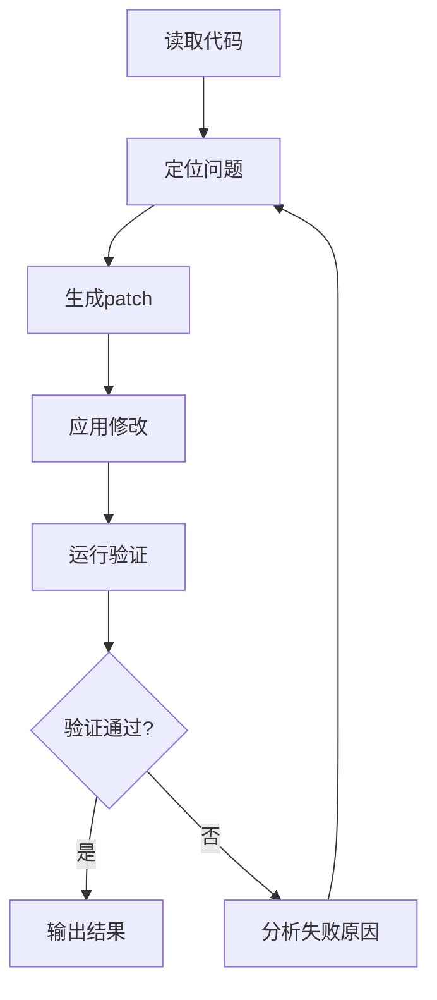

你会发现：

**验证不是结尾附赠步骤，而是主循环的一部分。**

这很重要。

因为真正的 agent 闭环不是：

- 找
- 改
- 结束

而是：

- 找
- 改
- 验
- 继续修

------

# 十三、真实修 bug 时，验证怎么起作用

场景：修复登录失败。

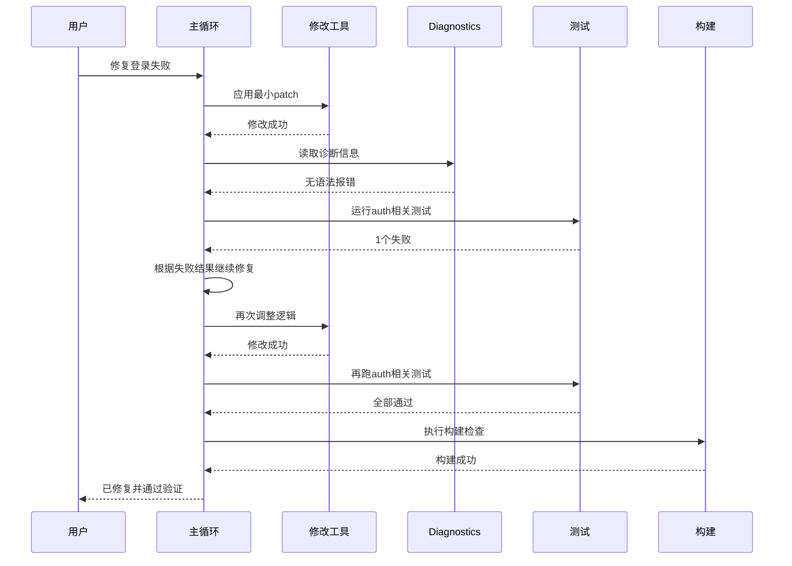

你看，验证不是一次性的。
它可能会把 agent 拉回循环里继续修。

------

# 十四、为什么“我觉得改对了”和“我证明改对了”差别巨大

这是这一课最想让你记住的一句话。

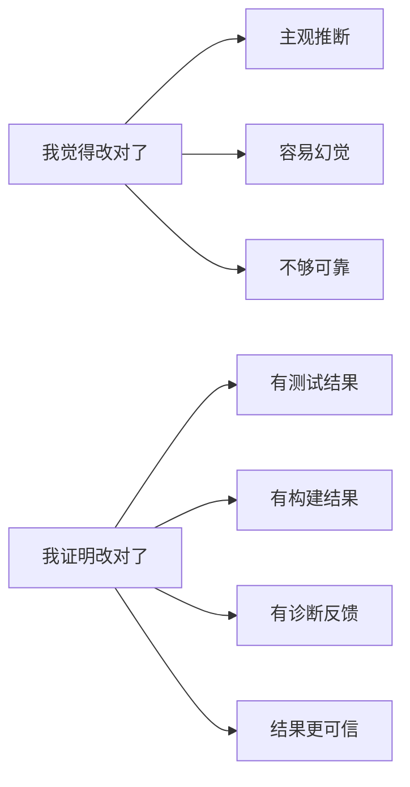

### 所以：

- “我觉得”是模型视角
- “我证明”是工程视角

你想做 agent 开发工程师，必须往第二种走。

------

# 十五、如果没有验证机制，会发生什么

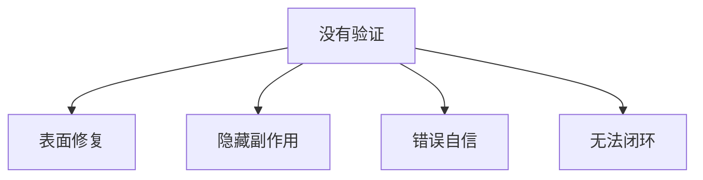

这就是为什么很多 demo agent 看起来能改代码，
但一上真实项目就不稳。

因为它缺的不是“会写”，而是：

# **会验证**

------

# 十六、这一课的思维导图

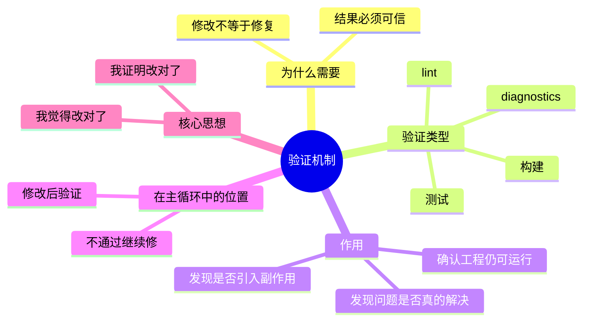

------

# 十七、你今天必须记住的 6 句话

## 第一句

**修改不是闭环，验证才让修改闭环。**

## 第二句

**测试验证行为，构建验证工程，lint 验证规则，diagnostics 提供快速反馈。**

## 第三句

**验证不是可选附加项，而是主循环的一部分。**

## 第四句

**先做相关验证，再决定是否扩大验证范围，通常更现实。**

## 第五句

**没有验证的修改，只是“看起来合理”，不是“结果可信”。**

## 第六句

**优秀 agent 不是“我觉得改对了”，而是“我证明改对了”。**

------

# 十八、这节课给你的练习

你继续按 1、2、3 回答就行。

### 题 1

为什么说“修改成功”不等于“任务成功”？

### 题 2

测试、构建、lint、diagnostics 四者的作用有什么区别？

### 题 3

为什么我说验证机制不是修改后的附属步骤，而是主循环的一部分？

你答完以后，我下一课给你讲：

# 第 8 课：上下文压缩与记忆更新

这节会把前面的上下文工程再往实战里推进一步，讲：

- 为什么 Agent 不能一直原样堆历史
- 什么时候该摘要
- 什么时候该保留原文
- 任务记忆是怎么长出来的

这一课会非常接近你以后真正自己做 Agent 时会遇到的问题。
