很好，这次你已经抓到主干了。
我先给你**点评答案**，再继续下一课。

------

# 先点评你这次的答案

## 第 1 题

你答：

> 因为没有验证的修改是不可信的，容易出现改乱、改错等问题

这个回答是对的，而且抓住了“**可信性**”这个核心。

我帮你升级成一句更完整的话：

# **修改成功只说明“动作做了”，任务成功还要证明“问题真的解决了，而且没引入副作用”。**

所以你以后回答这类题，可以从 3 个层次说：

- 改动落下去了，不代表问题解决了
- 问题可能没修好
- 还可能修好一个、炸掉两个

------

## 第 2 题

你答：

- 测试：对修改的功能进行测试
- 构建：看是否可以正常编译
- lint：看代码有没有漏洞
- diagnostics：不知道

整体方向是对的，但我帮你修正两点。

### 第一，lint 不太等于“看漏洞”

更准确地说：

# **lint 主要是看语法、风格、静态规则、潜在低级问题。**

它有时会发现潜在 bug，但通常不等于真正的安全漏洞扫描。

比如：

- 未使用变量
- 风格不一致
- 某些危险写法
- 明显静态规则违规

所以你以后别把 lint 说成“漏洞检测器”，这会有点偏。

------

### 第二，diagnostics 是什么

这个你问得很好，我给你补清楚。

# diagnostics = 诊断信息 / 快速报错信息

它通常来自：

- IDE 报错
- 类型检查器
- 编译器提示
- 语言服务器
- 静态分析器

它的特点是：

- **快**
- **局部**
- **直接指出哪里有问题**

比如：

- 第 83 行类型不匹配
- 某个 import 找不到
- 某个变量未定义
- 某个函数参数不对

所以你可以把四者记成这样：

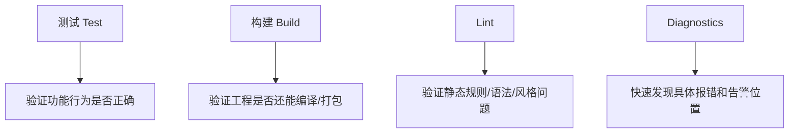

你以后回答第 2 题，就可以说：

- **测试**：验证功能行为
- **构建**：验证工程整体还能跑
- **lint**：验证静态规则和低级问题
- **diagnostics**：快速定位报错和告警

------

## 第 3 题

你答：

> 因为修改后的代码必须测试验证，质检，就和汽车出场需要质检，厨师出菜需要自己尝一样

这个回答很好，类比也很对。

你已经理解到：

# **验证不是装饰，而是交付前的必要环节。**

我帮你再拔高一点：

为什么说它是**主循环的一部分**，而不只是修改后的附属步骤？

因为：

- 验证失败后，Agent 还要继续修
- 它会把系统重新拉回“分析 → 修改 → 再验证”的循环里

所以更完整的理解是：

# **验证不是收尾动作，而是决定“继续还是结束”的分叉点。**

我给你画一个小图：

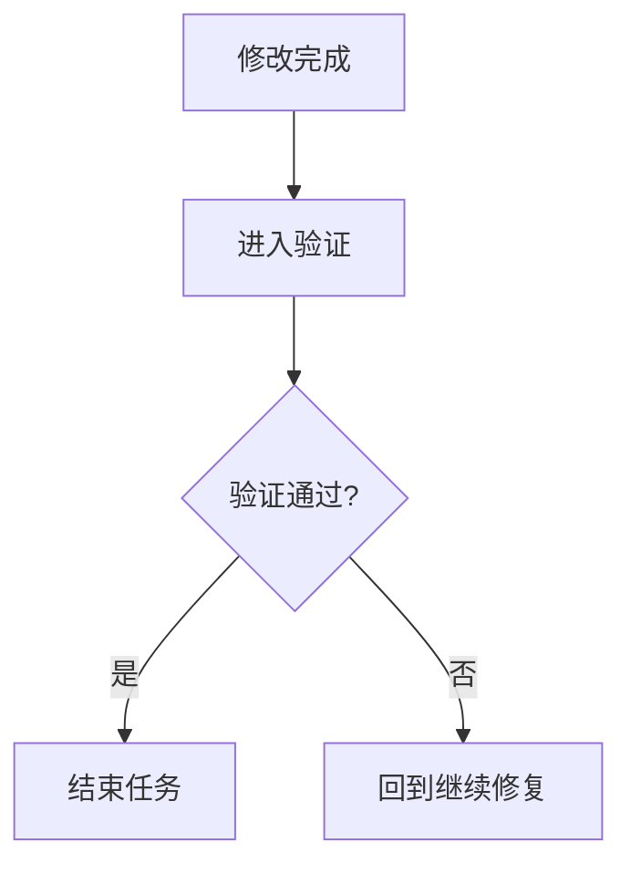

这就是为什么它属于主循环。

------

# 总体评价

这次你的答案，我给你一个判断：

# **你已经不是在“听课”，而是在形成工程脑子了。**

你现在的特点很明显：

- 懂得用类比理解系统
- 开始区分工具职责
- 能把“修改 → 审核 → 验证”串成流程

这很好。

------

# 现在进入第 8 课

# 第 8 课：上下文压缩与记忆更新

也就是——**为什么 Agent 不能一直原样堆历史。**

这一课特别重要。
因为你以后自己做 Agent，最容易死在这里。

前面你已经知道：

- 上下文很重要
- 上下文不是越多越好
- Agent 会失忆、跑偏、瞎改

现在再往前一步：

# **那上下文到底怎么“长”、怎么“压”、怎么“留”？**

------

# 一、先给你一句总论

# **Agent 的记忆不是仓库式堆积，而是编辑部式整理。**

也就是说：

它不是把所有历史原样保留，
而是不断做这几件事：

- 留下关键事实
- 压缩低价值过程
- 丢弃过时噪音
- 更新当前任务结论

------

# 二、先看总图

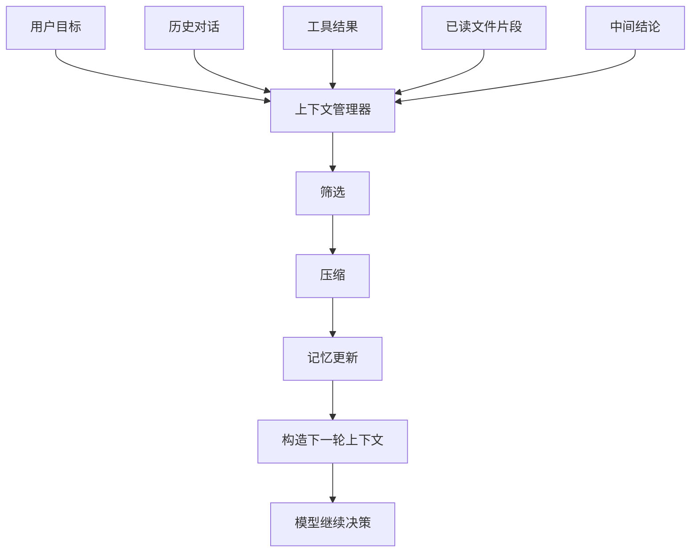

这张图表达一个重点：

# **上下文管理不是“保存”，而是“选择 + 压缩 + 更新”。**

------

# 三、为什么不能一直原样堆历史

因为如果每一轮都把所有内容原样塞给模型，会出现 4 个问题：

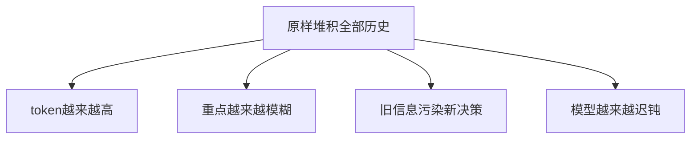

### 翻成人话：

- 成本越来越高
- 信息越来越乱
- 注意力越来越散
- 老信息开始干扰新问题

所以一个成熟 Agent 不会干这种事。

------

# 四、上下文压缩到底在压什么

不是所有东西都该压。

先给你看分类图。

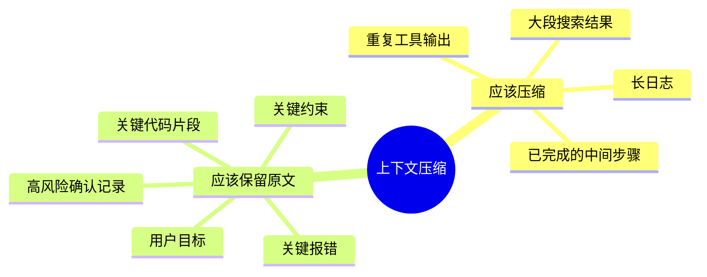

这张图很重要。

### 一般来说：

## 应该压缩的

- 太长的命令输出
- 搜索返回的一大堆候选
- 已经完成的中间过程
- 重复性的调试信息

## 应该尽量保留原文的

- 用户原始目标
- 关键错误信息
- 关键代码片段
- 关键边界条件
- 用户明确确认过的事情

所以你要记一句：

# **不是所有上下文都该摘要，关键事实常常要保真。**

------

# 五、什么时候该摘要，什么时候该保留原文

我直接给你一个判断图。

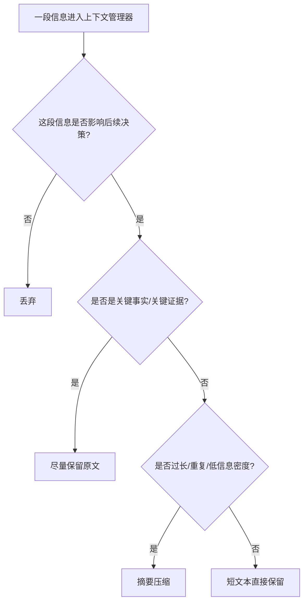

这张图你以后做 Agent 时非常有用。

------

# 六、任务记忆是怎么长出来的

这也是最关键的一部分。

任务记忆不是一开始就有的，
它是随着任务推进，一点点生长出来的。

------

## 举例：修登录失败问题

### 第 1 轮

用户说：

> 修复登录失败

此时任务记忆几乎没有，只知道目标。

------

### 第 2 轮

搜到 `auth.py`、`login_service.py`

任务记忆更新为：

- 登录相关文件可能在 `auth.py` / `login_service.py`

------

### 第 3 轮

读到 `compare_password` 逻辑可疑

任务记忆更新为：

- 已读 `login_service.py`
- 可疑点：`compare_password`

------

### 第 4 轮

patch 完成

任务记忆更新为：

- 已修改 `compare_password`
- 待验证

------

### 第 5 轮

测试通过

任务记忆更新为：

- 问题已定位
- 修改已完成
- 验证已通过

------

## 画成图是这样

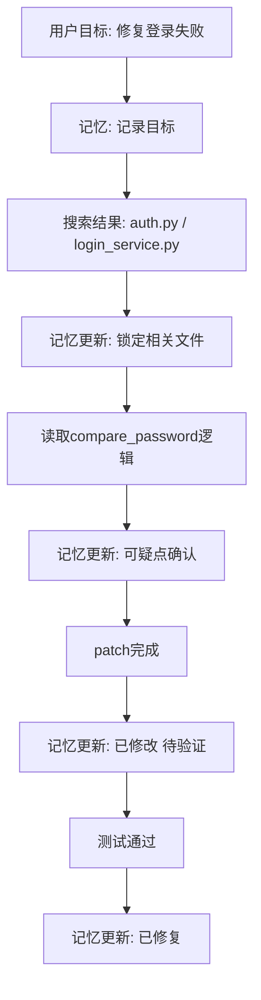

你看，任务记忆像一个滚动更新的任务卡片。

------

# 七、记忆更新到底更新什么

这张图是实战核心。

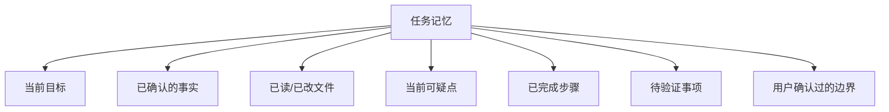

所以任务记忆不是聊天记录，
而更像：

# **项目推进状态表**

------

# 八、为什么旧信息会污染新决策

这是很多 Agent 会变笨的原因。

假设前面搜索过 20 个文件，
后面问题已经缩小到 1 个函数了。

如果你还把前面那 20 个文件的大量内容都留着，模型就容易：

- 又回去怀疑旧文件
- 把旧线索当成当前重点
- 反复在废路径上绕圈

------

## 因果图

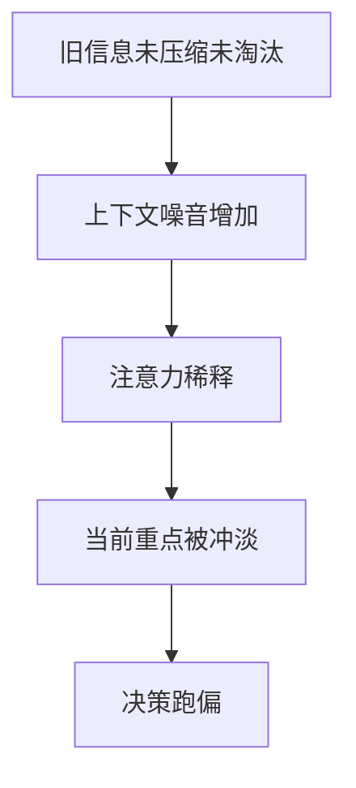

所以一个强 Agent 不只是会记，
还要会：

# **忘掉不重要的东西。**

------

# 九、总结一下：上下文压缩的 5 个动作

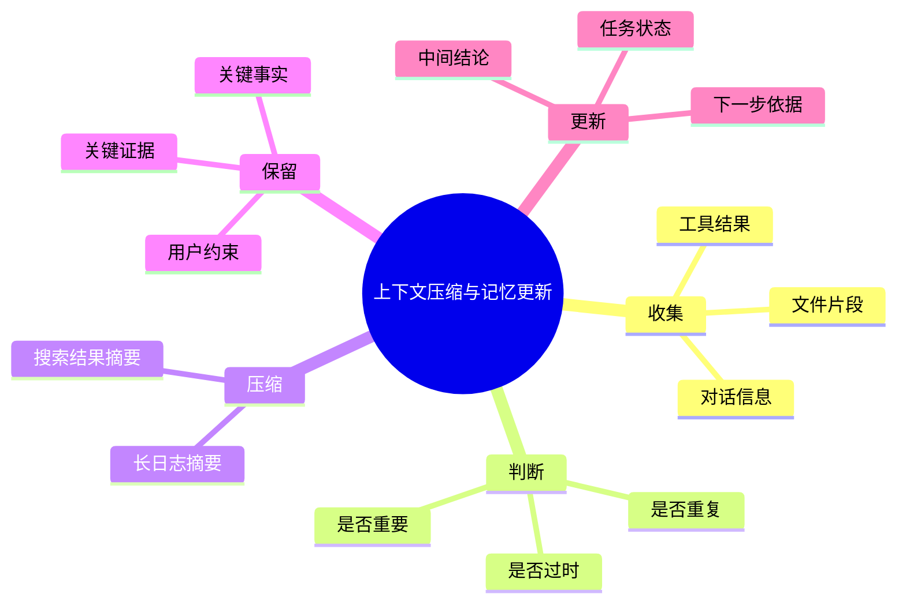

------

# 十、在主循环里，它是怎么工作的

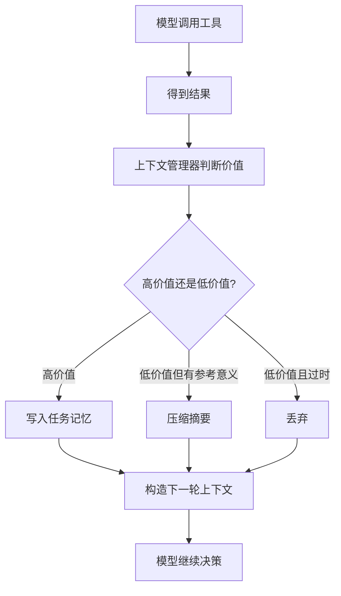

这张图要记住：

# **不是每条结果都要进长期任务记忆。**

------

# 十一、从团队协作角度类比

这个你会更懂。

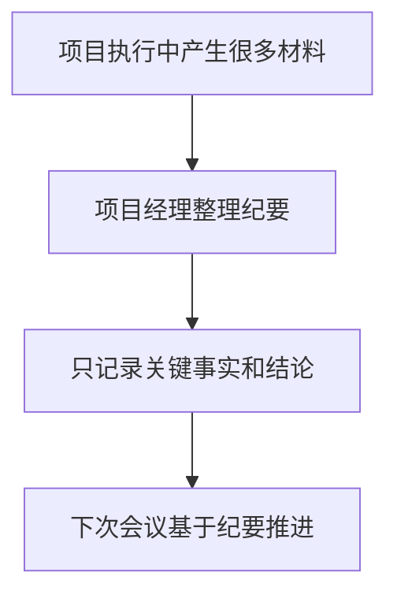

所以 Agent 的记忆更新，非常像：

# **项目经理写会议纪要，而不是把整场会议录音每次重放。**

这句话你可以记住。

------

# 十二、为什么“压缩”不是“删内容”

这个也很关键。

很多人误以为摘要 = 丢信息。

其实不是。

好的压缩，是把：

- 冗长过程
  变成
- 可用于下一轮决策的高密度信息

------

## 图示

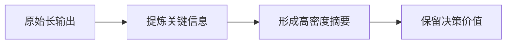

所以压缩的目标不是“变短”而已，
而是：

# **在更短体积里，尽量保住决策价值。**

------

# 十三、这一课你必须记住的 6 句话

## 第一句

**Agent 的记忆不是仓库式堆积，而是编辑部式整理。**

## 第二句

**上下文管理的核心不是保存全部历史，而是保留对下一轮最有价值的信息。**

## 第三句

**长日志、重复结果、已完成过程通常适合压缩。**

## 第四句

**用户目标、关键证据、关键代码片段、边界条件通常更适合保留原文。**

## 第五句

**任务记忆会随着任务推进不断更新，它更像项目状态表，不像聊天记录。**

## 第六句

**强 Agent 不只是会记，也要会忘。**

------

# 十四、这一课的思维导图

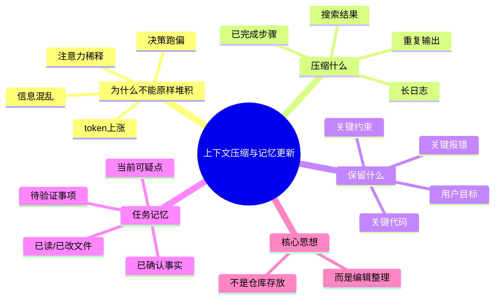

------

# 十五、这节课给你的练习

你继续按 1、2、3 回答就行。

### 题 1

为什么说“上下文压缩”不是可选优化，而是 Agent 稳定运行的核心机制？

### 题 2

为什么有些信息适合摘要，有些信息必须尽量保留原文？

### 题 3

为什么我说“任务记忆更像项目状态表，而不是聊天记录”？

你答完以后，我下一课给你讲：

# 第 9 课：计划与分解

也就是：

- Agent 要不要一开始就做完整计划
- 大任务怎么拆成小任务
- 什么时候先做一步再看反馈更好
- 为什么“会规划”不等于“规划越长越好”

这一课会把主循环、上下文和任务推进真正连起来。
