很好，这次你已经开始往“实现视角”回答了。

我先给你点评这 3 个答案，然后我们正式回到主线，进入：

# 第 9 课：计划与分解

也就是——**Agent 要不要一开始就做完整计划。**

------

# 一、先点评你 8.5 课的答案

## 第 1 题

你答：

> 仓库是储存信息，上下文管理是会把信息压缩、筛选、整理、目标、任务记忆这些

方向是对的。

你已经抓住了最核心差别：

- **仓库**：偏“存”
- **上下文管理器**：偏“选、压、编”

我帮你升级成一句更标准的话：

# **仓库关注“保存”，上下文管理器关注“为下一轮决策准备材料”。**

这句很关键。

因为上下文管理器不是为了把信息都留下，
而是为了让模型下一轮**更容易做对判断**。

------

## 第 2 题

你答：

> 各司其职，代码适合一些基础操作，如规则、长度压缩等等，语义代码解析不了，用模型更好

这个回答很好，已经抓到实现核心了。

我帮你再精炼一下：

# **代码擅长确定性规则，模型擅长不确定语义。**

例如：

- 代码擅长：
  - 长度截断
  - 去重
  - TTL 淘汰
  - 固定字段保留
- 模型擅长：
  - 日志摘要
  - 搜索结果提炼
  - 中间结论归纳
  - 复杂相关性判断

这就是为什么“规则归代码，语义归模型”更稳。

------

## 第 3 题

你答：

> 压缩、整理、理解、减少 token 调用

这个方向也是对的，但我帮你补完整一点。

如果一条用户消息背后有多次模型调用，
上下文管理器在中间的核心作用不只是“减少 token”，更重要的是：

# **让每一轮调用都拿到“对当前决策最有用的信息”。**

也就是说，它在多轮调用中承担的是：

- 记录任务进展
- 抽取关键事实
- 清掉噪音
- 给下一轮拼装上下文
- 防止模型失忆和跑偏

所以你可以把这题的更强答案记成：

# **上下文管理器是多轮模型调用之间的“状态桥梁”和“材料整理器”。**

------

# 二、现在正式回到主线

# 第 9 课：计划与分解

这一课非常关键。

因为很多人一提 Agent，就会默认觉得：

> 先做一个完整计划，再一步步执行

但真实系统里，事情没这么简单。

一句话先给你结论：

# **会规划很重要，但不是“计划越长越好”，而是“计划要和反馈节奏匹配”。**

------

# 三、先看总图：计划与分解在 Agent 里的位置

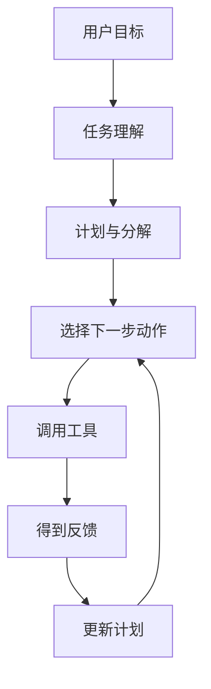

这张图表达一个重点：

# **计划不是一次性的，而是会被反馈不断修正。**

所以真正的 Agent 规划，更像：

- 先有一个方向
- 做一步
- 看结果
- 再调整

而不是一开始就把后面十步全写死。

------

# 四、为什么“会规划”不等于“先写超长计划”

因为长计划有 3 个天然问题：

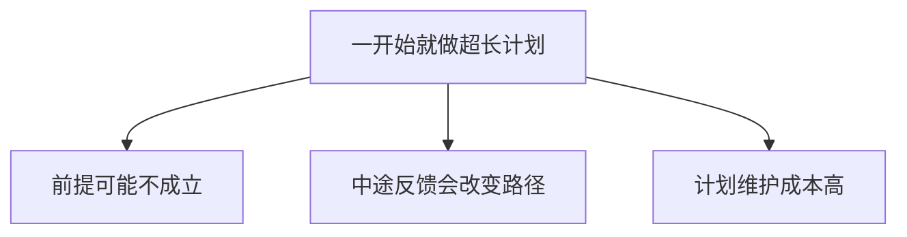

### 举个例子

用户说：

> 修复登录失败

如果一开始就写：

1. 读 auth.py
2. 读 login_service.py
3. 检查 compare_password
4. 检查 token 生成
5. 检查配置
6. 改逻辑
7. 跑测试
8. 跑 build
9. 总结结果

看起来完整，但问题是：

- 也许第 2 步就发现根因了
- 也许根本不用看 token 生成
- 也许第 7 步测试失败后，后面全得改

所以过长计划很容易变成：

# **看起来很聪明，实际上很僵硬。**

------

# 五、Agent 常见的两种规划方式

这一张图你要记住。

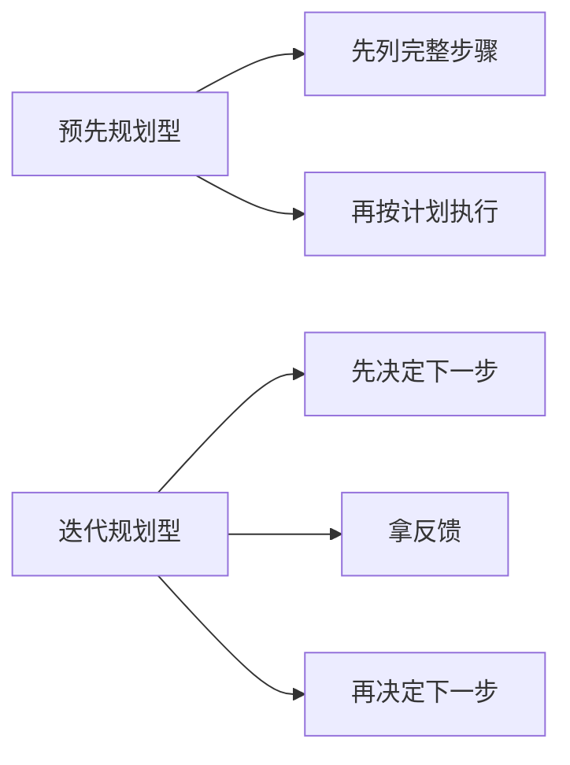

------

## 1）预先规划型

适合：

- 任务结构明确
- 变化少
- 依赖清晰
- 中途不太会被反馈打断

例如：

- 批量重命名文件
- 固定格式的数据转换
- 明确的文档生成流程

------

## 2）迭代规划型

适合：

- 问题不完全明确
- 中途要看工具结果
- 需要边查边改
- 需要根据反馈随时修正

例如：

- 修 bug
- 理解旧代码
- 多文件重构
- 排查复杂错误

Claude Code 这类 coding agent，很多场景都更偏第二种。

------

# 六、为什么 coding agent 特别适合“先做一步再看反馈”

因为代码世界很容易出现这些情况：

- 一开始不知道根因
- 读了文件才知道下一步
- patch 后测试可能打脸
- diagnostics 会暴露新问题
- 改一个地方会引出另一个依赖问题

所以 coding agent 非常适合这种节奏：

你可以记一句：

# **在不确定任务里，“下一步正确”往往比“全局计划漂亮”更重要。**

------

# 七、但这是不是意味着完全不要计划？

也不是。

真正成熟的做法通常是：

# **有一个高层方向 + 用迭代方式推进细节。**

我给你画一个很实用的结构。

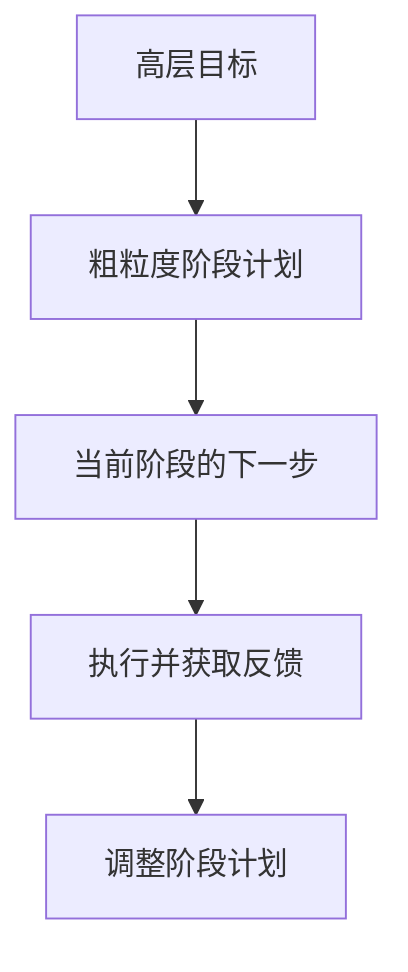

翻成人话：

- 先有大方向
- 不把所有细节写死
- 每轮只把当前最关键的一步决定清楚
- 根据反馈更新后面的安排

这其实最符合真实工程。

------

# 八、什么叫“分解任务”

这也是你以后自己实现 Agent 时一定会遇到的。

分解不是把一句话拆成越多子任务越高级。
而是：

# **把大任务拆成能独立判断、独立执行、独立验证的小块。**

------

## 一个好的分解长这样

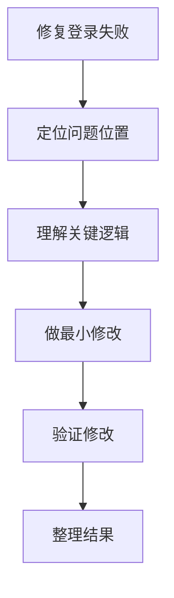

这就是好的分解：

- 每一步都相对清楚
- 每一步都有目标
- 每一步都能判断是否完成

------

# 九、一个坏的分解长什么样

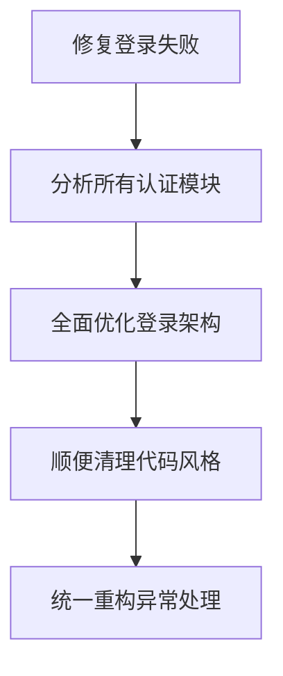

这种就坏在：

- 步子太大
- 目标膨胀
- 越拆越偏
- 已经不是“修 bug”，而是“顺手重构半个系统”

所以分解的核心不是“拆很多”，而是：

# **拆到足够小，但不失去目标对齐。**

------

# 十、任务分解时，通常按什么维度拆

这一张很实用。

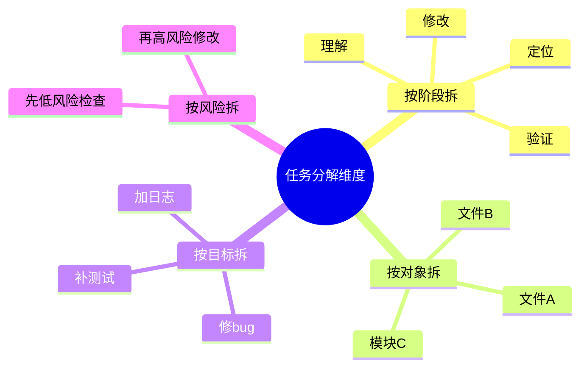

你以后做 Agent 时，最常用的是：

- **按阶段拆**
- **按对象拆**

比如：

- 先搜代码
- 再读这个文件
- 再 patch
- 再测

------

# 十一、计划与分解在主循环里是怎么工作的

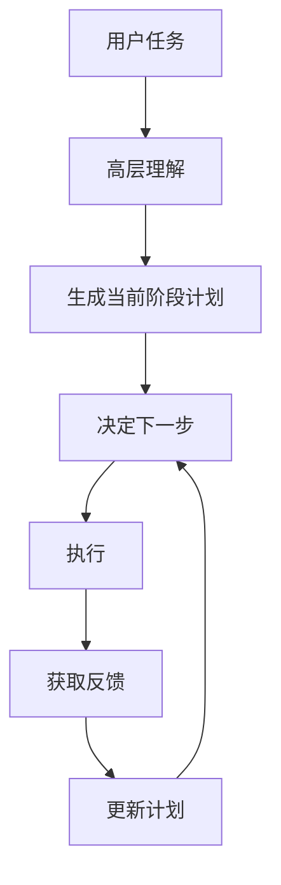

所以你要记住：

# **计划不是一次性产物，而是主循环里的动态对象。**

这句话非常重要。

------

# 十二、真实例子：修复登录失败怎么计划

### 一个比较好的计划方式：

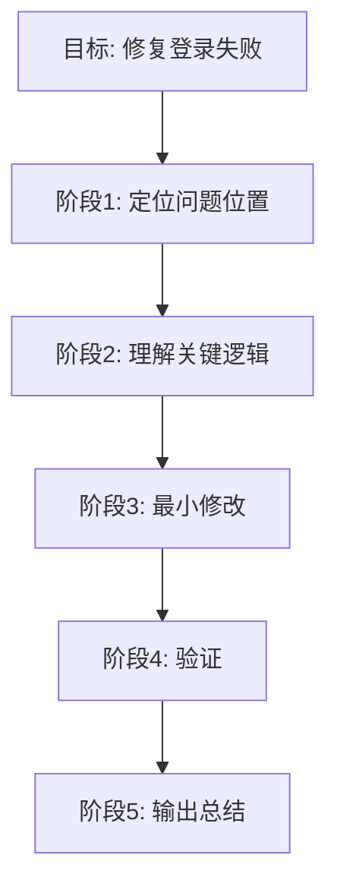

而每个阶段里，不是一次写死全部步骤，
而是逐步推进。

例如在“定位问题位置”阶段：

这就体现了：

- 上层有计划
- 下层靠反馈推进

------

# 十三、为什么“先做一步再看反馈”很重要

因为很多任务的信息不是一开始就有的。

这点你一定要吃透。

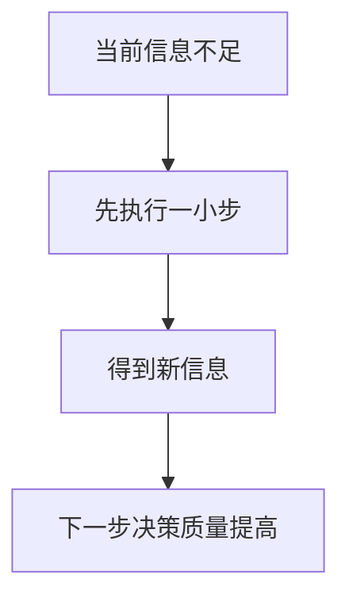

你看，很多时候不是不想规划，
而是**你没有足够信息做长规划**。

所以与其瞎规划，不如：

# **先用一小步换来更多信息。**

------

# 十四、什么时候该做更完整的计划

也有适合长一点计划的时候。

通常满足这些条件：

- 任务边界清楚
- 步骤稳定
- 中途依赖少
- 风险较低
- 结果形式明确

例如：

- 给一批文件统一加版权头
- 生成 CRUD
- 固定模板改名
- 批量替换变量名

这种情况下，完整一点的计划就更有价值。

------

# 十五、这节课最核心的“规划观”

我给你压成一句话：

# **好的 Agent 规划，不是把未来写满，而是让下一步始终清楚。**

这句话你一定要记。

------

# 十六、这一课的思维导图

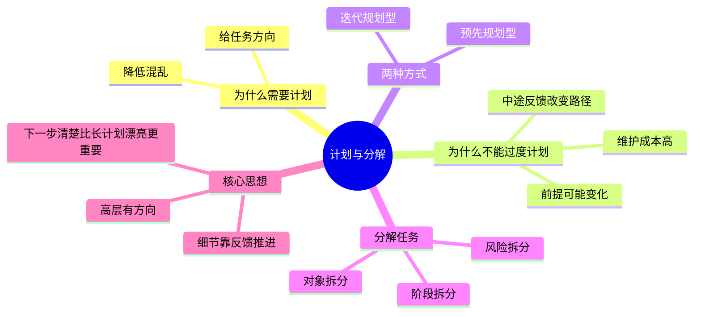

------

# 十七、你今天必须记住的 6 句话

## 第一句

**会规划不等于先写很长的计划。**

## 第二句

**长计划的问题在于：前提会变，反馈会打脸，维护成本高。**

## 第三句

**coding agent 很多时候更适合“先做一步，再看反馈”的迭代规划。**

## 第四句

**好的分解，是把任务拆成能独立执行、独立判断、独立验证的小块。**

## 第五句

**计划不是一次性产物，而是主循环里的动态对象。**

## 第六句

**好的 Agent 规划，不是把未来写满，而是让下一步始终清楚。**

------

# 十八、这节课给你的练习

你继续按 1、2、3 回答就行。

### 题 1

为什么在 coding agent 里，很多时候“先做一步再看反馈”比一开始写超长计划更合理？

### 题 2

什么叫“好的任务分解”？

### 题 3

为什么我说“计划不是一次性产物，而是动态对象”？

你答完以后，我下一课给你讲：

# 第 10 课：失败恢复与重试机制

这节会非常实战，讲：

- 工具失败了怎么办
- patch 失败了怎么办
- 测试一直不过怎么办
- 为什么真正的 Agent 必须会“摔倒后站起来”

这一课会非常接近真实产品。
