很好，这次你已经明显进入“**Agent 不是静态脚本，而是动态推进系统**”这个认知层了。

我先点评你这 3 个答案，然后进入：

# 第 10 课：失败恢复与重试机制

也就是——**真正的 Agent 为什么必须会“摔倒后站起来”。**

------

# 一、先点评你第 9 课的答案

## 第 1 题

你答：

> 因为代码逻辑复杂，在代码中有些时候需要根据前一步的结果去推演下一步的计划，这样是最优的。而且如果中途出错也好调整，而不是死板的长计划走。

这个回答是对的，而且抓住了两个核心：

- **信息是逐步暴露的**
- **计划必须能随反馈调整**

我帮你升级成一句更强的话：

# **在 coding agent 里，很多关键事实不是一开始就知道的，而是靠前一步动作“换”出来的。**

所以“先做一步再看反馈”不是保守，而是更符合信息获取规律。

------

## 第 2 题

你答：

> 阶段任务计划，风险任务计划，就是不同场景有不同的任务分解和计划

这个方向没错，但还不够“落地”。

题目问的是“什么叫好的任务分解”，更准确的答案应该是：

# **好的任务分解，是把大任务拆成能独立执行、独立判断、独立验证的小块。**

比如：

- 先定位
- 再理解
- 再修改
- 再验证

也就是说，好的分解不是“按类别列几个词”，而是要体现：

- 每一步做什么
- 怎么判断做完
- 下一步怎么接上

------

## 第 3 题

你答：

> 因为需要根据上一次的结果去推演，否则会出现修改错误、编译失败继续进行的问题。

这个答得是对的。

你已经意识到：

# **计划不是写在纸上的静态文档，而是随着执行结果不断更新的运行时对象。**

我帮你再精炼一下：

- 如果验证失败，计划要变
- 如果搜索结果显示方向错了，计划要变
- 如果 patch 失败，计划也要变

所以“动态对象”这四个字的意思就是：

# **计划会被执行结果持续修正。**

------

# 总体评价

这节你已经吃到关键味道了：

- 不再把 Agent 理解成固定流程
- 开始理解“执行反馈会反向塑造计划”
- 开始接近真实工程思维

这很好。

------

# 二、现在进入第 10 课

# 第 10 课：失败恢复与重试机制

这一课非常实战。
因为真实世界里，Agent **一定会失败**。

不是“可能会失败”，而是一定会。

比如：

- 工具调用失败
- 文件不存在
- patch 没打上
- 测试没通过
- 构建炸了
- 命令权限不足
- 模型走偏了

所以一个真正能用的 Agent，不是“从不失败”，而是：

# **失败后还能恢复推进。**

------

# 三、先给你一句总论

# **失败恢复机制 = Agent 的抗打击能力。**

没有它，Agent 只能跑顺风局。
有了它，Agent 才能进真实项目。

------

# 四、先看总图：失败恢复在系统里的位置

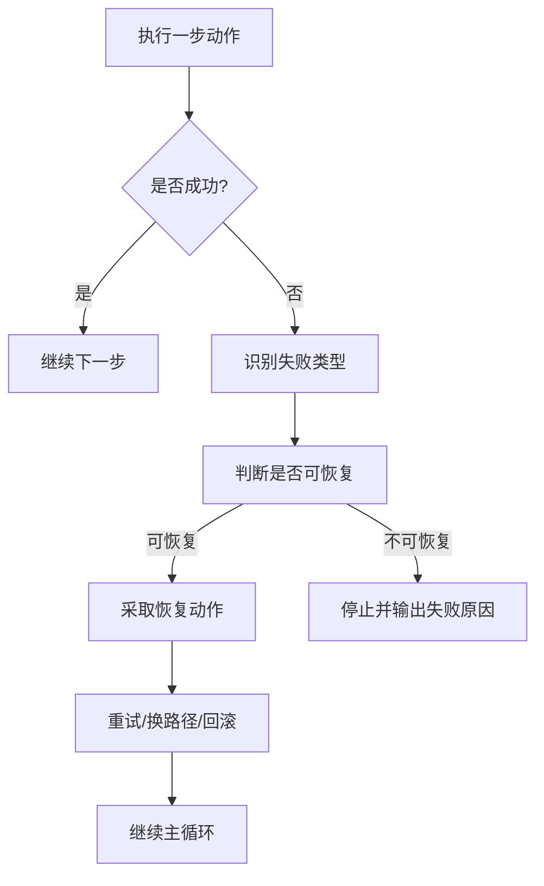

这张图表达一个关键：

# **失败不是终点，而是一个新的判断节点。**

------

# 五、为什么 Agent 不能“失败一次就退出”

因为真实任务里很多失败都不是致命失败。

例如：

- 搜索词不准，可以换个关键词
- 文件没找到，可以先列目录
- patch 失败，可以先重新读上下文
- 测试失败，可以根据报错继续修
- 构建失败，可以先修编译问题

所以很多失败，本质上是：

# **推进中的正常摩擦，不是任务终结。**

------

# 六、常见失败类型有哪些

这张图你要记。

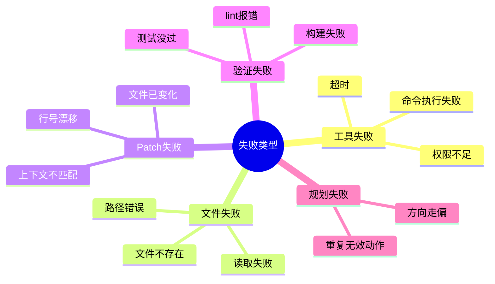

你会发现，失败不只有一种。
不同失败，对应的恢复方式也不一样。

------

# 七、失败恢复的第一步，不是马上重试，而是“识别失败类型”

这一点非常关键。

很多新手系统一失败就直接再来一次，结果越搞越糟。

成熟 Agent 会先问：

- 这是什么失败？
- 是暂时性失败，还是逻辑性失败？
- 是环境问题，还是代码问题？
- 是路径问题，还是权限问题？

------

## 图示

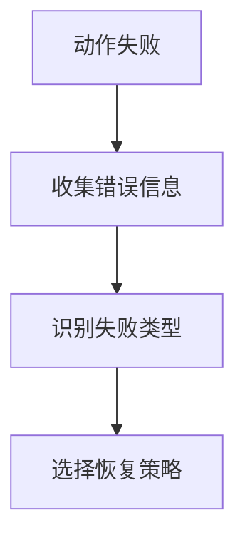

所以第一原则是：

# **先分类，再恢复。**

------

# 八、常见恢复策略有哪些

我给你画成恢复策略图。

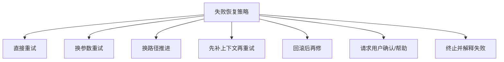

下面我逐个讲。

------

## 1）直接重试

适合：

- 网络抖动
- 临时超时
- 偶发命令失败

这种失败有时再试一次就好。

但不能无限试。

------

## 2）换参数重试

适合：

- 搜索词不准
- 命令参数不对
- 读取范围过大

例如：

- `search_code("login failed")` 不行，就换成 `search_code("login auth password")`

------

## 3）换路径推进

适合：

- 当前路走不通
- 当前文件没找到问题
- 当前模块不是根因

例如：

- 不再盯 auth.py，转去读 login_service.py

------

## 4）先补上下文再重试

适合：

- patch 打不上
- 模型理解不够
- 文件上下文不完整

这时不该硬 patch，而该先：

- 重新读文件
- 重新取附近代码
- 再生成 patch

------

## 5）回滚后再修

适合：

- 已有修改导致验证失败
- 改动范围超了
- 明显误伤无关逻辑

先撤，再换更小改动。

------

## 6）请求用户确认 / 帮助

适合：

- 高风险操作
- 方向有歧义
- 需要外部信息
- 需要权限

这不是失败，而是合理停下。

------

## 7）终止并解释失败

适合：

- 确实不可恢复
- 权限不够
- 环境缺失
- 达到失败上限

一个好的 Agent 就算停，也要停得明白。

------

# 九、最容易被忽略的一点：不是所有失败都该“重试”

这句话你一定要记。

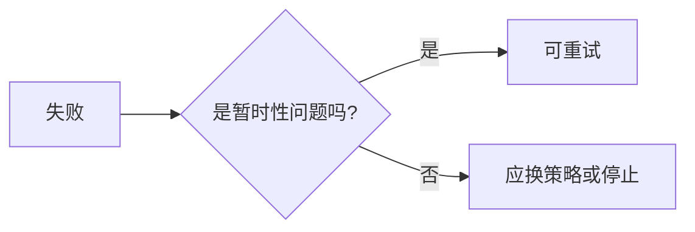

例如：

- `Timeout`：可能可重试
- `Permission denied`：直接重试通常没意义
- `Patch context mismatch`：应该补上下文，不该盲重试
- `Test assertion failed`：说明逻辑错了，不是再跑一遍能好

所以：

# **重试不是恢复，正确重试才是恢复。**

------

# 十、Patch 失败时怎么办

这块非常典型，也很贴近 coding agent。

## 常见 patch 失败原因

- 文件内容变了
- 目标上下文不匹配
- 行号漂移
- 取的片段不完整

------

## 正确恢复方式通常是：

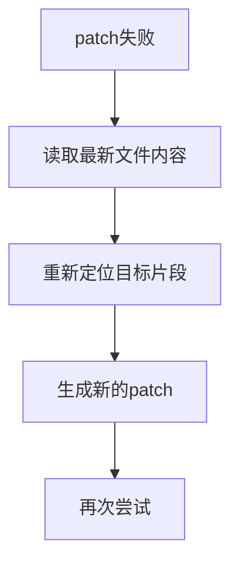

而不是：

- 原 patch 原地硬怼 5 次

所以 patch 失败更像：

# **上下文失配问题**

不是简单的“再来一次”。

------

# 十一、测试失败时怎么办

测试失败是最常见、也最有价值的失败。

因为它通常说明：

- 修改没修好
- 或者修好了当前点，但引入了副作用

------

## 正确节奏是：

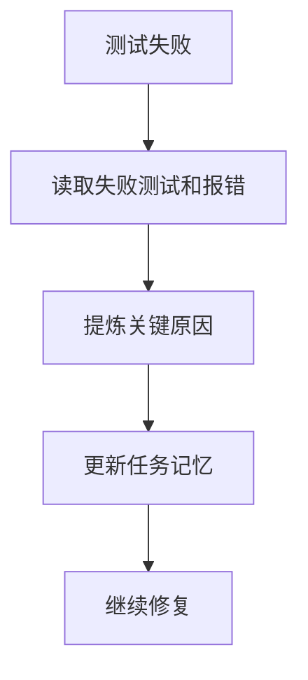

所以测试失败不是坏事，
它其实是：

# **高价值反馈。**

------

# 十二、什么时候该停止，而不是继续恢复

一个成熟 Agent 必须知道什么时候停。

否则就会进入：

- 假循环
- 无意义重试
- 成本失控
- 风险上升

------

## 停止条件常见有这些

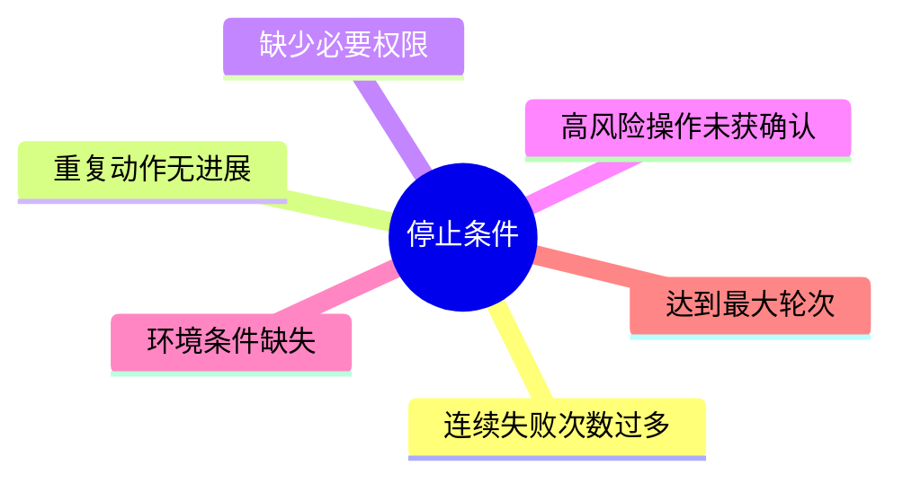

所以你要记住：

# **恢复能力不是无限折腾，而是“有限、受控、可解释的恢复”。**

------

# 十三、失败恢复在主循环里是怎么接进去的

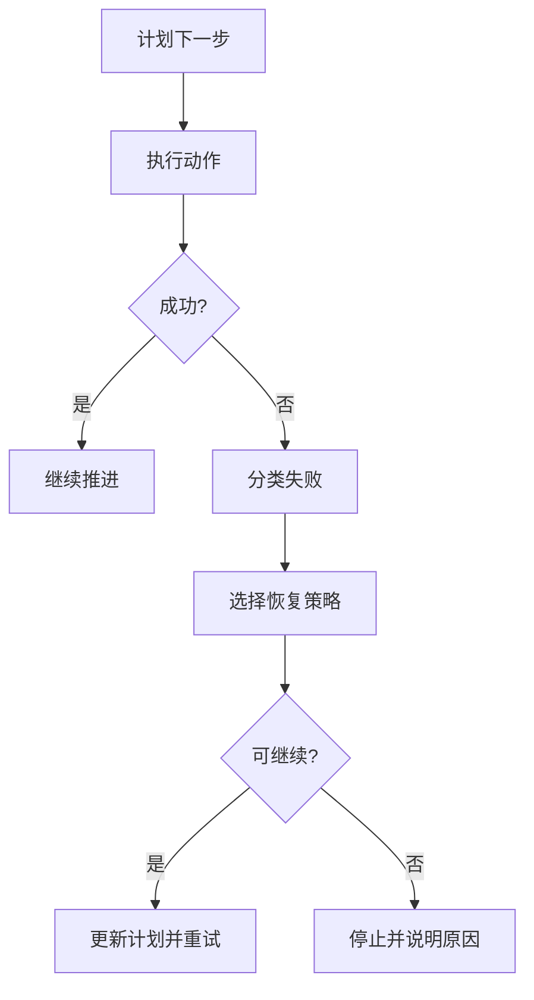

你看，失败恢复不是外挂，
它已经嵌进主循环了。

------

# 十四、真实例子：修复登录失败时的失败恢复

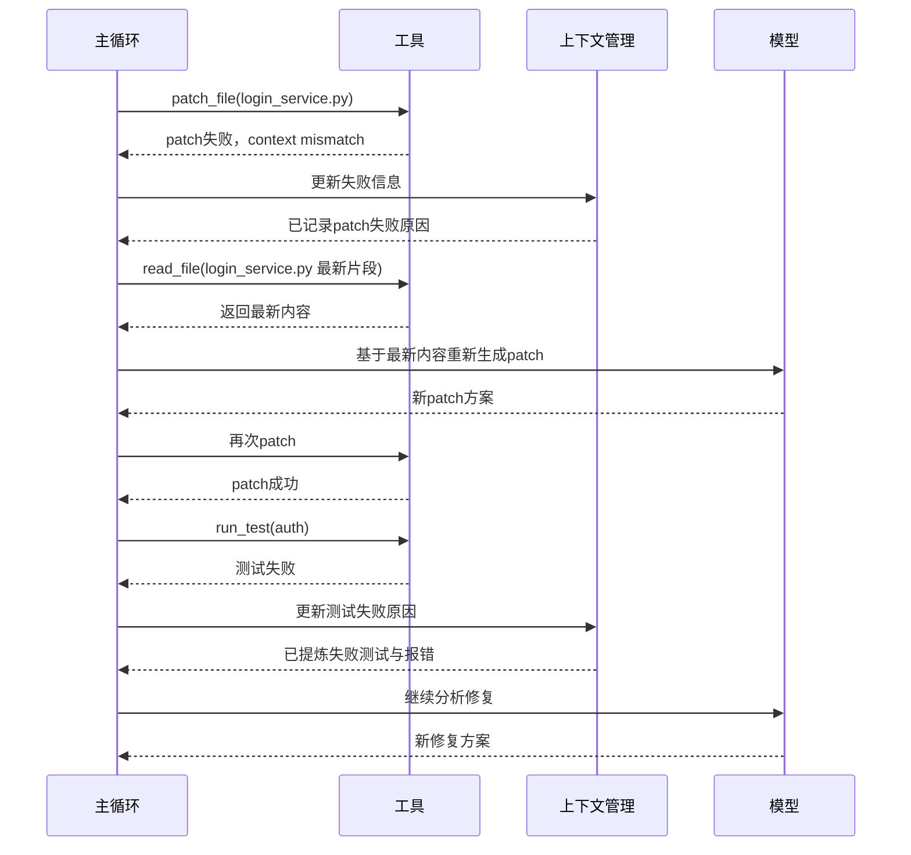

这张图特别像真实系统。

------

# 十五、为什么失败恢复能力决定 Agent 能不能商用

因为真实环境里不可能全是 happy path。

没有失败恢复的 Agent：

- 看 demo 很顺
- 一碰真实项目就脆

有失败恢复的 Agent：

- 会摔
- 但能继续走
- 而且知道什么时候停

所以：

# **商用 Agent 的关键，不是从不出错，而是出错后还能稳定处理。**

------

# 十六、这一课最核心的 6 句话

## 第一句

**真实 Agent 一定会失败，区别只在于失败后会不会恢复。**

## 第二句

**失败恢复的第一步不是重试，而是识别失败类型。**

## 第三句

**不是所有失败都该直接重试，很多失败应该换策略。**

## 第四句

**patch 失败通常是上下文失配问题，测试失败通常是高价值反馈。**

## 第五句

**恢复能力必须是有限、受控、可解释的，不是无限折腾。**

## 第六句

**真正能商用的 Agent，不是从不摔倒，而是摔倒后能站起来。**

------

# 十七、这一课的思维导图

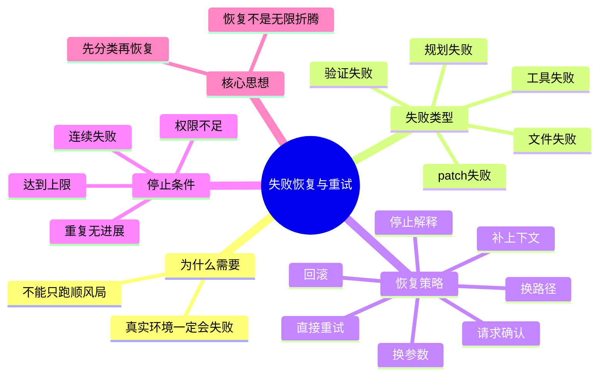

------

# 十八、这节课给你的练习

你继续按 1、2、3 回答就行。

### 题 1

为什么说失败恢复的第一步不是“马上重试”，而是“先识别失败类型”？

### 题 2

为什么 patch 失败和测试失败，恢复策略通常不一样？

### 题 3

为什么我说“恢复能力强”不等于“可以无限重试”？

你答完以后，我下一课给你讲：

# 第 11 课：工具接口设计

这节会非常接近你以后自己写 Agent 的代码实现，讲：

- 一个好工具接口长什么样
- 为什么输入输出结构化很重要
- 错误信息为什么要“可恢复”
- 工具设计差，为什么会把整个 Agent 拖笨

这一课会很适合你。
