很好，这次你已经抓到“**恢复不是瞎试，而是带判断地继续推进**”这个核心了。

我先点评你这 3 个答案，然后进入：

# 第 11 课：工具接口设计

也就是——**为什么工具设计差，会把整个 Agent 拖笨。**

------

# 一、先点评你第 10 课的答案

## 第 1 题

你答：

> 因为需要先分类再恢复，就是需要先分析原因在恢复，不是无脑恢复

这个回答是对的，而且抓住了关键。

我帮你升级一句：

# **恢复策略依赖失败类型，不先分类，恢复动作就容易选错。**

比如：

- 网络超时，可以重试
- 权限不足，重试没意义
- patch 失败，要补上下文
- 测试失败，要改逻辑

所以“先分类再恢复”本质上是在做：

**把失败映射到正确修复路径。**

------

## 第 2 题

你答：

> 因为 patch 是修改文件失败，所以通常需要换工具即可

这里方向有一点偏了，我帮你纠正。

# patch 失败通常不是“换工具”问题，

# 更常见的是“上下文失配”问题。

比如：

- 文件内容变了
- 目标片段定位错了
- 行号漂移了
- patch 依赖的上下文不完整

所以 patch 失败更常见的恢复方式是：

- 重新读最新文件
- 重新定位目标片段
- 再生成 patch

而不是简单“换个工具”。

------

## 第 3 题

你答：

> 因为需要归类，恢复归类，如果无限重试就会出现 token 炸弹了，并且有些场景也不适合

这个回答方向是对的。

你已经意识到：

- 成本会爆
- 有些失败不是重试能解决
- 恢复必须有边界

我帮你再提炼一下：

# **恢复能力强，指的是“有策略地恢复”，不是“无限次继续尝试”。**

否则就会出现：

- 假循环
- 重复无效动作
- 成本失控
- 风险累积

------

# 总体评价

你现在已经开始能区分：

- 失败类型
- 恢复路径
- 恢复边界

这很好，说明你已经开始从“会看概念”走向“能设计系统”。

------

# 二、现在进入第 11 课

# 第 11 课：工具接口设计

这一课非常重要，而且很贴近你以后真正写 Agent 的代码。

因为前面我们讲了很多：

- 主循环
- 上下文
- 安全
- 验证
- 恢复

但这些东西最终都要落到一个地方：

# **工具接口**

一句话先给你结论：

# **模型能力决定上限，工具接口质量决定稳定性。**

很多 Agent 不是输在模型不够聪明，
而是输在：

- 工具太难调用
- 工具结果太乱
- 错误信息不可恢复
- 参数边界不清楚

------

# 三、先看总图：工具接口在系统里的位置

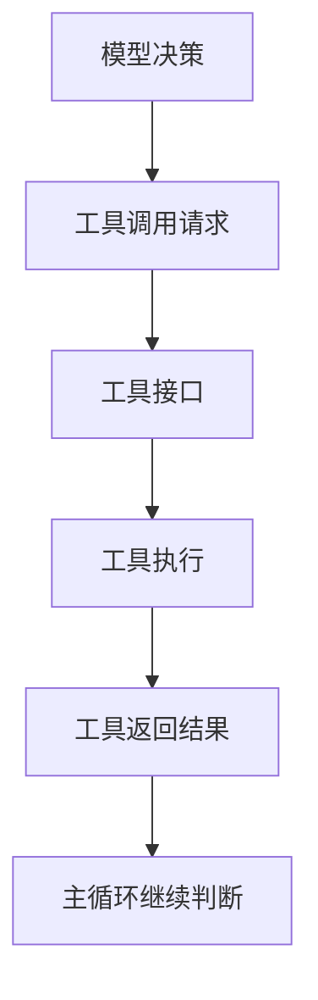

你要看明白一个重点：

# **模型不是直接操作底层系统，它是通过工具接口间接操作。**

所以工具接口质量，直接影响：

- 模型会不会用
- 主循环能不能接
- 失败后能不能恢复

------

# 四、什么叫“工具接口”

不是“有个函数”就叫好工具接口。

更准确地说：

# **工具接口 = 模型和真实执行世界之间的协议层。**

它负责定义：

- 这个工具叫什么
- 输入参数有哪些
- 每个参数什么意思
- 返回结果长什么样
- 出错时怎么表达
- 副作用边界是什么

------

## 图示


你可以把工具接口理解成：

# **模型世界和系统世界之间的翻译官。**

------

# 五、为什么工具设计差，会把整个 Agent 拖笨

因为模型不是人。

人看到乱糟糟的接口，也许还能猜。
模型看到一个烂接口，往往会出现：

- 参数乱填
- 调错工具
- 返回结果理解错
- 失败时不知道怎么处理

------

## 坏工具接口的后果图

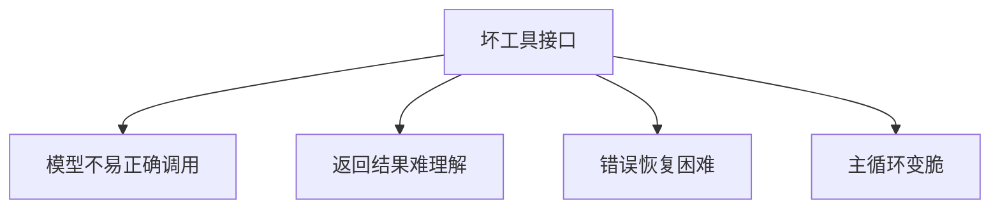

所以工具接口其实不是“小细节”，
而是 Agent 的基础设施。

------

# 六、一个好工具接口，最重要的 5 个特征

这一张图你一定要记住。

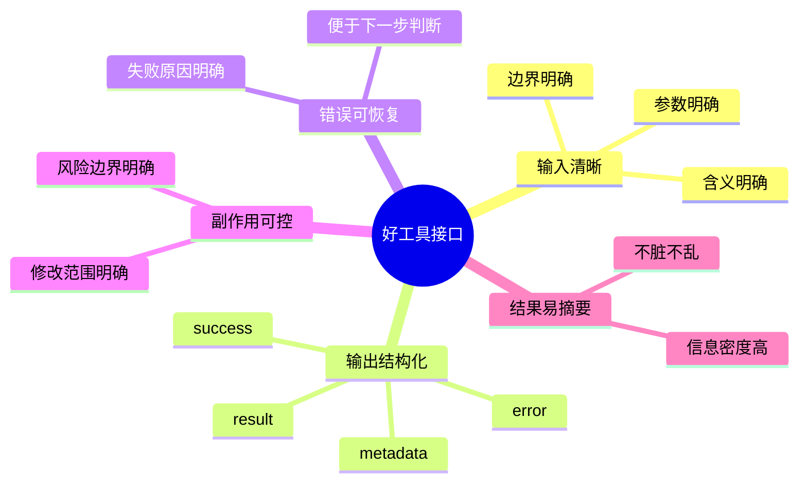

------

# 七、第一个特征：输入清晰

这点特别重要。

一个工具输入如果模糊，模型就会乱用。

## 坏例子

```text
do_file_action(input: string) -> string
```

这个为什么差？

因为完全不清楚：

- `input` 要传什么
- 是路径？内容？命令？还是 JSON？
- 行为边界是什么

模型就很容易瞎猜。

------

## 好例子

```text
read_file(
  file_path: string,
  start_line?: int,
  end_line?: int
) -> {
  success: boolean,
  content?: string,
  error?: string
}
```

这个就清晰很多：

- 参数叫什么
- 参数是干嘛的
- 返回结果长什么样

------

## 图示

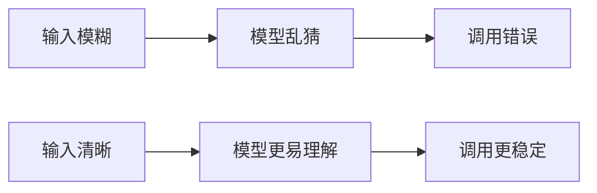

------

# 八、第二个特征：输出结构化

这是很多工具最容易烂掉的地方。

如果工具输出就是一坨字符串，后面很难处理。

## 差的返回

```text
"failed maybe because file not found or permission issue"
```

这有什么问题？

- 不确定是不是失败
- 不知道失败类型
- 不知道该怎么恢复

------

## 更好的返回

```text
{
  success: false,
  error_code: "FILE_NOT_FOUND",
  error_message: "login_service.py not found",
  retryable: false
}
```

这个一看就知道：

- 失败了
- 为什么失败
- 能不能重试

------

## 图示

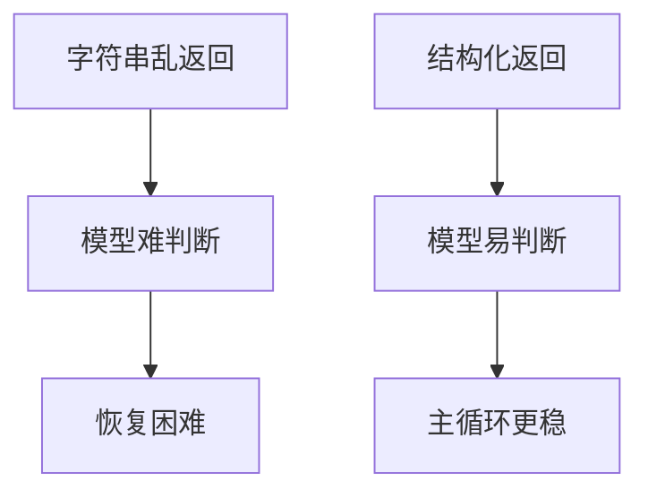

所以你可以记一句：

# **结构化输出，是让工具结果可编排、可恢复的前提。**

------

# 九、第三个特征：错误要“可恢复”

这个特别关键。

错误信息不是给人看着舒服的，
而是给系统下一步用的。

------

## 一个“可恢复”的错误，至少要告诉系统：

- 是什么错
- 为什么错
- 能不能重试
- 下一步更适合做什么

------

## 图示

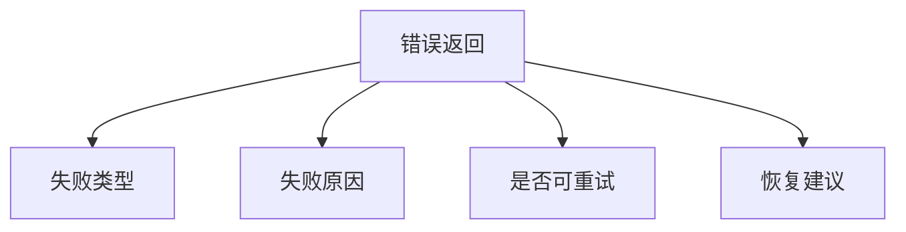

例如：

### 好的错误

```text
{
  success: false,
  error_code: "PATCH_CONTEXT_MISMATCH",
  error_message: "Target snippet no longer matches file content",
  retryable: true,
  suggested_recovery: "re-read file and regenerate patch"
}
```

这个就非常好。

它不只是说“失败了”，
还告诉系统：

# **该怎么恢复。**

------

# 十、第四个特征：副作用可控

很多工具的问题不是能不能执行，
而是执行后影响范围不清楚。

例如：

- 它到底改了哪个文件？
- 是改一行还是整文件？
- 是删了一个文件还是整个目录？
- 是本地运行还是在 host 上跑？

如果副作用不明确，安全层和恢复机制都很难设计。

------

## 图示

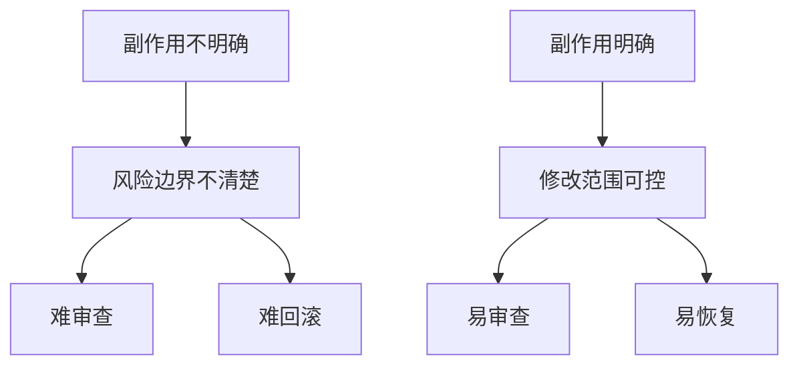

所以一个好工具接口，要尽量让：

- 作用对象明确
- 影响范围明确
- 执行环境明确

------

# 十一、第五个特征：结果要易于摘要

这个和你前面学的上下文管理直接相关。

如果工具返回特别脏：

- 过长
- 无结构
- 混杂无关信息
- 不知道重点在哪

那上下文管理器和模型就很痛苦。

------

## 一个好的工具结果应该更像：

- 关键信息在前
- 元数据明确
- 原始输出可选保留
- 方便压缩成摘要

------

## 图示

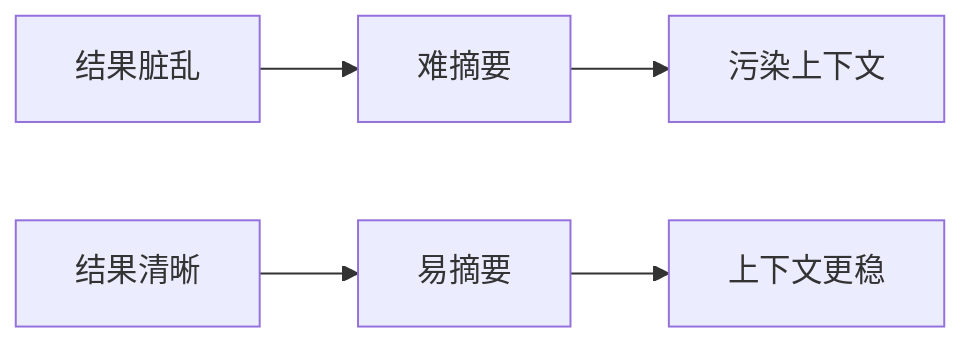

------

# 十二、一个工具接口通常长什么样

我给你画一个通用模板。

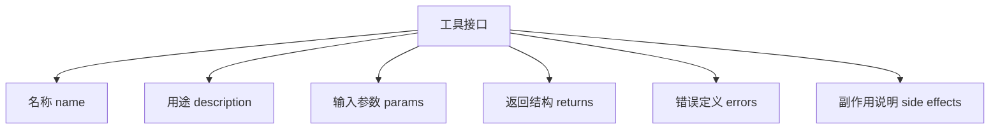

你以后自己写工具时，基本都可以照这个脑图走。

------

# 十三、给你几个具体例子

## 例 1：read_file

### 好接口

```text
read_file(
  file_path: string,
  start_line?: int,
  end_line?: int
) -> {
  success: boolean,
  content?: string,
  line_range?: [int, int],
  error_code?: string,
  error_message?: string
}
```

为什么好？

- 输入明确
- 输出明确
- 有行号范围
- 有错误码

------

## 例 2：patch_file

### 好接口

```text
patch_file(
  file_path: string,
  target_snippet: string,
  replacement: string
) -> {
  success: boolean,
  diff?: string,
  error_code?: string,
  error_message?: string,
  retryable?: boolean
}
```

为什么好？

- 目标片段明确
- 替换内容明确
- 返回 diff
- 失败后可判断怎么恢复

------

## 例 3：run_command

### 好接口

```text
run_command(
  command: string,
  cwd?: string,
  timeout_sec?: int
) -> {
  success: boolean,
  exit_code: int,
  stdout?: string,
  stderr?: string,
  timed_out?: boolean,
  error_code?: string
}
```

为什么好？

- 执行环境明确
- 超时边界明确
- 结果分 stdout / stderr
- 失败语义清晰

------

# 十四、为什么工具接口要“长得像 API”，而不是“长得像随手脚本”

因为 Agent 系统不是人工临时操作，
而是：

# **模型 + 主循环 + 工具编排系统**

这就要求工具必须：

- 可预测
- 可复用
- 可组合
- 可调试

随手脚本可能人能用，
但 Agent 很难稳定用。

------

## 图示

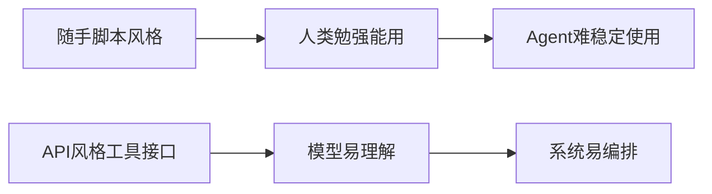

------

# 十五、为什么说工具接口差，会把整个 Agent 拖笨

因为它会连锁影响很多层。

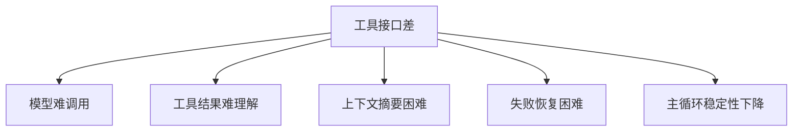

所以一个成熟 Agent 的很多“聪明感”，
其实不是模型突然更聪明，
而是：

# **工具接口设计得更适合被模型使用。**

------

# 十六、从团队协作角度类比

这个你会很好理解。

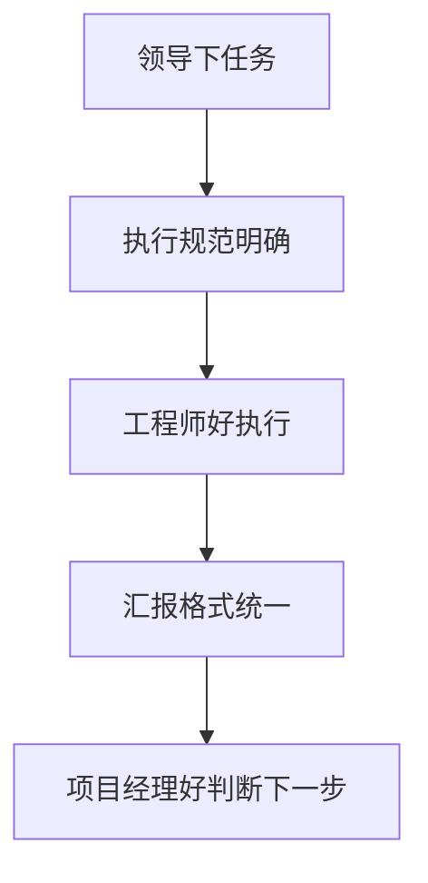

翻成人话：

- 输入清晰：任务说得明白
- 输出结构化：结果汇报标准化
- 错误可恢复：出问题知道怎么补救
- 副作用明确：知道改动影响范围

所以工具接口，其实非常像：

# **团队协作里的标准化任务单 + 标准化回执。**

------

# 十七、这一课你必须记住的 6 句话

## 第一句

**工具接口是模型世界和执行世界之间的协议层。**

## 第二句

**一个好工具接口，至少要做到：输入清晰、输出结构化、错误可恢复、副作用可控。**

## 第三句

**结构化输出，是让工具结果可编排、可恢复的前提。**

## 第四句

**错误信息不是只给人看的，更是给系统下一步恢复用的。**

## 第五句

**工具接口越像标准 API，Agent 越容易稳定使用。**

## 第六句

**很多 Agent 看起来不聪明，不是模型差，而是工具接口太烂。**

------

# 十八、这一课的思维导图

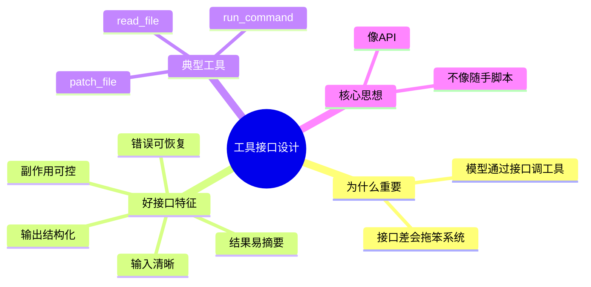

------

# 十九、这节课给你的练习

你继续按 1、2、3 回答就行。

### 题 1

为什么说“工具接口是协议层”，而不只是“一个函数”？

### 题 2

为什么结构化输出对 Agent 特别重要？

### 题 3

为什么“错误可恢复”是好工具接口的重要标准？

你答完以后，我下一课给你讲：

# 第 12 课：Agent 的状态机视角

这节会把前面所有内容再提升一层，讲：

- 为什么 Agent 可以被看成状态机
- 状态、转移、停止条件怎么理解
- 为什么状态机思维能帮你把系统设计得更稳

这一课会非常适合你把整套知识串起来。
