好，继续主线。

现在进入一个会把前面很多知识**真正统一起来**的视角：

# 第 12 课：Agent 的状态机视角

也就是——**为什么 Agent 不只是“循环”，而更像“状态在流动的系统”。**

这一课很关键。
因为你前面已经学了很多零件：

- 主循环
- 上下文
- 工具
- 安全
- 验证
- 恢复
- 工具接口

但如果没有一个更高层的框架去把它们串起来，你脑子里还是容易像一堆模块。

这一课就是要做这个事。

------

# 一、先给你一句总论

# **Agent 可以被理解成：一个在不同状态之间不断转移、直到结束的系统。**

也就是说：

- 它不是死循环
- 也不是一堆函数乱调
- 它更像一个“有状态、有转移条件、有停止条件”的机器

这就是状态机视角。

------

# 二、先看总图：什么叫状态机视角

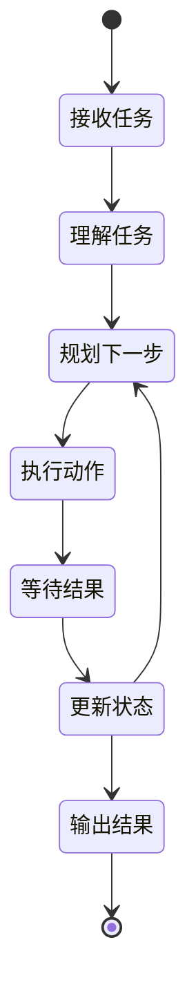

这张图你先不要被“状态机”三个字吓到。

翻成人话很简单：

Agent 在运行时，不是在“干一坨事”，
而是在：

- 当前处于哪个阶段
- 这个阶段完成后该转到哪里
- 在什么条件下继续
- 在什么条件下停止

------

# 三、为什么要用“状态机”来理解 Agent

因为前面你学的很多问题，其实都跟“状态”有关：

- 为什么不能无限重试
- 为什么需要停止条件
- 为什么验证失败后要回到继续修复
- 为什么高风险操作要进入等待确认
- 为什么 patch 失败后不是直接结束

这些本质上都不是“函数调用问题”，
而是：

# **状态转移问题。**

------

## 我给你画成一个总因果图

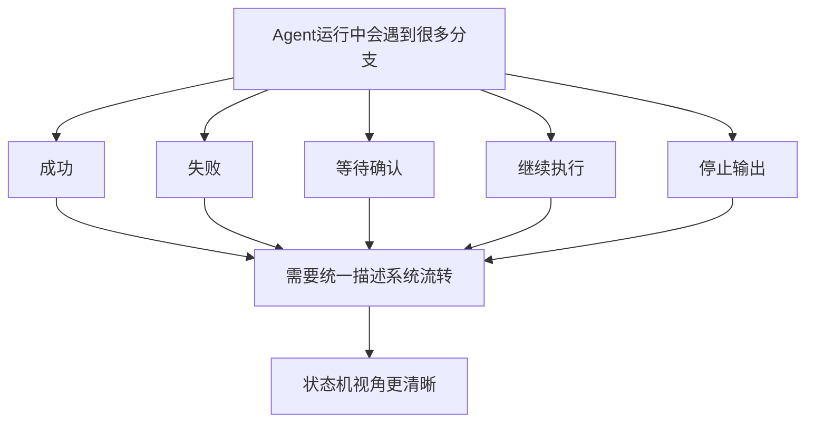

所以状态机最大的价值就是：

# **把“系统什么时候在哪、为什么跳到下一步”表达清楚。**

------

# 四、什么叫“状态”

状态，不是代码里的一个字符串那么简单。
更准确地说：

# **状态 = 系统在当前时刻的运行阶段 + 当前任务条件。**

例如：

- 正在理解任务
- 正在调用工具
- 正在等待测试结果
- 正在等待用户确认
- 正在恢复失败
- 已经完成输出

这些都可以叫状态。

------

## 图示

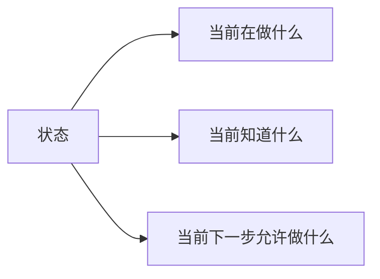

你可以把状态理解成：

# **“系统此刻所处的位置 + 可走的下一步范围”**

------

# 五、什么叫“状态转移”

状态转移就是：

# **在某个条件满足后，系统从一个状态切换到另一个状态。**

例如：

- 搜索完成 → 转到读取文件
- patch 失败 → 转到恢复状态
- 测试通过 → 转到输出结果
- 高风险命令触发 → 转到等待确认

------

## 图示

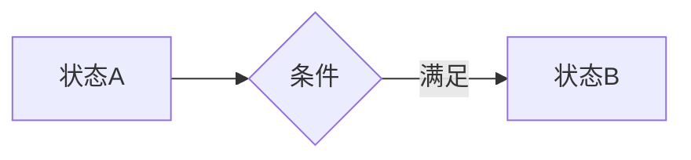

所以状态机的精髓不是“状态很多”，
而是：

# **每个状态都知道自己在什么条件下跳到哪里。**

------

# 六、Agent 最常见的一组状态

我先给你一版通用状态图。

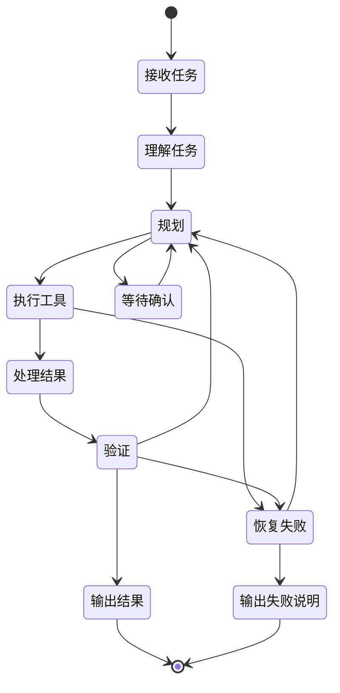

这张图很关键，因为你会发现前面所有课，几乎都在这里面了：

- 规划
- 工具执行
- 结果处理
- 验证
- 恢复
- 人类确认
- 输出

所以状态机不是新知识，
而是把旧知识统一起来。

------

# 七、主循环和状态机是什么关系

这个你一定要弄清。

很多人会问：

> 我前面学的是主循环，现在又来状态机，它们是不是一回事？

答案是：

# **主循环是“系统一直在转”，状态机是“系统每次在什么阶段、怎么转”。**

------

## 图示

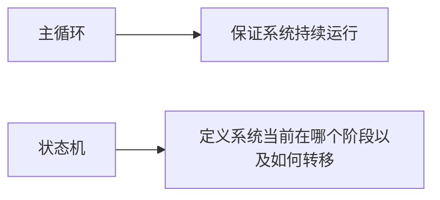

翻成人话：

- **主循环**：像发动机，一直转
- **状态机**：像挡位系统，告诉你现在挂的是几挡，什么时候换挡

这个类比很适合你记。

------

# 八、为什么状态机视角能让系统更稳

因为它能解决 4 个常见问题：

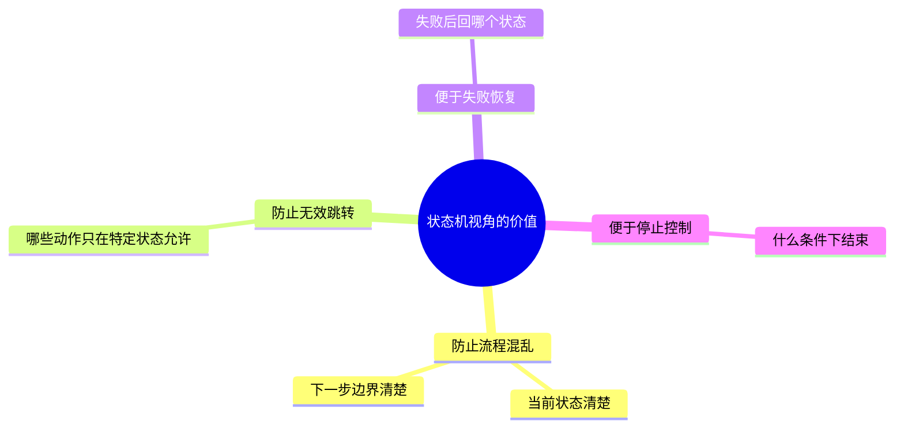

也就是说，状态机能帮你回答：

- 现在系统到底在干嘛
- 此刻允许做什么
- 失败后该回哪
- 什么时候该停

------

# 九、一个真实例子：修复登录失败，状态是怎么流动的

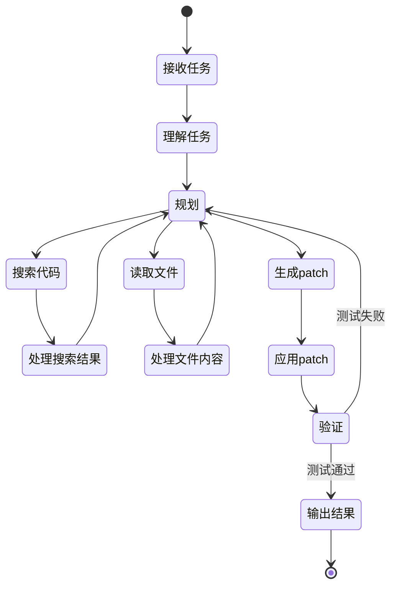

你会发现，这其实比“while 循环”更好理解。

因为它清楚地表达了：

- 先搜
- 再读
- 再 patch
- 再验证
- 验证不过就回去继续规划

这就是 Agent 很典型的运行节奏。

------

# 十、等待确认，其实就是一个标准状态

前面我们讲安全层时说过：

- 某些动作需要用户确认

从状态机视角看，这不是“额外插个 if”，
而是一个标准状态：

# **等待确认**

------

## 图示

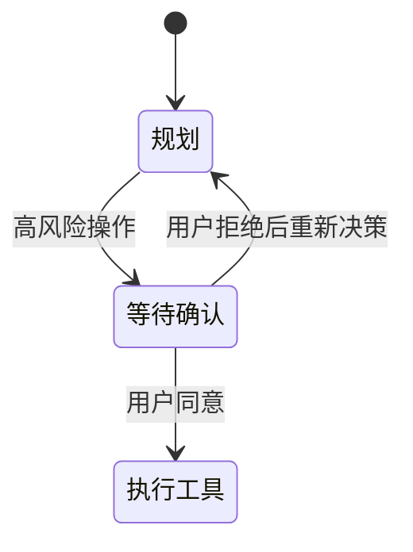

这个很重要。

因为当你把“等待确认”理解成状态后，
很多设计就清楚了：

- 为什么系统会暂停
- 为什么用户回复后还能继续
- 为什么确认也是主循环的一部分

------

# 十一、失败恢复，其实也是一组状态转移

同样地，失败恢复也不该只理解成“catch 一下异常”。

从状态机视角看，它是：

- 执行失败
- 进入失败识别
- 进入恢复动作
- 再次回到规划/执行
- 或者停止

------

## 图示

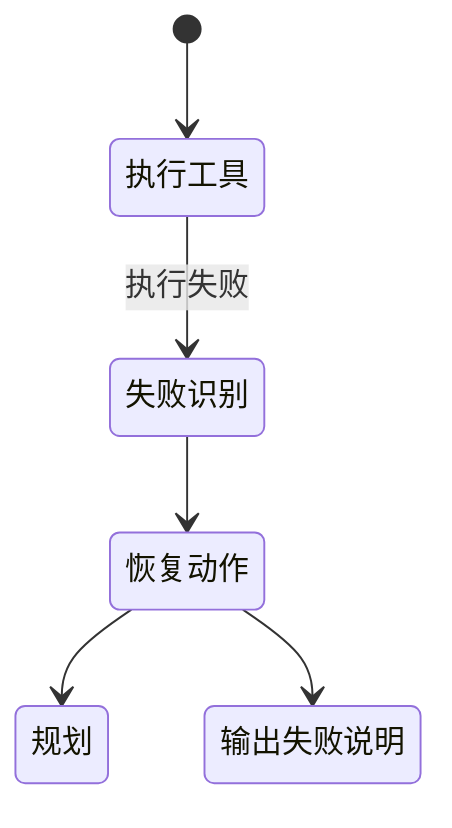

所以失败恢复为什么要学状态机？
因为它天然就是：

# **失败状态 → 恢复状态 → 回归正常状态**

------

# 十二、验证为什么也是状态，不只是一步动作

这个你前面已经有感觉了。

验证之所以重要，不只是因为要“跑测试”，
更因为它决定系统走向：

- 结束
- 继续修
- 回滚
- 停止

所以从状态机视角看：

# **验证是一个关键分叉状态。**

------

## 图示

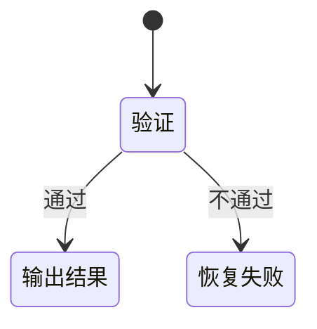

这也是为什么我前面一直强调：

**验证不是附属步骤，而是主循环的一部分。**

因为它会改变状态流向。

------

# 十三、停止条件，本质上也是状态机的一部分

停止不是“感觉差不多了就停”。

成熟系统会有明确的终止条件：

- 任务完成
- 连续失败过多
- 用户取消
- 达到最大轮次
- 高风险操作未获批准
- 环境条件不足

------

## 图示

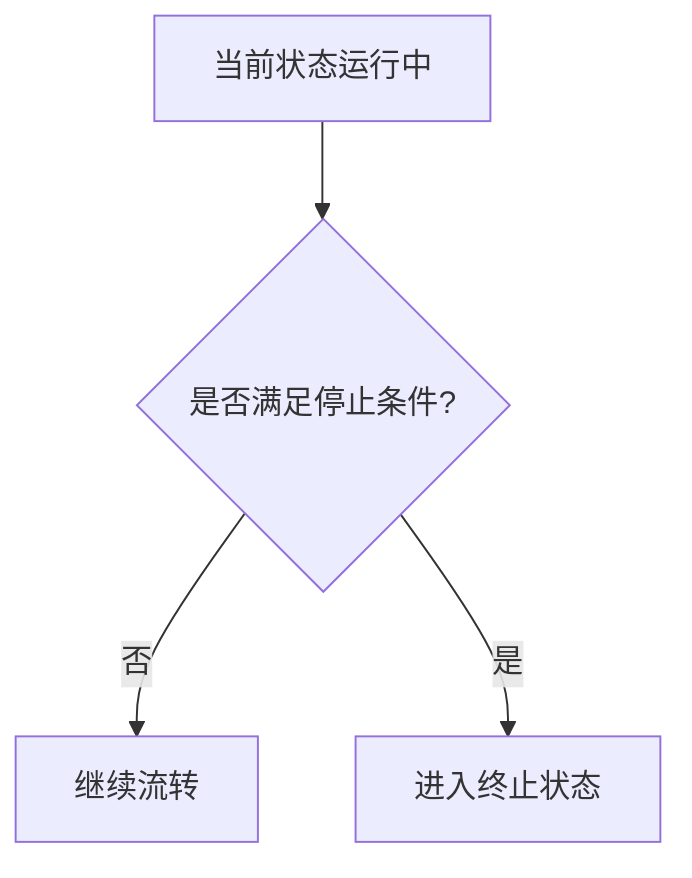

所以停止条件不是补充逻辑，
而是状态机里非常核心的一部分。

------

# 十四、为什么状态机思维特别适合你

因为你本身就偏：

- 系统设计
- 流程拆解
- 工作流理解
- 业务节点理解

状态机视角本质上就是把 Agent 看成一个“运行中的流程系统”。

这个和你理解业务系统、审批流、工单流，非常像。

------

## 我给你画个你会很喜欢的类比图

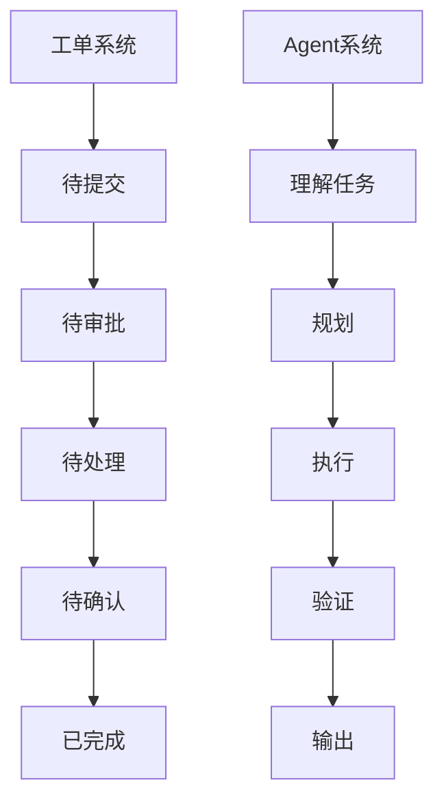

你会发现：

# **Agent 和工作流系统，本质上都可以被看成“状态流转系统”。**

这也是为什么你学这个会比较顺。

------

# 十五、状态机视角的一个巨大价值：便于实现

因为你以后真正写代码时，会很自然地写成这种形式：

```text
state = "PLAN"

while not done:
    if state == "PLAN":
        ...
        state = "EXECUTE"
    elif state == "EXECUTE":
        ...
        state = "VERIFY"
    elif state == "VERIFY":
        ...
        state = "DONE" or "RECOVER"
    elif state == "RECOVER":
        ...
        state = "PLAN"
```

也就是说，状态机视角不是纯理论，
它非常接近真实实现。

------

# 十六、一个最小 Agent 状态机骨架

我给你画一版最小可实现的。

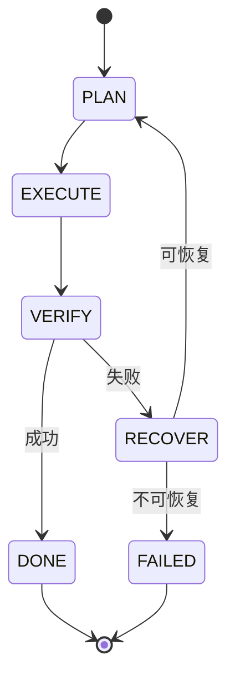

这个骨架非常值得你记住。

因为一个最小 Agent 其实已经能抽象成：

- 规划
- 执行
- 验证
- 恢复
- 完成/失败

------

# 十七、状态机视角最容易踩的坑

这一课也有几个坑要提醒你。

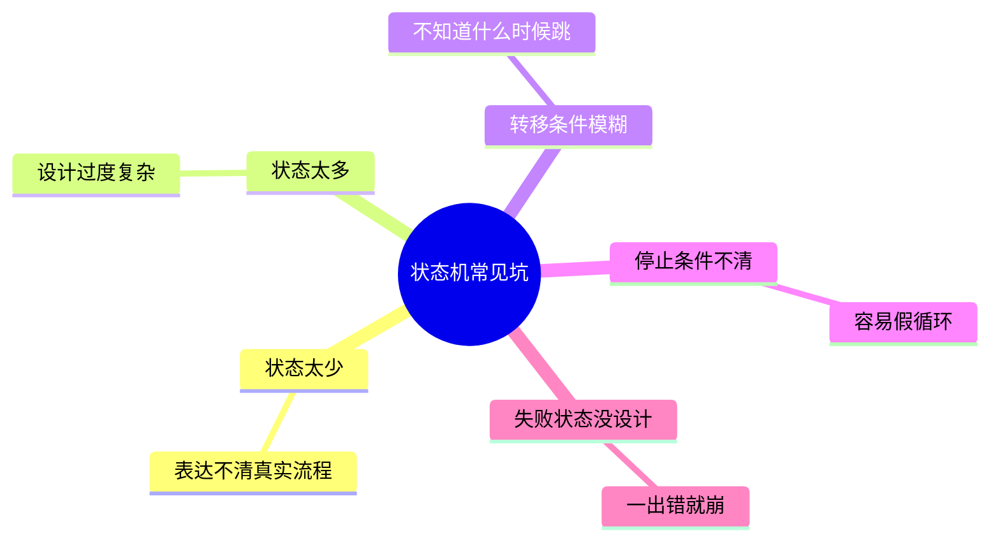

所以状态机不是越复杂越好，
而是要做到：

# **关键状态够清晰，转移条件够明确。**

------

# 十八、这一课你必须记住的 6 句话

## 第一句

**Agent 不只是循环系统，也可以看成状态流转系统。**

## 第二句

**状态 = 当前运行阶段 + 当前可执行动作范围。**

## 第三句

**主循环负责“持续运行”，状态机负责“当前在哪、往哪走”。**

## 第四句

**等待确认、验证、失败恢复，都天然适合被建模成状态。**

## 第五句

**停止条件不是附加逻辑，而是状态机的重要组成部分。**

## 第六句

**状态机视角能帮助你把 Agent 设计得更清晰、更稳、更容易实现。**

------

# 十九、这一课的思维导图

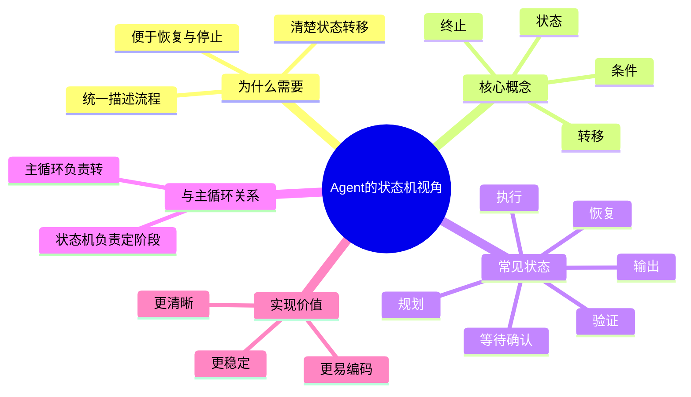

------

# 二十、这节课给你的练习

你继续按 1、2、3 回答就行。

### 题 1

为什么说 Agent 不只是 while 循环，而更适合用状态机来理解？

### 题 2

为什么“等待确认”和“失败恢复”都很适合被看成状态？

### 题 3

为什么停止条件也是状态机设计里很重要的一部分？

你答完以后，我下一课给你讲：

# 第 13 课：多 Agent 与角色分工

这节会把你一开始最关心的“分角色、多提示词、多步骤协作”彻底讲透。
