好，直接往下讲，不做练习点评了。

# 第 13 课：多 Agent 与角色分工

也就是——**多角色是不是更高级，什么时候该拆，什么时候不该拆。**

先给结论：

# **多 Agent 不是默认更强。**

# **很多场景，单 Agent + 好工具 + 好流程，就够了。**

真正该拆成多 Agent，通常不是因为“听起来高级”，而是因为：

- 任务确实有明显分工
- 不同阶段需要不同上下文
- 不同角色的输出格式不同
- 你想降低单个 Agent 的认知负担

------

# 一、先看总图

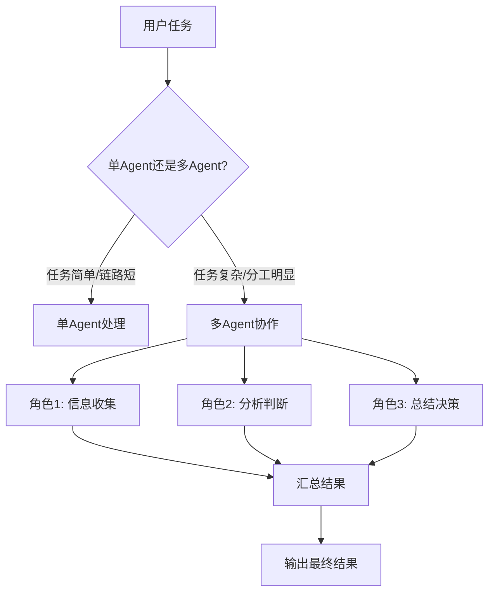

------

# 二、什么叫多 Agent

不是简单写 3 段 prompt 就叫多 Agent。

更准确地说：

# **多 Agent = 把一个大任务拆给多个“有独立职责、独立输入输出边界”的执行单元。**

例如：

- 一个负责搜资料
- 一个负责做财务分析
- 一个负责做风险分析
- 一个负责最后汇总

------

# 三、你最早说的那个例子，其实很典型

你之前说过类似这种：

- 角色 A：分析财务
- 角色 B：分析主力行为
- 角色 C：主脑总结

这个就是很典型的**角色分工式多 Agent**。

我给你画出来：

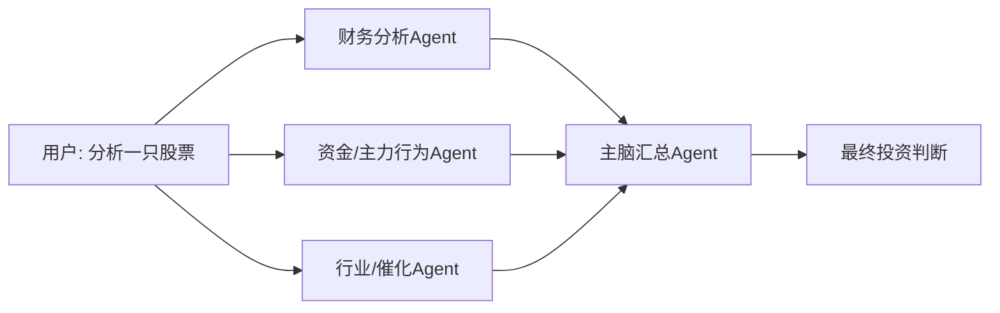

这类设计的核心价值是：

- 每个角色只看自己最相关的信息
- 最后由一个汇总者统一判断

------

# 四、为什么有时候多 Agent 有价值

因为单 Agent 有时会同时背太多任务：

- 要搜
- 要分析
- 要比较
- 要总结
- 还要记住每个方向的中间结论

这会让它的上下文和认知负担都变重。

------

## 图示

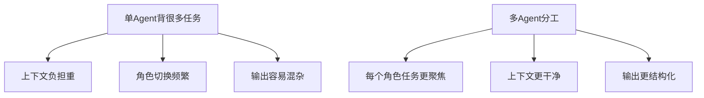

所以多 Agent 的本质，不是“更酷”，而是：

# **把复杂任务拆成更干净的认知单元。**

------

# 五、但为什么我说多 Agent 不是默认更强

因为它也有成本。

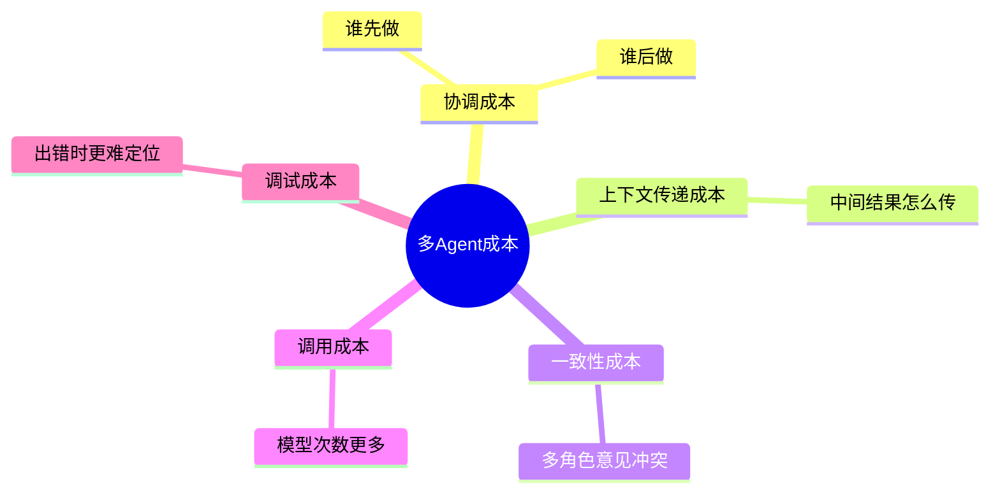

所以如果任务本来就简单，比如：

- 总结一个函数
- 修一个很明确的小 bug
- 读一个配置文件解释含义

那多 Agent 反而可能拖慢系统。

------

# 六、什么时候适合单 Agent

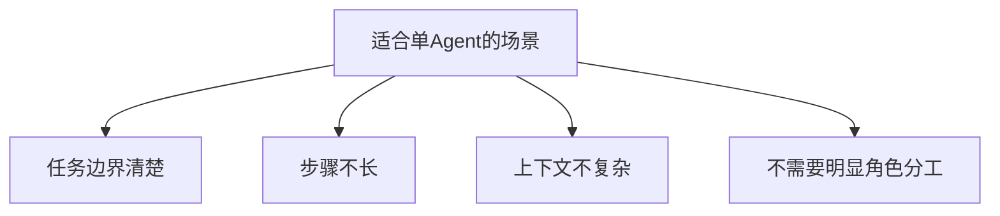

例如：

- 搜并改一个函数
- 总结一篇文档
- 做一次简单问答
- 修一个明显报错

这种通常单 Agent 就够。

------

# 七、什么时候适合多 Agent

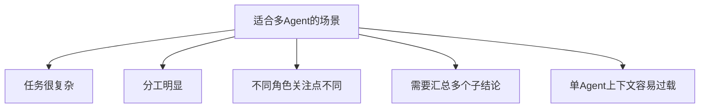

例如：

- 股票研究系统
- 企业投标分析
- 法务/财务/技术多视角评估
- 一个大功能从需求分析到编码再到测试
- 浏览器操作 + 文档理解 + 最终报告

------

# 八、多 Agent 常见的 4 种模式

这一张很重要。

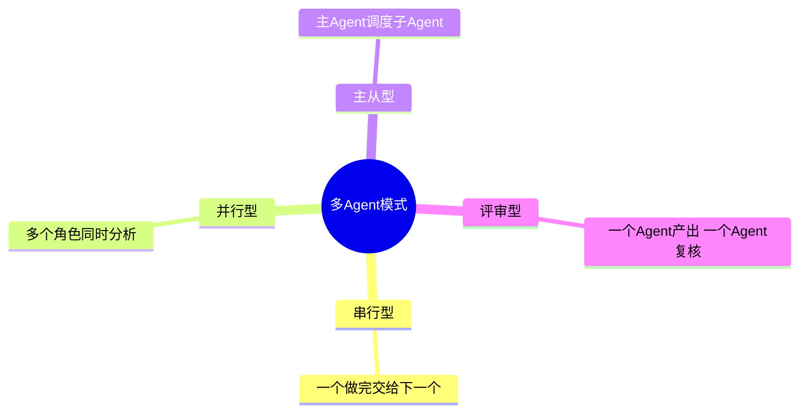

下面我逐个讲。

------

## 1）串行型

像流水线。

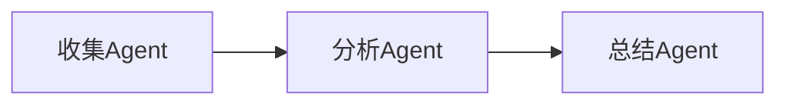

适合：

- 明显前后依赖
- 每一步输出给下一步

例如：

- 先搜资料，再分析，再写报告

------

## 2）并行型

多个角色同时干。

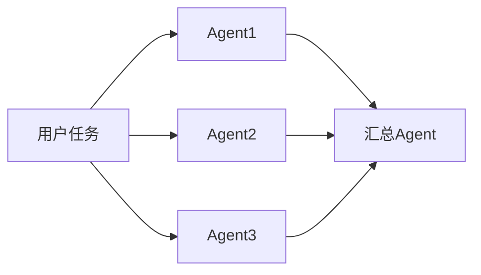

适合：

- 多视角分析
- 子任务彼此独立

例如：

- 财务、行业、技术面并行看一只股票

------

## 3）主从型

一个主 Agent 负责任务拆分和调度，子 Agent 各干各的。

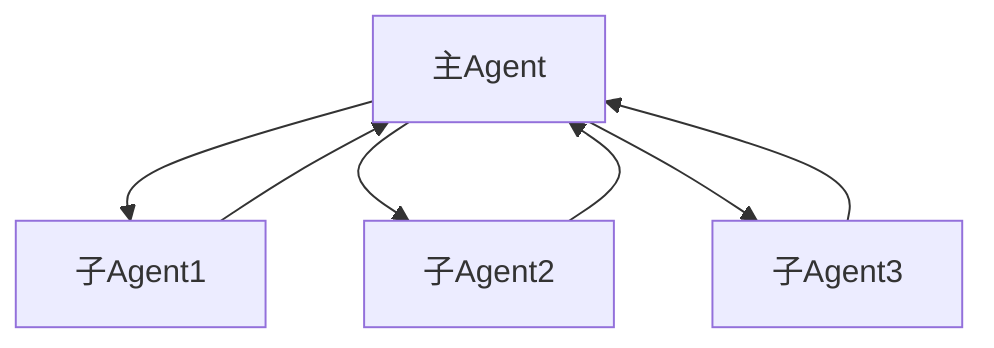

适合：

- 复杂系统
- 需要统一调度
- 需要一个主脑控制节奏

这类很像 manager-worker。

------

## 4）评审型

一个生成，一个审查。

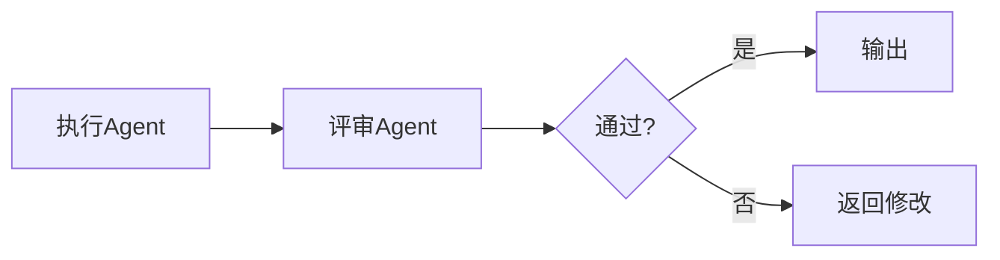

适合：

- 高风险输出
- 代码审查
- 报告复核
- 安全检查

------

# 九、单 Agent + 角色提示词，和真正多 Agent，有什么区别

这是很多人最容易混的点。

## 方式一：单 Agent 里写多个角色提示

例如：

- 先像财务分析师分析
- 再像主力行为分析师分析
- 最后像总监总结

这本质上还是**一个 Agent**，只是它在一个上下文里“切换视角”。

------

## 方式二：真正多 Agent

是：

- 财务 Agent 单独跑一轮
- 主力行为 Agent 单独跑一轮
- 汇总 Agent 再拿前两个结果做判断

这已经是**多次独立调用、独立中间结果、独立角色边界**了。

------

## 对比图

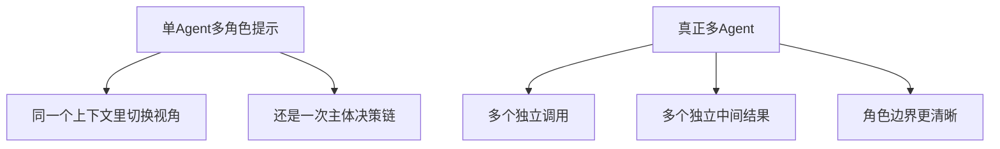

所以你之前问“模型自己能不能识别分角色”，答案其实是：

# **能模拟角色，但不等于真正多 Agent。**

------

# 十、为什么很多产品表面看是多 Agent，底层其实是“主 Agent + 子流程”

因为真正多 Agent 很贵，也复杂。

很多系统看起来像这样：

- 研究员
- 审核员
- 总结员

但实现上未必是 3 个真正独立智能体，
也可能是：

# **一个主 Agent 按不同 prompt/不同节点跑多个阶段。**

也就是说：

- 产品上叫多角色
- 工程上可能只是“多阶段节点”

这点你一定要分清。

------

# 十一、从工程实现上，多 Agent 最难的其实不是 prompt

而是这几个问题：

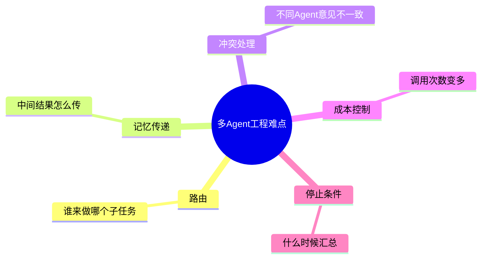

所以多 Agent 真正难的是：

# **协作协议**

不是“多写几个身份设定”。

------

# 十二、你以后最常用的，其实不是“纯多 Agent”，而是这两种

## 第一种：单 Agent + 分阶段流程

这个最稳。

例如：

- 先搜
- 再分析
- 再总结

本质还是一个主 Agent 控多个节点。

------

## 第二种：主 Agent + 少量专用子 Agent

例如：

- 主 Agent 负责任务推进
- 一个财务子 Agent
- 一个代码审查子 Agent

这类很适合你以后落地。

------

## 图示

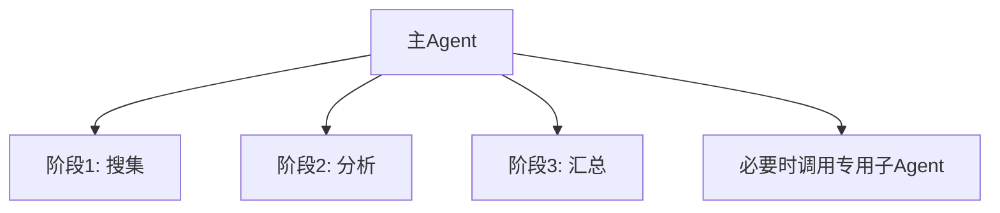

这通常比一上来搞 8 个 Agent 更现实。

------

# 十三、在 coding agent 里，多 Agent 怎么用

这个也很重要。

例如一个复杂编码任务，可以拆成：

- 代码理解 Agent
- 修改 Agent
- 测试验证 Agent
- 评审 Agent

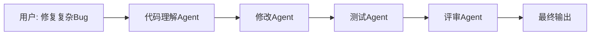

但现实里很多 coding agent 不会真的这么拆得很重，
因为成本高。更常见的是：

# **主 Agent 内部按阶段模拟这些角色。**

------

# 十四、所以到底什么时候该拆角色

我给你一个最实用的判断标准：

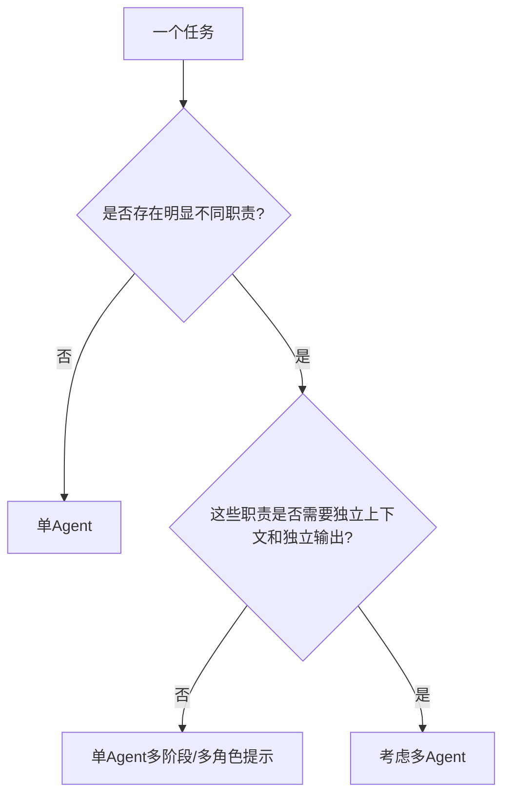

这张图非常实用。

你以后判断时就看两点：

1. 有没有明显不同职责
2. 这些职责要不要独立上下文和独立输出

如果都不强，就没必要多 Agent。

------

# 十五、这节课最核心的 6 句话

## 第一句

**多 Agent 不是默认更强，而是分工更明确。**

## 第二句

**真正多 Agent 的核心，不是多几个身份提示，而是多个独立职责单元。**

## 第三句

**单 Agent 多角色提示，和真正多 Agent，不是一回事。**

## 第四句

**多 Agent 的价值在于降低单个 Agent 的认知负担，提升分工清晰度。**

## 第五句

**多 Agent 的代价是协调、记忆传递、成本和调试复杂度。**

## 第六句

**工程上更常见的，是主 Agent + 分阶段流程，或主 Agent + 少量专用子 Agent。**

------

# 十六、这一课的思维导图

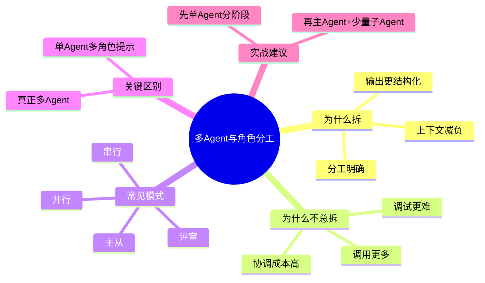

------

# 十七、这节课给你的练习

这次你要是懒得答也行，我可以继续直接讲下一课。

### 题 1

为什么“单 Agent 多角色提示”和“真正多 Agent”不是一回事？

### 题 2

多 Agent 最大的价值和最大的问题分别是什么？

### 题 3

为什么工程上更常见的是“主 Agent + 分阶段流程”，而不是很多独立 Agent 乱飞？

你回一句“继续”，我就直接讲：

# 第 14 课：评估与 Evals

这节会非常关键，因为它决定你以后做的是“能演示的 Agent”，还是“可验证的 Agent”。
