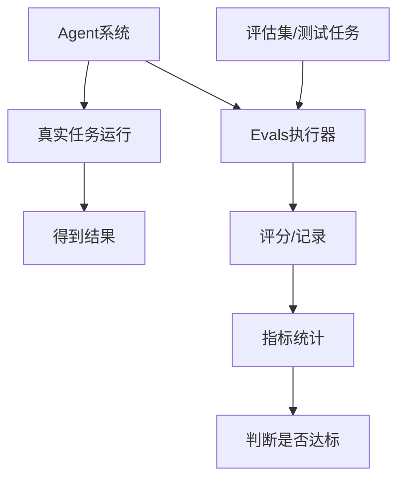
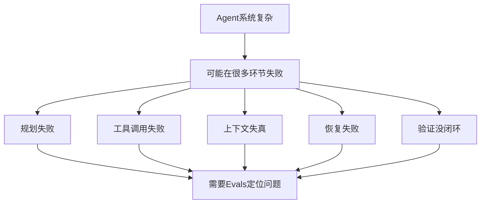
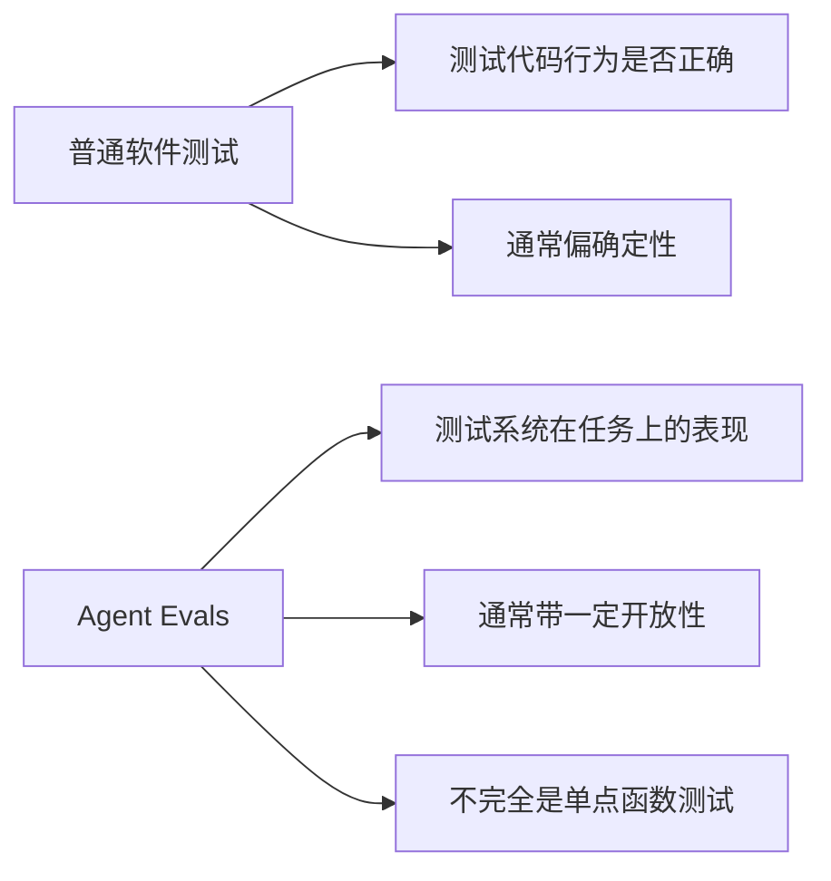
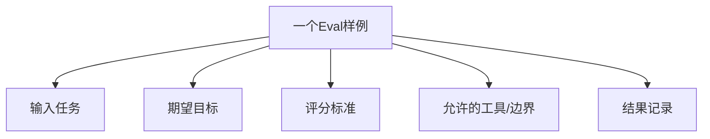
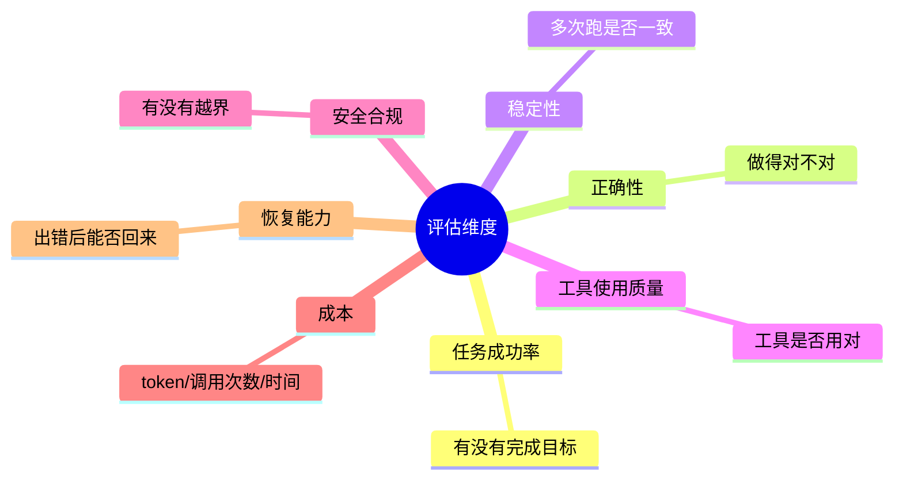
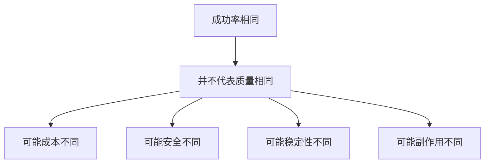
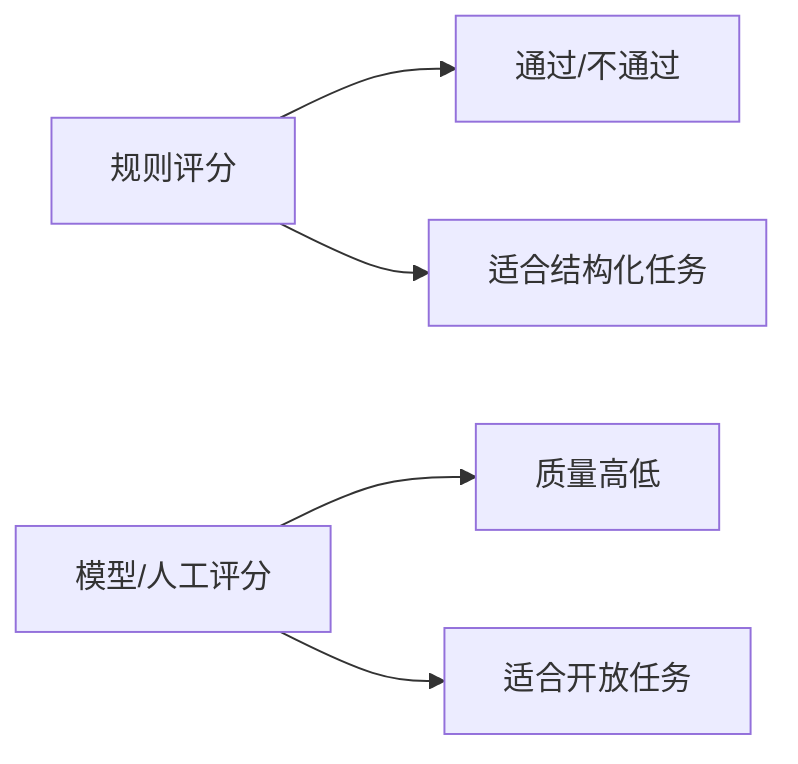
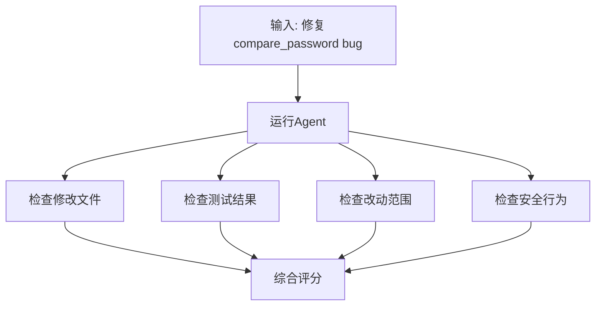
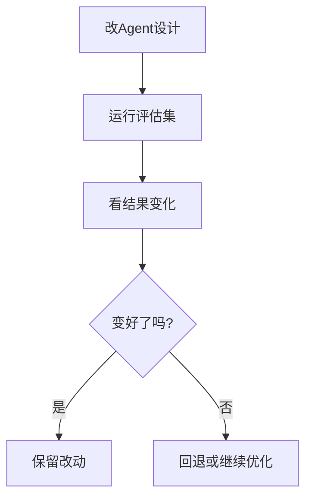
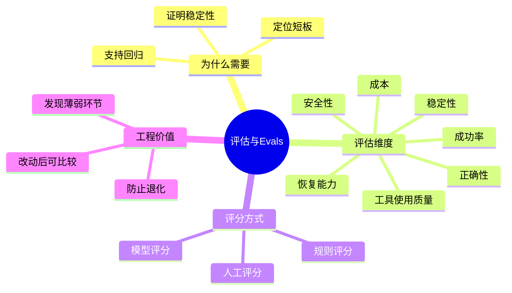

好，继续主线。

# 第 14 课：评估与 Evals

也就是——**为什么“看起来能用”不等于“真的可用”。**

这一课非常关键。
因为很多 Agent 项目最容易死在这里：

- demo 的时候很惊艳
- 一换输入就不稳
- 一换任务就跑偏
- 一改 prompt 就退化
- 修了一个地方，另一个地方坏了

所以真正成熟的 Agent，不只是要能跑，
还要能：

# **被验证、被比较、被回归检查。**

------

# 一、先给你一句总论

# **Evals 的本质，就是把“我感觉它不错”变成“我能证明它稳定到什么程度”。**

这句话你一定要记。

因为工程和演示的区别，很多时候就在这里：

- 演示：我跑一遍成功了
- 工程：我知道它在一组任务上成功率多少，失败集中在哪，改动后有没有变差

------

# 二、先看总图：Evals 在 Agent 体系里的位置

这张图表达一个重点：

# **Evals 不是给用户看的，它是给你这个开发者/设计者看的。**

它是用来回答这些问题的：

- 现在这个 Agent 到底稳不稳
- 哪些任务类型最容易失败
- 改了 prompt/工具/流程之后，是更好了还是更差了

------

# 三、为什么 Agent 特别需要 Evals

因为 Agent 比普通问答系统更复杂。

它有：

- 多轮调用
- 工具使用
- 上下文管理
- 状态转移
- 安全策略
- 验证与恢复

这就意味着，它失败的地方也更多。

------

## 图示

所以 Agent 不能只靠“感觉还行”。

------

# 四、什么叫 Eval

简单说：

# **Eval = 用一组固定任务，反复测试你的 Agent 表现。**

例如你做一个 coding agent，你可以准备一批任务：

- 修复一个明确 bug
- 给某函数加日志
- 改一个配置值
- 读一个文件总结问题
- patch 后跑测试

然后看 Agent：

- 能不能完成
- 成功率多少
- 出错在哪
- 代价多大

------

# 五、Evals 和普通测试有什么像、又有什么不一样

这个你要分清。

### 相同点

- 都是为了验证系统质量
- 都需要输入、预期、结果比较

### 不同点

Agent eval 常常更关心：

- 任务有没有完成
- 过程是否合规
- 工具是否使用正确
- 成本是否可接受
- 稳定性如何

也就是说，eval 更像：

# **任务级评估**

而不是简单单元测试。

------

# 六、一个 Eval 通常包含什么

这一张很重要。

例如一个 eval case 可能是：

- 输入：修复 `login_service.py` 的密码比较 bug
- 期望目标：相关测试通过
- 评分标准：是否改对文件、是否通过测试、是否无多余改动
- 限制：不能改数据库配置
- 记录：耗时、调用次数、失败类型

------

# 七、Agent 常见的评估维度有哪些

这张图你要记住。

这几个维度非常重要。

下面我拆开讲。

------

## 1）任务成功率

最基本的。

例如 100 个任务里完成了多少。

这是最直观的指标。

------

## 2）正确性

不是只看“做完了”，而是看“做对了吗”。

例如：

- 改了登录 bug，但其实偷偷改坏了别的逻辑
- 输出了结论，但结论不对

------

## 3）稳定性

同样任务跑 3 次，结果是不是差不多。

如果一次成一次不成，那产品就很难用。

------

## 4）工具使用质量

例如：

- 该用 search 的时候有没有乱读一堆文件
- 该 patch 的时候有没有整文件重写
- 该验证的时候有没有跳过测试

------

## 5）安全合规

例如：

- 有没有修改不该改的目录
- 有没有执行高危命令
- 有没有突破任务边界

------

## 6）成本

例如：

- 调用了几次模型
- 走了多少轮
- 花了多少 token
- 执行时间多长

有些 Agent 虽然能做成，但代价太大，也不行。

------

## 7）恢复能力

例如：

- patch 失败后能不能重新定位
- 测试失败后能不能继续修
- 工具超时后能不能合理收敛

------

# 八、为什么“成功率”还不够

因为成功率可能骗你。

举个例子：

- A 系统成功率 80%
- B 系统成功率 80%

看起来一样。

但可能：

- A 的成本更低
- A 更稳定
- A 更安全
- A 改动更小
- B 虽然也能成功，但经常乱改、费 token、波动大

所以 Agent 评估不能只看一个数字。

------

## 图示

------

# 九、Evals 最常见的两种方式

## 第一种：规则评分

也就是能写死标准的。

例如：

- 是否通过测试
- 是否修改了指定文件
- 是否出现 forbidden command
- 调用次数是否超限

这种很适合 coding agent。

------

## 第二种：模型评分 / 人工评分

也就是一些更开放的结果，需要判断质量。

例如：

- 报告总结是否清晰
- 多角色分析是否覆盖主要维度
- 输出是否符合风格要求

------

## 图示

最稳的做法通常是：

# **能规则化的先规则化，实在规则不了的再加模型/人工评分。**

------

# 十、coding agent 的一个典型 Eval 长什么样

举个很贴近你的例子。

### Eval 任务

修复 `compare_password` 的 bug。

### 评分点

- 是否修改了 `login_service.py`
- 是否没有改无关目录
- 是否通过 `tests/auth`
- 是否总改动行数在合理范围
- 是否没调用高危命令

------

## 图示

你看，这就已经很像一个真实的 eval case 了。

------

# 十一、为什么你以后做项目，一定要先做“小评估集”

这个特别重要。

不要等项目做大了再想评估。

正确做法是：

# **边做边积累 eval case。**

例如你做一个最小 agent 时，就先准备 10 个任务：

- 3 个读代码类
- 3 个改代码类
- 2 个测试失败恢复类
- 2 个安全边界类

以后每改一次 prompt、上下文、工具接口，都跑这 10 个看看有没有退化。

这就叫：

# **回归评估**

------

# 十二、为什么 Evals 对你这种未来想做 Agent 工程的人特别重要

因为它会直接决定你是不是停留在“我觉得它挺聪明”。

真正工程化的人会说：

- 我有 20 个基准任务
- 当前版本成功率 75%
- patch 失败恢复是主要问题
- 改了上下文策略后，成功率升到 83%，但 token 成本上升 10%

这就完全不是一个层次了。

------

# 十三、Evals 在研发流程里怎么放

你看，它其实就像：

- 软件开发里的测试回归
- 只是对象变成了 Agent 行为

------

# 十四、一个成熟 Agent 团队，会怎么看评估结果

不是只看“平均分”。

而是会问：

- 哪类任务失败最多
- 是工具问题、上下文问题还是恢复问题
- 是不是某个新改动引起了退化
- 失败案例有没有模式
- 哪些可以规则修复，哪些要重新设计

所以 Evals 的价值不仅是打分，
更是：

# **找系统短板。**

------

# 十五、这一课最核心的 6 句话

## 第一句

**Evals 的本质，是把“感觉能用”变成“可证明的表现”。**

## 第二句

**Agent 评估关注的不只是成功率，还包括正确性、稳定性、安全性、成本和恢复能力。**

## 第三句

**能规则化评分的先规则化，规则不了的再用模型或人工评分。**

## 第四句

**对 coding agent 来说，测试通过、改动范围、安全边界都可以成为重要评估项。**

## 第五句

**Evals 不只是打分工具，更是定位系统短板的手段。**

## 第六句

**想从 demo 走向工程，评估集和回归机制几乎是必需品。**

------

# 十六、这一课的思维导图

------

# 十七、这节课给你的练习

你要是懒得答也可以继续直接下一课。

### 题 1

为什么说“成功率高”还不够，不能代表 Agent 整体质量高？

### 题 2

为什么 coding agent 特别适合先做规则型 eval？

### 题 3

为什么我说 Evals 不只是打分，而是定位系统问题？

你回一句“继续”，我就直接讲：

# 第 15 课：人类介入与审批点

这节会把“全自动是不是最好”这件事彻底讲清楚。
