好，继续主线。

# 第 15 课：人类介入与审批点

也就是——**为什么“全自动”不一定是最优解。**

这一课非常重要。
因为很多人一学 Agent，很容易天然追求：

- 越自动越好
- 最好一句话全做完
- 最好不用人管

但真实世界里，很多高质量系统恰恰不是“彻底无人参与”，而是：

# **把人放在最关键的节点上。**

一句话先给你结论：

# **优秀 Agent 不是“完全替代人”，而是“在人最该介入的地方，设计好介入点”。**

------

# 一、先看总图

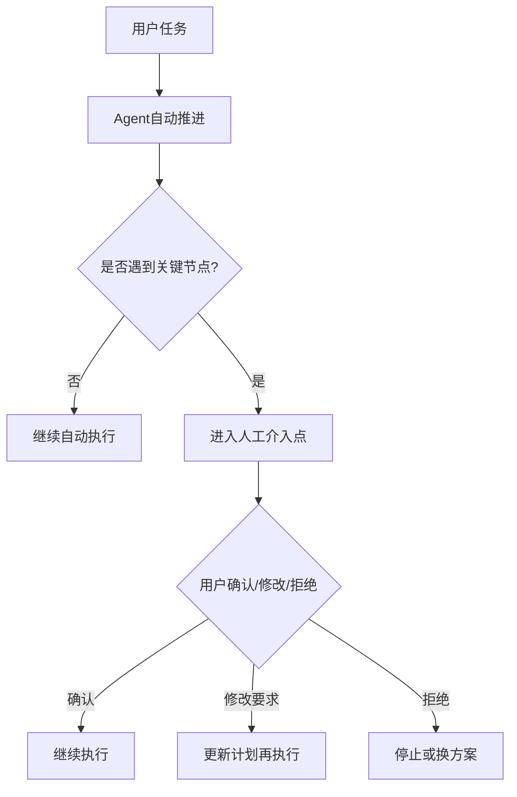

这张图你先记一个核心：

# **人工介入不是系统失败，而是系统设计的一部分。**

------

# 二、为什么“全自动”不一定最好

因为真实任务里有很多场景，
系统虽然“技术上能继续”，但“业务上不应该自动继续”。

比如：

- 要删除文件
- 要改关键配置
- 要对外发送邮件
- 要执行高风险命令
- 要做资金相关动作
- 要输出有法律/财务后果的结论

这时候如果系统无脑全自动，反而危险。

------

## 图示

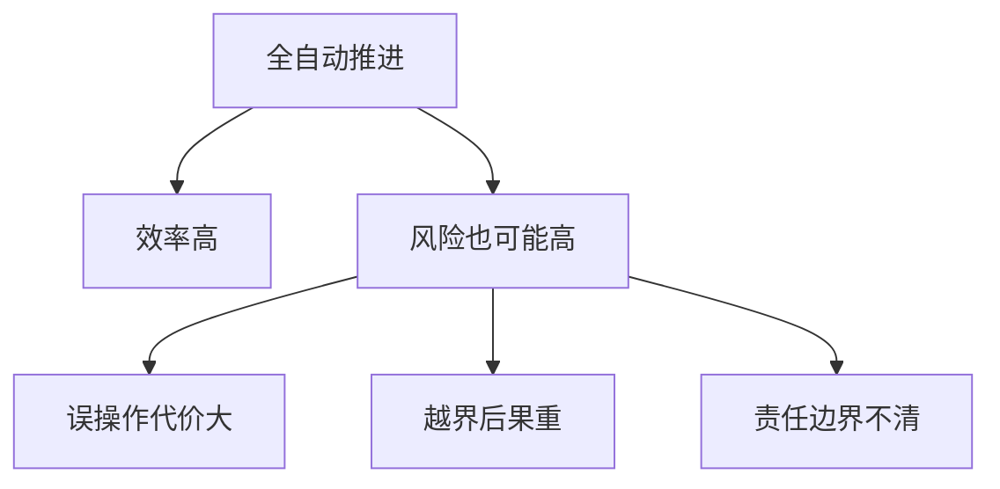

所以你要记住：

# **自动化追求的不是“完全没人”，而是“在合适边界内尽量自动”。**

------

# 三、什么叫“人工介入点”

不是简单弹个窗就算。

更准确地说：

# **人工介入点 = 系统在关键状态下，把决策权临时交还给人。**

例如：

- 是否执行这条危险命令
- 是否接受这次大范围改动
- 是否采用 A 方案还是 B 方案
- 是否继续在失败后重试
- 是否允许对外发送结果

------

## 图示

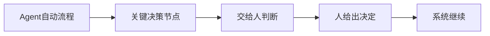

所以人工介入点，本质上是：

# **权限与责任的交接点。**

------

# 四、为什么人工介入点特别重要

因为它解决了 4 个大问题：

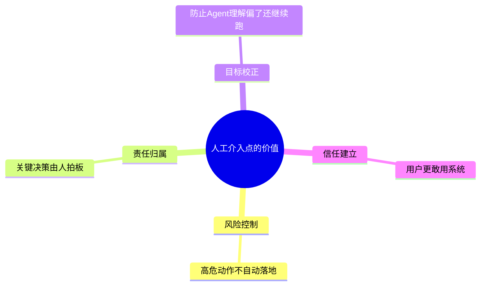

------

## 1）风险控制

最直接的价值。

高风险动作，不该默认自动执行。

------

## 2）责任归属

很多关键结果，最终必须由人负责，而不是模型负责。

------

## 3）目标校正

Agent 有时会理解偏。
人在关键节点能把它拉回来。

------

## 4）信任建立

用户知道“关键处我还能管”，才更敢把任务交出去。

------

# 五、哪些场景特别适合设置人工介入点

这一张很实用。

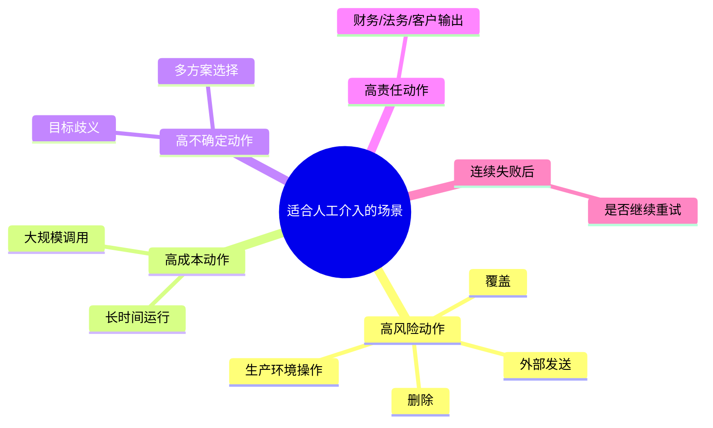

这几个你以后做产品时非常常见。

------

# 六、第一类：高风险动作审批

这是最典型的。

例如：

- 删除目录
- 改生产配置
- 执行 `rm -rf`
- 覆盖整文件
- 发消息给真实用户

------

## 图示

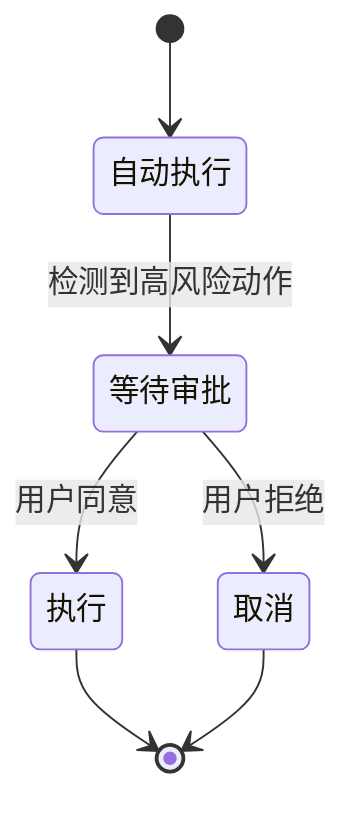

所以人工审批点最经典的作用就是：

# **把高风险自动化，变成“可控自动化”。**

------

# 七、第二类：高不确定动作审批

这类不是因为危险，
而是因为系统自己没把握。

例如：

- 有两个都可能正确的修复方案
- 用户目标表达不清
- 多个文件都像问题源头
- 两种输出风格都可能合理

这时候继续硬跑，风险是“越做越偏”。

------

## 图示

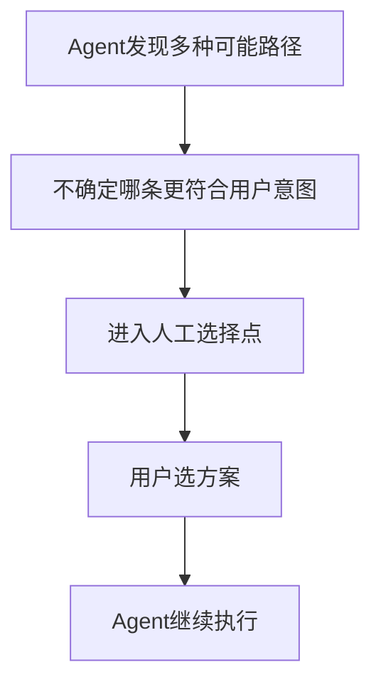

所以你要记住：

# **人工介入不只是为了安全，也为了意图对齐。**

------

# 八、第三类：高责任动作审批

这类尤其适合企业场景。

例如：

- 财务报表结论
- 法务意见
- 对客户的正式回复
- 生产部署
- 工单最终关闭

这些不是“系统能不能做”的问题，
而是“谁该最终负责”的问题。

------

## 图示

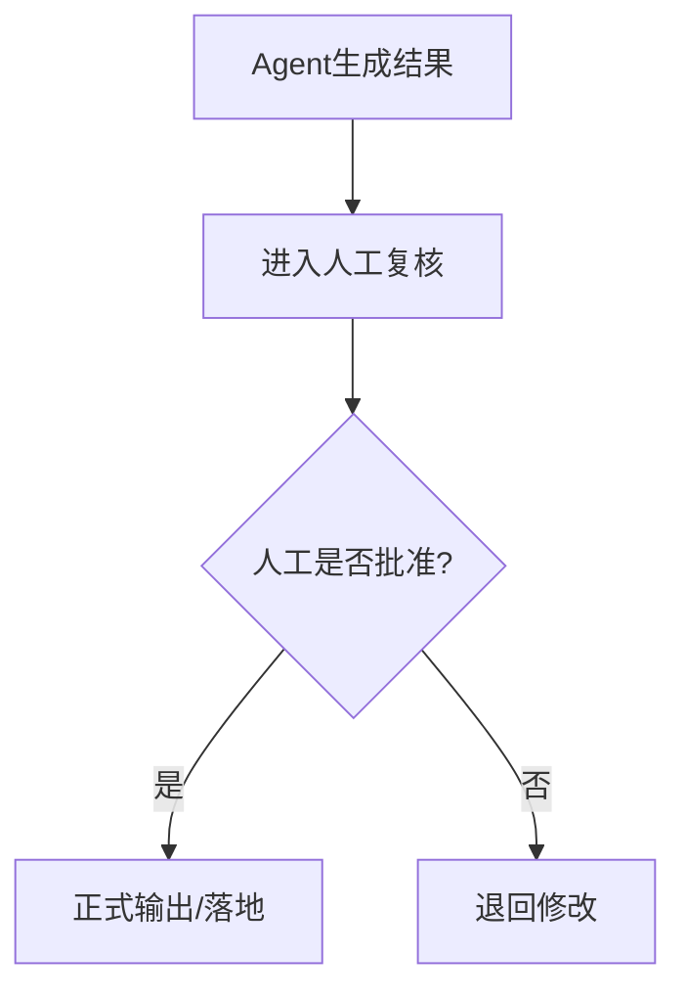

你会发现，这和真实公司流程非常像。

所以人工介入点，本质上也非常接近：

# **审批流节点。**

------

# 九、第四类：连续失败后的人工接管

这也很重要。

如果 Agent 已经：

- 连续 patch 失败 3 次
- 测试修了 5 轮还不过
- 一直在重复读文件
- 一直卡在某个权限问题

这时候不该无限自动下去，
更合理的是：

# **把控制权交还给人。**

------

## 图示

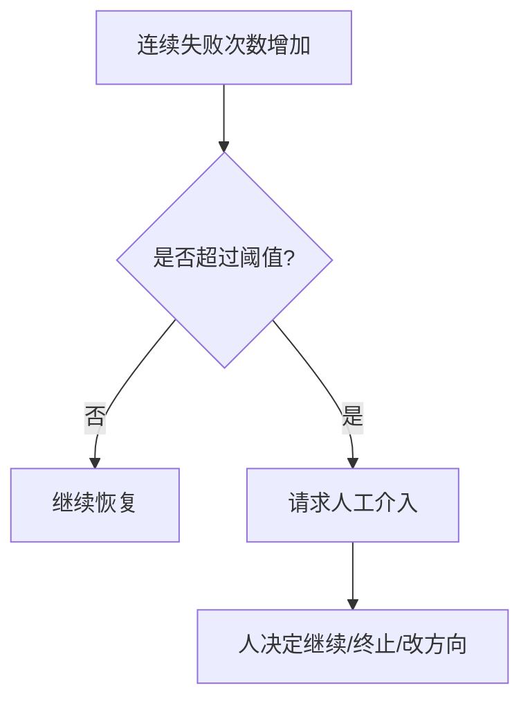

所以人工接管也是一种非常重要的介入点。

------

# 十、人工介入通常有哪几种形式

不是只有“同意/拒绝”。

常见有 4 种：

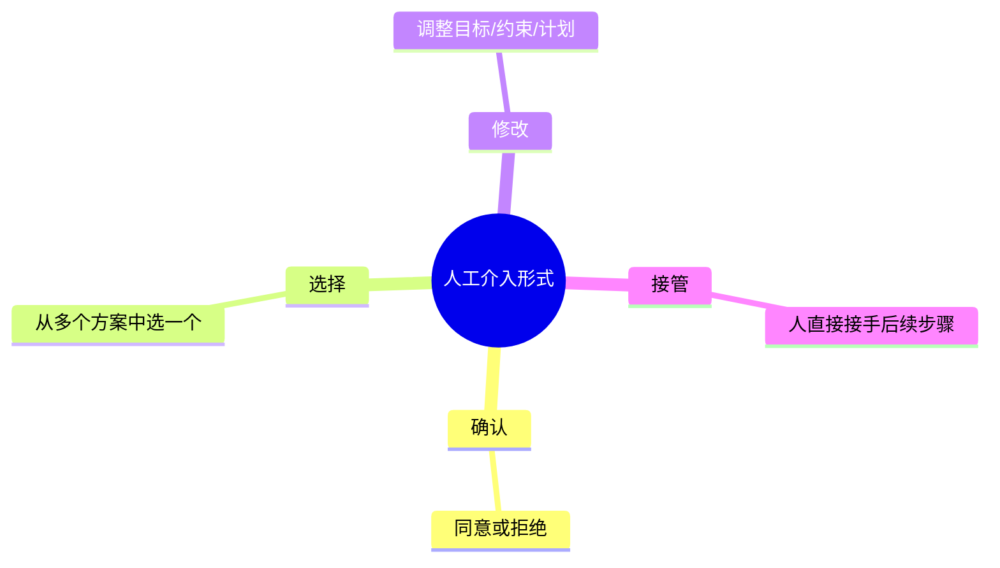

下面我给你翻译一下。

------

## 1）确认

最简单：

- 允许执行
- 不允许执行

------

## 2）选择

例如：

- 选方案 A 还是 B
- 先修这个还是那个
- 输出要详细版还是简版

------

## 3）修改

例如：

- 不要改 auth 模块，改 login_service 就行
- 只给建议，不要直接 patch
- 先别跑全量测试

------

## 4）接管

例如：

- 这一步我自己处理
- 你只继续后面的总结或验证

------

# 十一、为什么人工介入点不是越多越好

这也很关键。

如果你什么都要问用户，
那 Agent 就退化成了“半自动脚本助手”。

------

## 图示

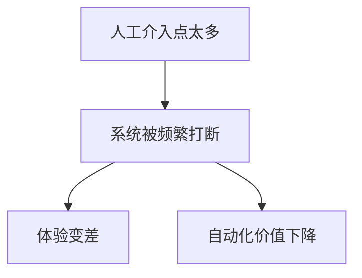

所以人工介入设计的关键不是“多”，
而是：

# **把人放在最值得拍板的地方。**

------

# 十二、那人工介入点应该怎么定

我给你一个非常实用的判断公式：

# **风险高 + 不确定高 + 责任重 → 更适合人工介入**

我给你画出来：

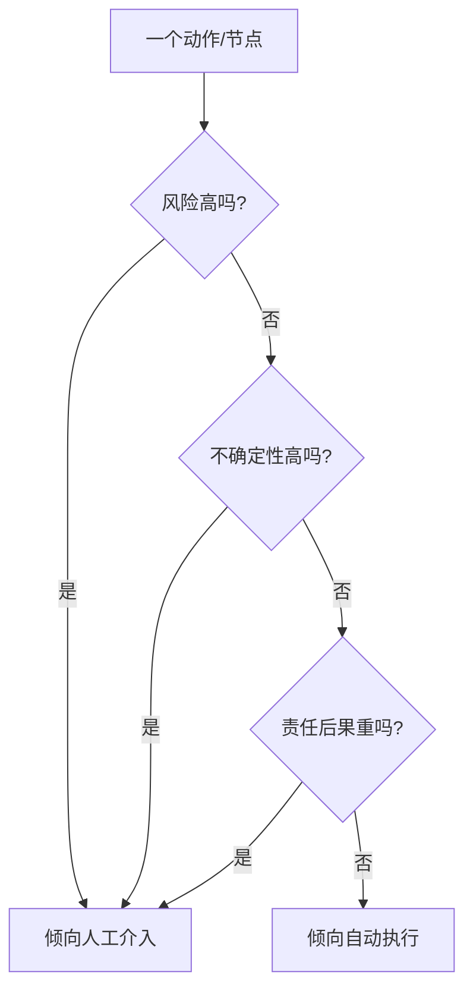

这张图你以后设计产品特别有用。

------

# 十三、在 coding agent 里，哪些点常常适合人工介入

你更关心 coding agent，我单独列一下。

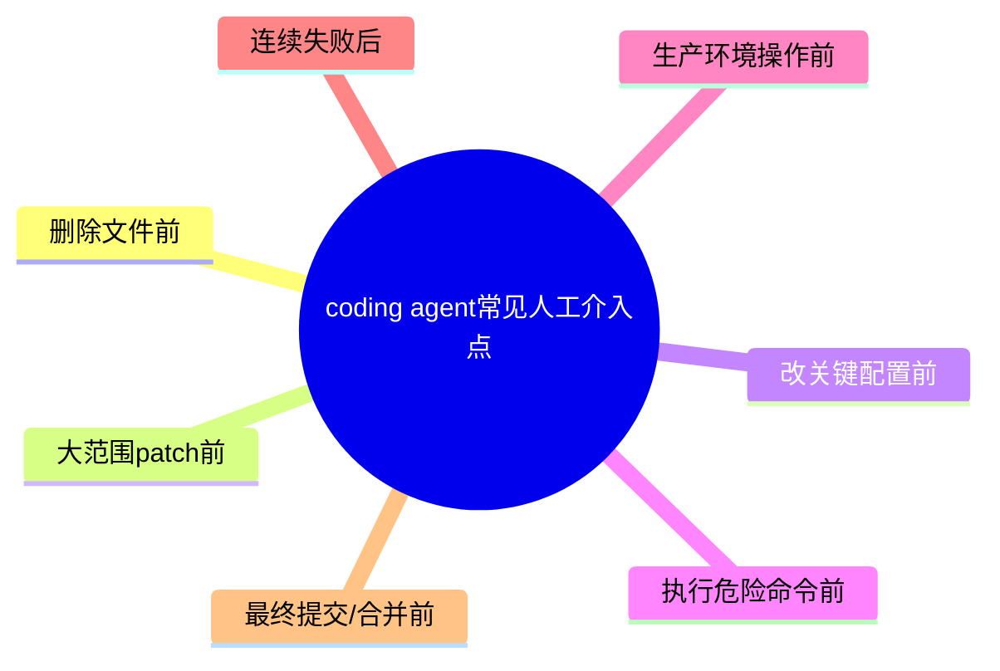

所以一个成熟 coding agent，往往不是全自动提交生产，
而是：

- 自动理解
- 自动修改
- 自动验证
- 在关键处请你确认

这才现实。

------

# 十四、人工介入和状态机是什么关系

前一课你学了状态机，这里正好接上。

从状态机视角看，
人工介入点其实就是一个状态：

# **WAIT_HUMAN / 等待人类输入**

------

## 图示

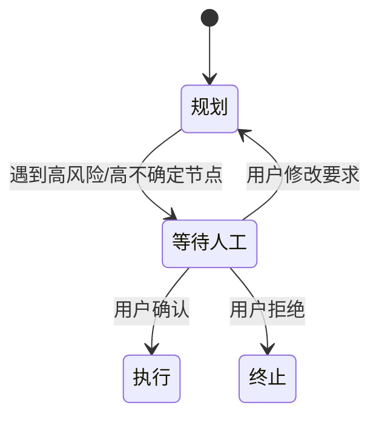

这很重要，因为它说明：

- 人工介入不是外挂
- 而是主循环和状态机里天然的一环

------

# 十五、为什么“人类在环”往往比“纯自动”更适合真实企业

因为企业场景不只在乎“能不能做”，
还在乎：

- 谁批准的
- 谁负责的
- 过程可不可审计
- 关键节点可不可复查

所以很多企业真正喜欢的，不是纯自动，而是：

# **Human-in-the-loop（人在环）**

也就是：

- 机器做大部分
- 人在关键点拍板

------

# 十六、这一课最核心的 6 句话

## 第一句

**人工介入不是系统失败，而是系统设计的一部分。**

## 第二句

**全自动不一定最好，关键是“在合适边界内尽量自动”。**

## 第三句

**高风险、高不确定、高责任的节点，通常更适合设置人工介入点。**

## 第四句

**人工介入点本质上是权限与责任的交接点。**

## 第五句

**人工介入的形式不只有确认，还包括选择、修改和接管。**

## 第六句

**好的 Agent 不是彻底替代人，而是把人放在最值得拍板的地方。**

------

# 十七、这一课的思维导图

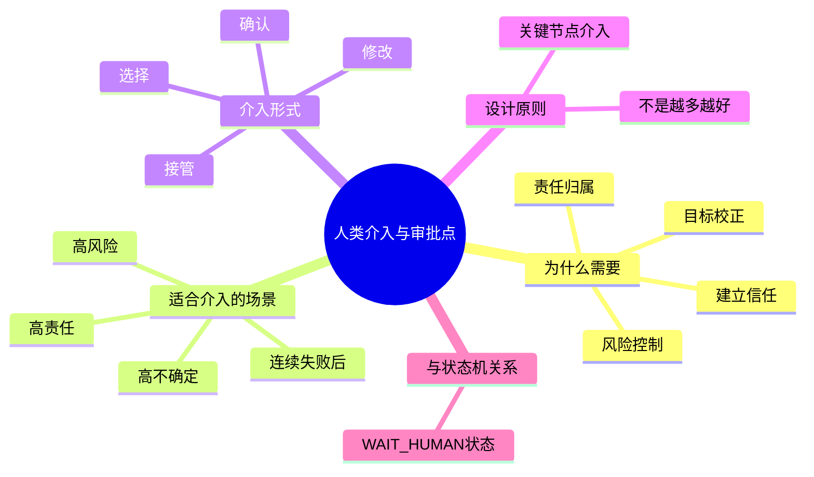

------

# 十八、接下来还剩两节核心主线

- **第 16 课：长期记忆与外部记忆**
- **第 17 课：最小可实现 Agent 总体设计**

第 16 课会把“跨任务记忆、知识库、持久化状态”讲清楚。
第 17 课会把整套东西落成一个你真能做的最小项目蓝图。

你回一句“继续”，我就直接讲第 16 课。
