好，继续主线。

# 第 16 课：长期记忆与外部记忆

也就是——**Agent 怎么跨任务记住东西，但又不把自己记成一团浆糊。**

这一课非常关键。
因为前面我们讲的大多是：

- 当前任务怎么跑
- 当前上下文怎么管
- 当前状态怎么转

但真实 Agent 往往不只做一次任务。
它还会遇到这些问题：

- 上次我已经读过这个项目结构了，能不能别再从头来
- 这个用户一直偏好中文输出，能不能记住
- 这个仓库测试命令固定是 `pytest -q`，能不能下次直接用
- 某个模块一改就容易炸，能不能当经验保留

这时候就涉及：

# **长期记忆**

但记忆一旦做不好，就会马上变成：

- 记错
- 记多
- 记脏
- 记得过期了还在用

所以长期记忆不是“能记就行”，
而是要讲结构和边界。

------

# 一、先给你一句总论

# **长期记忆的本质，不是“把所有历史都存下来”，而是“把未来还会稳定有用的信息持久化”。**

这句话非常重要。

因为不是所有东西都配进长期记忆。

------

# 二、先看总图

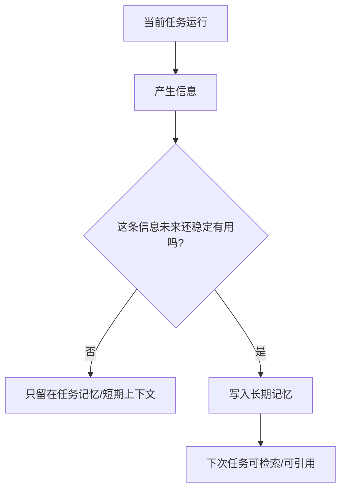

你先记住一个核心判断：

# **长期记忆关心“跨任务复用价值”，不是“本任务里出现过”。**

------

# 三、长期记忆和任务记忆，有什么区别

这个一定要分清。

## 任务记忆

是当前任务内部滚动更新的状态。

例如：

- 已读哪些文件
- 当前可疑点是什么
- 哪个 patch 已经打上
- 测试哪里挂了

这些通常只对**当前任务**有价值。

------

## 长期记忆

是跨任务也还可能有价值的信息。

例如：

- 这个仓库常用测试命令是 `pytest -q`
- 用户喜欢中文、简洁输出
- `auth` 模块改动风险高
- 这个系统的生产配置不能自动改

这些可能对**未来多个任务**都有帮助。

------

## 对比图

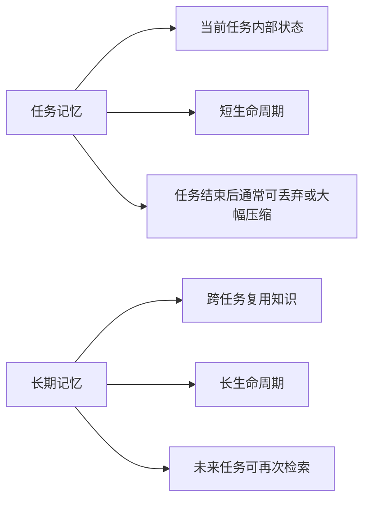

所以一句话：

# **任务记忆管“这次”，长期记忆管“下次还用得上”。**

------

# 四、什么信息适合进长期记忆

这张图你要记住。

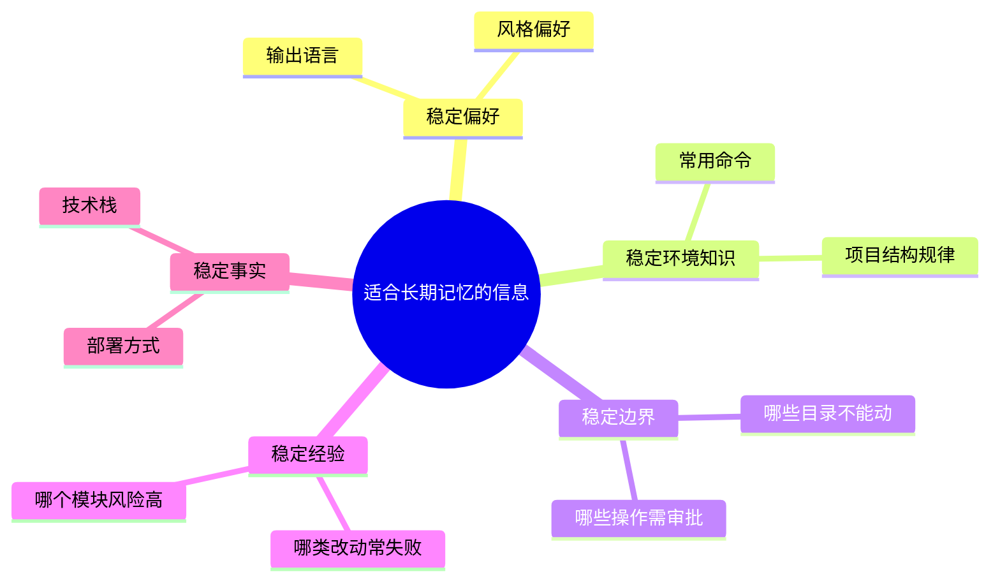

### 典型适合长期记忆的东西

- 用户长期偏好
- 项目长期结构信息
- 常用流程和命令
- 稳定的风险边界
- 反复验证过的经验规则

------

# 五、什么信息不适合进长期记忆

同样重要。

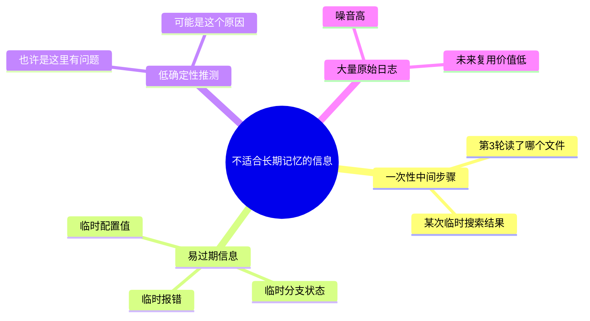

所以别把长期记忆做成“历史垃圾桶”。

你可以记一句：

# **长期记忆应该更像“经验库”，而不是“聊天备份”。**

------

# 六、长期记忆通常有哪几类

我给你按工程视角拆一下。

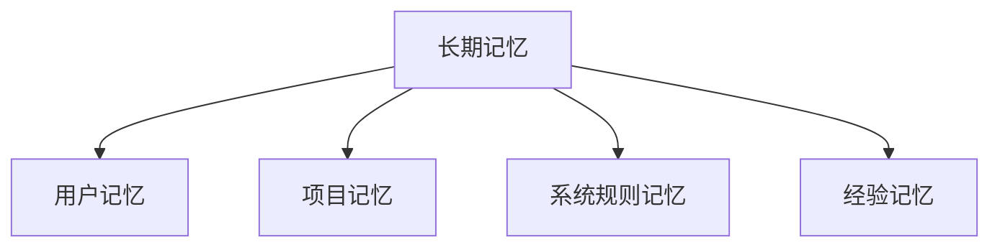

下面我逐个解释。

------

## 1）用户记忆

例如：

- 用户偏好中文
- 用户喜欢图示
- 用户更偏简洁回答
- 某类任务只要建议不要直接执行

这类记忆通常服务“交互体验”。

------

## 2）项目记忆

例如：

- 这个仓库主要是 Spring Boot + MySQL
- 测试命令常用 `pytest -q`
- `auth` 在 `login_service.py`
- 生产配置在 `config/prod`

这类记忆服务“任务效率”。

------

## 3）系统规则记忆

例如：

- 生产目录禁止自动修改
- 删除操作必须审批
- 某工具默认 timeout 30s
- 某类命令默认不允许

这类记忆服务“安全边界”。

------

## 4）经验记忆

例如：

- `auth` 模块 patch 失败率高
- 某类测试日志很长，先摘要再处理
- 某个项目读 README 再搜代码通常更稳

这类记忆服务“策略优化”。

------

# 七、长期记忆和外部记忆是什么关系

这个也要分清。

## 长期记忆

是个能力概念：
**跨任务保存并复用信息。**

## 外部记忆

是实现方式：
**把记忆放在模型上下文外部的某个持久层里。**

例如：

- 数据库
- 文件
- 向量库
- KV 存储
- 文档索引

------

## 图示

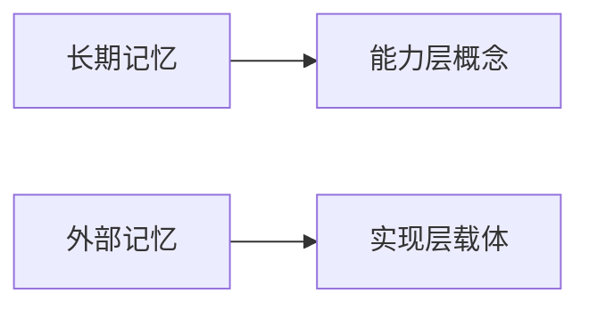

所以更准确地说：

# **长期记忆常常通过外部记忆来实现。**

------

# 八、为什么长期记忆通常不能只靠模型上下文硬记

因为模型上下文有几个问题：

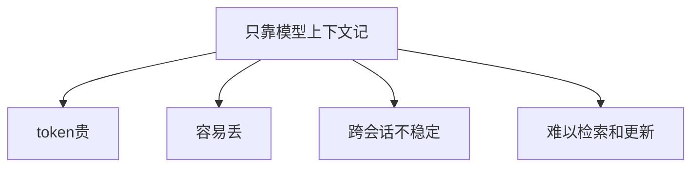

所以真正实用的长期记忆，通常要放到外部：

- 存起来
- 可查
- 可更新
- 可删
- 可控制生命周期

这就是外部记忆的重要性。

------

# 九、长期记忆最常见的工作流

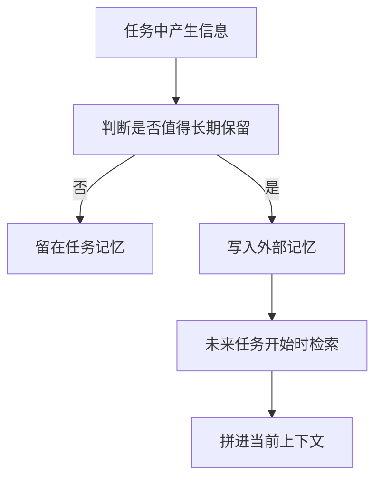

这张图就是长期记忆最基本的闭环。

------

# 十、长期记忆最大的风险：脏记忆

这个特别重要。

因为一旦记错，比不记还危险。

### 什么叫脏记忆

- 已经过期了还在用
- 只是猜测却被当成事实
- 某次临时异常被当成稳定规律
- 用户一时的要求被当成长期偏好

------

## 图示

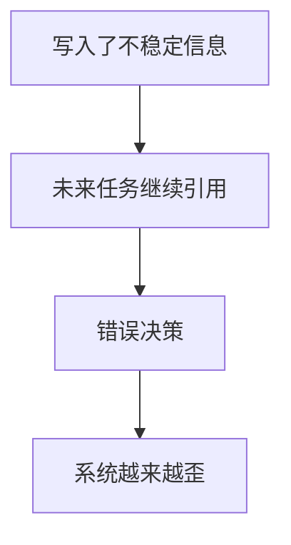

所以长期记忆的核心不是“多”，而是：

# **准、稳、可更新。**

------

# 十一、那长期记忆要怎么控脏

我给你一个很实用的原则图。

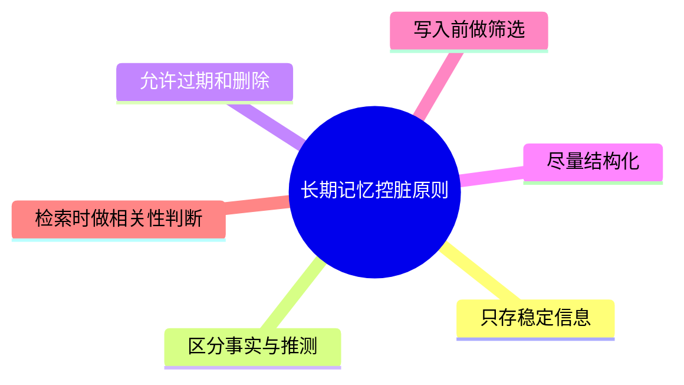

尤其要记住两条：

## 1. 区分事实和推测

“可能是 compare_password 有问题”
这类不要轻易进长期记忆。

## 2. 允许过期和删除

长期记忆不是永久真理。
它应该能：

- 更新
- 覆盖
- 失效
- 删除

------

# 十二、长期记忆怎么检索，不然存了也没用

记忆不是存进去就完了，
更关键的是：

# **未来任务能不能在合适的时候把它捞出来。**

常见方式有两类：

## 1）规则检索

例如：

- 任务是 coding，就先拿项目记忆
- 任务是和某用户交互，就先拿用户偏好
- 任务涉及生产环境，就拿安全规则记忆

## 2）语义检索

例如：

- 当前任务提到 auth
- 就去找和 auth 模块相关的项目经验和风险记忆

------

## 图示

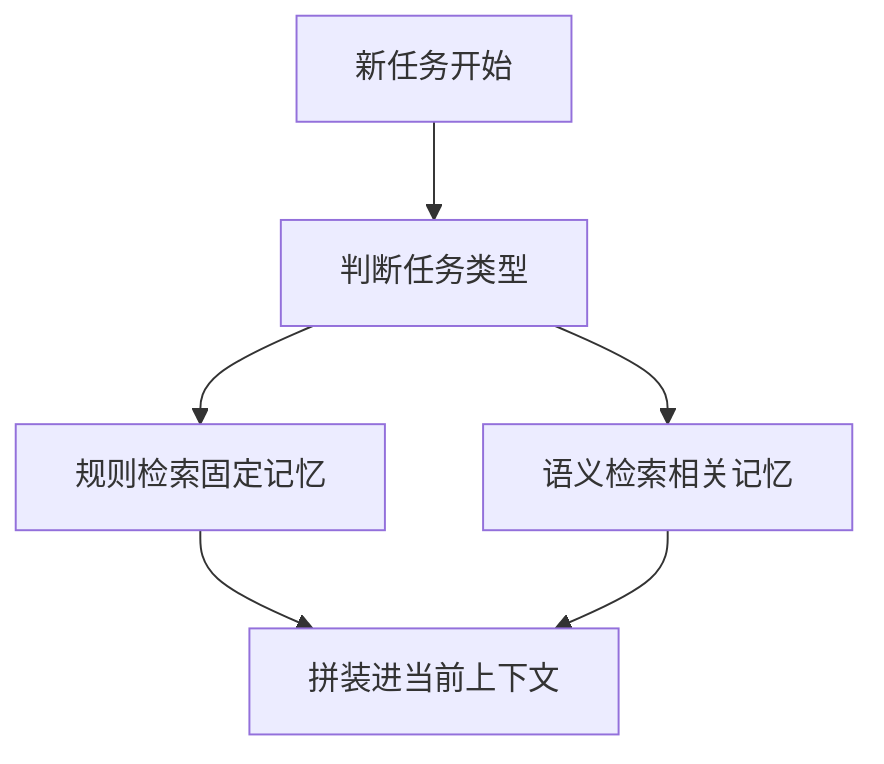

------

# 十三、长期记忆不是越多越好

这一点和上下文一样。

因为记忆太多会导致：

- 检索噪音高
- 决策变慢
- 相关性下降
- 老信息污染新任务

所以长期记忆系统也得有：

- 写入门槛
- 检索筛选
- 生命周期控制

------

# 十四、在 coding agent 里，长期记忆最实用的几种内容

你更关心 coding agent，我单独列给你。

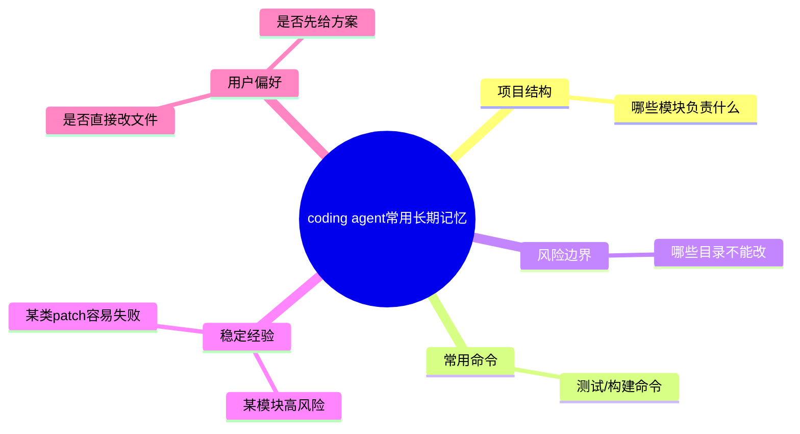

这类记忆一旦做得好，会明显提升 Agent 的“熟练感”。

------

# 十五、你以后自己做最小版时，长期记忆先别做太复杂

我建议你最开始只做三类就够：

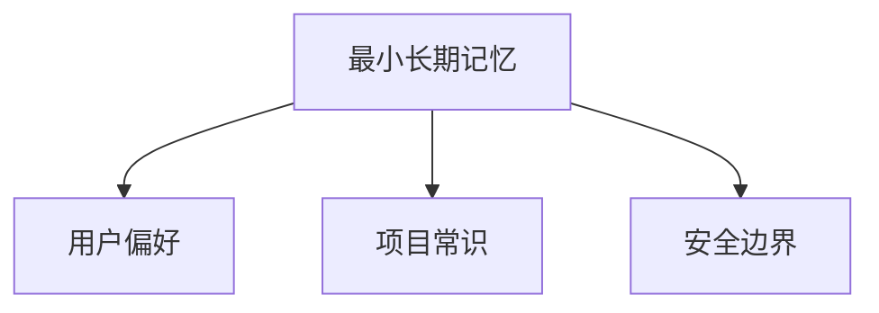

例如：

- 输出默认中文
- 常用测试命令
- 哪些路径不能自动改

这三类已经很实用了。

别一开始就上：

- 大而全知识库
- 复杂向量检索
- 自动写入一切

那很容易做脏。

------

# 十六、长期记忆和第 8 课上下文压缩，是什么关系

你可以这样理解：

- **任务记忆**：当前任务里的滚动纪要
- **长期记忆**：跨任务留下来的经验和规则

------

## 图示

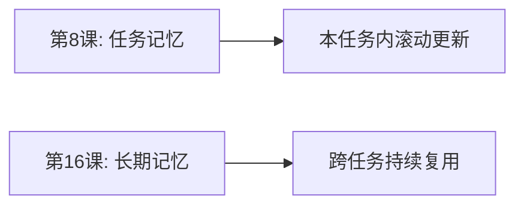

所以它们不是替代关系，
而是不同层级的记忆。

------

# 十七、这一课最核心的 6 句话

## 第一句

**长期记忆不是保存全部历史，而是持久化未来还稳定有用的信息。**

## 第二句

**任务记忆管“这次”，长期记忆管“下次还用得上”。**

## 第三句

**长期记忆通常通过外部记忆来实现，比如数据库、文件、索引等。**

## 第四句

**长期记忆的最大风险不是记不住，而是记脏、记错、记过期。**

## 第五句

**长期记忆应该更像经验库，而不是聊天备份。**

## 第六句

**做最小 Agent 时，先从用户偏好、项目常识、安全边界这三类长期记忆开始最稳。**

------

# 十八、这一课的思维导图

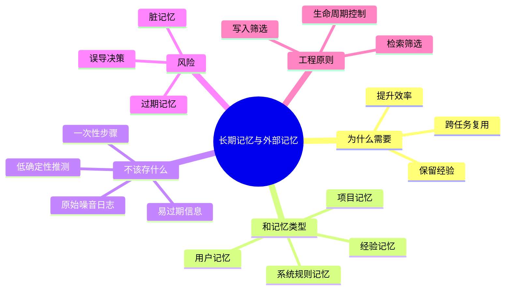

------

# 十九、主线还剩最后一课

# 第 17 课：最小可实现 Agent 总体设计

这一课会把前面所有内容收束起来，变成一个你真能做的蓝图。

内容会包括：

- 最小系统包含哪些模块
- 主循环怎么跑
- 上下文管理器怎么接
- 工具怎么设计
- 验证、恢复、审批怎么接进去
- 最小版本先做什么，不做什么

你回一句“继续”，我就把整套 Agent 课程收束成一个最小可实现项目方案。
