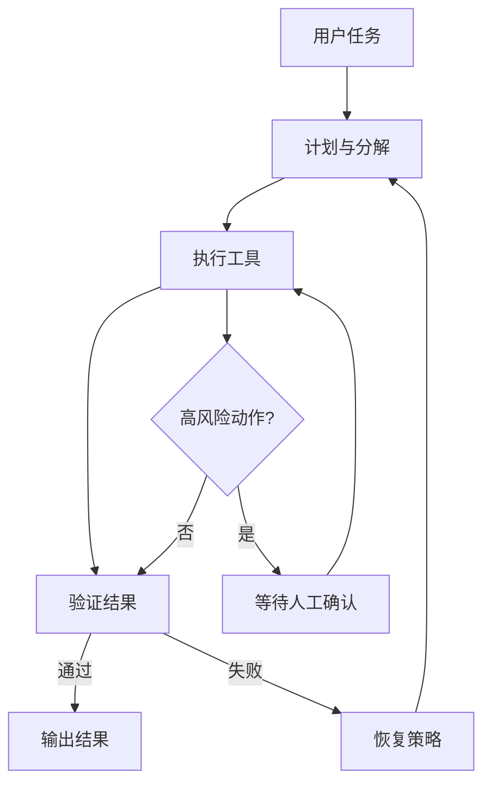

# 第 17 课：最小可实现 Agent 总体设计

这一课给出从“会概念”到“能落地”的最小方案。

## 一、MVP 目标

- 能接收任务并循环推进。
- 能调用最小工具集完成代码修改。
- 能做基础验证与失败恢复。
- 能在关键动作上等待人工确认。

## 二、最小架构

## 三、最小工具集（建议）

1. `read_file`
2. `search`
3. `patch_file`
4. `run_command`
5. `git_diff`

## 四、最小状态机

- `PLAN`：分解下一步
- `ACT`：执行动作
- `VERIFY`：校验结果
- `RECOVER`：失败恢复
- `WAIT_HUMAN`：人工确认
- `DONE/FAILED`：终止

## 五、实现顺序（建议）

1. 先打通主循环（不加记忆）。
2. 再接工具路由与最小改动策略。
3. 加入验证分支与恢复分支。
4. 最后补人工审批点与评估集。

## 六、交付标准

- 连续 10 个样例任务可稳定完成。
- 失败任务有可解释原因与可执行恢复建议。
- 所有文件改动都可通过 diff 审核。
- 关键高风险动作都经过显式确认。

