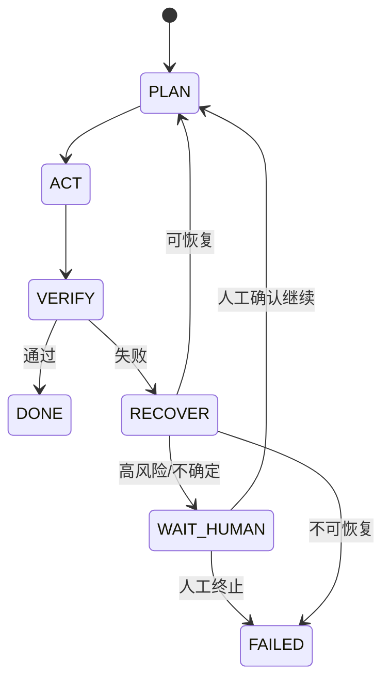

# 实战篇：最小 Agent 小项目手册

这份手册基于第 17 课，目标是让你用 5-7 天做出一个能跑、能改、能验、能恢复的最小 Agent。

## 一、项目目标

- 输入一个 coding 任务，Agent 能分解并执行。
- 支持文件读取、搜索、补丁修改、命令执行。
- 支持验证（至少测试或构建）。
- 失败时支持分类恢复，不是一错就停。
- 关键风险操作可人工确认。

## 二、项目边界（学习版）

不做：
- 多 Agent 协同
- 长期记忆库
- 复杂权限系统

先做：
- 单 Agent 主循环
- 最小工具链
- 基础状态机

## 三、建议技术栈

- 语言：Python 或 Node.js（二选一即可）
- 模型调用：你熟悉的任意 API SDK
- 存储：本地 JSON（任务状态、执行日志）
- 运行方式：CLI（命令行）优先

## 四、目录结构建议

```text
mini-agent/
  README.md
  app/
    main.py (或 main.ts)
    loop/
      state_machine.*
      planner.*
      executor.*
      verifier.*
      recover.*
    tools/
      read_file.*
      search.*
      patch_file.*
      run_command.*
    safety/
      policy.*
      approval.*
    memory/
      task_state.*
      summary.*
  evals/
    cases.json
    runner.*
  logs/
```

## 五、状态机定义（最小）



## 六、7 天学习排期

1. Day 1：搭项目骨架 + CLI 入参 + 状态定义  
2. Day 2：接 `read_file/search` 工具 + 能跑一轮  
3. Day 3：接 `patch_file/run_command` + 最小改动策略  
4. Day 4：加 `VERIFY`（测试或构建）  
5. Day 5：加 `RECOVER`（失败分类 + 重试）  
6. Day 6：加 `WAIT_HUMAN`（高风险确认）  
7. Day 7：做 `evals` 跑 10 个样例并复盘  

## 七、最小验收标准

- 连续跑通 10 个任务，成功率 >= 70%
- 每次改动都有 diff 记录
- 每次失败都有分类和说明
- 至少有 1 个任务触发人工确认

## 八、推荐练习任务（从易到难）

1. 修改一个函数注释并通过 lint  
2. 修复一个已知测试失败并通过测试  
3. 在指定模块新增参数校验并补测试  
4. 重构小函数（不改行为）并保持测试通过  
5. 修复一处跨文件调用错误并验证构建  

## 九、你每天的复盘模板

```md
## 今日目标
## 完成内容
## 失败案例
## 恢复动作
## 明日计划
```

## 十、从学习版到增强版

下一步迭代顺序建议：

1. 加更细粒度权限策略（读写执行分级）  
2. 加任务上下文压缩与摘要质量检查  
3. 引入长期记忆（只保存稳定有效信息）  
4. 加更系统的 Evals（成功率、成本、恢复率）  

---

如果你愿意，下一步我可以直接给你生成这个小项目的“代码脚手架版本”（可运行的最小框架），你只需要填模型 API Key 就能跑。
